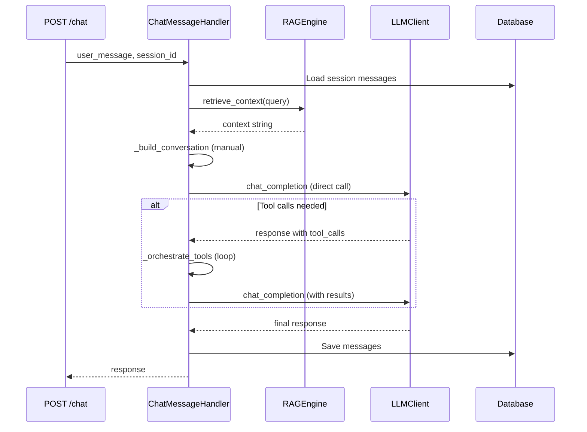
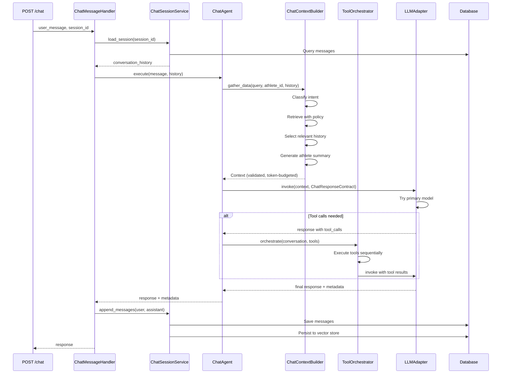

# Architecture Document: Chat Context Engineering Refactor

## Executive Summary

This document defines the target architecture for migrating the chat system from its current monolithic implementation to the Context Engineering (CE) architecture. The refactor achieves parity with the evaluation system's structured approach while maintaining backward compatibility and enabling controlled rollout.

**Migration Approach**: Incremental, phase-by-phase refactor with feature flags
**Timeline**: 6 phases + cross-phase tasks
**Risk Level**: Medium (mitigated by feature flags and comprehensive testing)
**Expected Benefits**: Improved maintainability, observability, reliability, and personalization

---

## 1. Current State Analysis

### 1.1 Current Architecture Problems

The existing chat implementation exhibits several architectural issues:

1. **Monolithic Handler**: ChatMessageHandler owns session management, context building, tool orchestration, and LLM invocation
2. **Manual Prompt Building**: String concatenation for prompt assembly with no versioning
3. **No Domain Knowledge**: Missing structured domain knowledge injection
4. **Full History Dump**: Entire session history sent every turn (token waste)
5. **No Personalization Layer**: Missing athlete behavior summary
6. **Direct LLM Calls**: No abstraction, no fallback, no telemetry
7. **Ad-hoc Tool Execution**: No bounded iteration or structured orchestration

### 1.2 Current Component Structure

```
ChatMessageHandler (Monolithic)
├── Session Management
│   ├── Create/load sessions
│   ├── Maintain active_session_messages
│   └── Persist to DB and vector store
├── Context Building
│   ├── _retrieve_context() - RAG retrieval
│   ├── _build_conversation() - Manual assembly
│   └── _get_system_prompt() - Hardcoded prompt
├── Tool Orchestration
│   └── _orchestrate_tools() - Ad-hoc loop
└── LLM Invocation
    └── Direct LLMClient calls
```

### 1.3 Current Data Flow

```
API Request
    ↓
ChatMessageHandler.handle_message()
    ↓
Load session messages (DB query)
    ↓
Retrieve context (RAG)
    ↓
Build conversation (manual string concat)
    ↓
LLM invocation (direct call)
    ↓
Tool orchestration (if needed)
    ↓
Save messages (DB + vector store)
    ↓
Return response
```

---

## 2. Target Architecture

### 2.1 Component Responsibility Map


| Component | Responsibility | NOT Responsible For |
|-----------|---------------|---------------------|
| **ChatMessageHandler** | Thin coordinator between API and execution layer | Session lifecycle, context building, tool execution, LLM invocation, prompt ownership |
| **ChatSessionService** | Session lifecycle and persistence management | Context building, message generation, tool execution, LLM invocation |
| **ChatAgent** | Runtime execution owner for chat flow | Session persistence, context layer assembly, individual tool execution, direct model invocation |
| **ChatContextBuilder** | Structured context assembly with CE layers | Session management, tool execution, LLM invocation, response generation |
| **ToolOrchestrator** | Multi-step tool execution with ReAct pattern | Context building, LLM invocation, session management, individual tool implementation |
| **LLMAdapter** | Model invocation abstraction with fallback | Context building, tool execution, session management, prompt template loading |

### 2.2 Target Module Structure

```
app/
├── api/
│   └── chat.py                      # API endpoints (unchanged interface)
├── services/
│   ├── chat_session_service.py      # NEW: Session lifecycle
│   ├── chat_agent.py                # NEW: Runtime execution owner
│   ├── chat_message_handler.py      # REFACTORED: Thin coordinator
│   └── tool_orchestrator.py         # NEW: Multi-step tool execution
├── ai/
│   ├── context/
│   │   └── chat_context.py          # ACTIVATED: ChatContextBuilder
│   ├── adapter/
│   │   └── langchain_adapter.py     # SHARED: LLMAdapter
│   ├── prompts/
│   │   ├── system/
│   │   │   └── coach_chat_v1.0.0.j2 # NEW: Versioned system prompt
│   │   └── tasks/
│   │       └── chat_response_v1.0.0.j2 # NEW: Task instructions
│   └── telemetry/
│       └── invocation_logger.py     # SHARED: Telemetry logging
```

### 2.3 Target Data Flow

```
API Request
    ↓
ChatMessageHandler (thin coordinator)
    ↓
ChatSessionService.load_session()
    ↓
ChatAgent.execute()
    ├── ChatContextBuilder.gather_data()
    │   ├── Classify intent
    │   ├── Retrieve with policy
    │   ├── Select relevant history
    │   ├── Generate athlete summary
    │   └── Build layered context
    ├── LLMAdapter.invoke()
    │   ├── Try primary model
    │   ├── Fallback if needed
    │   └── Emit telemetry
    └── ToolOrchestrator.orchestrate() (if tools needed)
        ├── Execute tools sequentially
        ├── Pass results to LLM
        └── Bounded iteration (max 5)
    ↓
ChatSessionService.append_messages()
    ↓
ChatSessionService.persist_session()
    ↓
Return response
```

---

## 3. Sequence Diagrams

### 3.1 Current Chat Flow (Legacy)



**Problems**: Monolithic handler, manual prompt building, no fallback, full history dump, no telemetry

### 3.2 Target Chat Flow (CE Architecture)



**Benefits**: Clean separation, versioned prompts, intent-aware retrieval, dynamic history, athlete summary, model fallback, telemetry

---

## 4. Runtime Context Model (8 Layers)

The CE architecture builds context in structured layers with token budget enforcement:


```python
@dataclass
class Context:
    """Structured context for chat operations"""
    
    # Layer 1: System Instructions (200-300 tokens)
    # - AI coach persona
    # - Behavioral constraints
    # - Communication style
    # - Tool usage guidelines
    system_instructions: str
    
    # Layer 2: Task Instructions (100-150 tokens)
    # - Respond to athlete query
    # - Use tools to gather data
    # - Provide evidence-based advice
    # - Reference specific data points
    task_instructions: str
    
    # Layer 3: Domain Knowledge (150-200 tokens)
    # - Training zones (Z1-Z5)
    # - Effort levels (easy/moderate/hard/max)
    # - Recovery guidelines
    # - Nutrition targets
    domain_knowledge: Dict[str, Any]
    
    # Layer 4: Athlete Behavior Summary (150-200 tokens)
    # - Training patterns (e.g., "runs 4x/week, prefers morning")
    # - Preferences (e.g., "dislikes high-intensity intervals")
    # - Recent trends (e.g., "increasing volume steadily")
    # - Past feedback (e.g., "responds well to structured plans")
    athlete_behavior_summary: str
    
    # Layer 5: Structured Athlete State (100-150 tokens)
    # - Active goals with targets and dates
    # - Current training plan (if any)
    # - Recent metrics (weight, RHR, sleep)
    structured_athlete_state: Dict[str, Any]
    
    # Layer 6: Retrieved Evidence (400-600 tokens)
    # - Intent-specific data (recent activities, trends, etc.)
    # - Formatted as evidence cards with source IDs
    # - Limited to top 5-10 most relevant records
    retrieved_evidence: List[EvidenceCard]
    
    # Layer 7: Dynamic History (600-800 tokens)
    # - Last 3-5 relevant turns
    # - Contextually important past turns
    # - NOT full session history
    dynamic_history: List[Dict[str, str]]
    
    # Layer 8: Current User Message (50-200 tokens)
    # - The athlete's current question/request
    current_user_message: str
    
    # Metadata
    token_count: int  # Total: 2400 tokens (enforced)
    intent: Intent
```

### 4.1 Layer Details

| Layer | Token Budget | Purpose | Source |
|-------|--------------|---------|--------|
| System Instructions | 200-300 | AI coach persona, behavioral rules | `coach_chat_v1.0.0.j2` |
| Task Instructions | 100-150 | Operation-specific objectives | `chat_response_v1.0.0.j2` |
| Domain Knowledge | 150-200 | Sport science reference data | `domain_knowledge.yaml` |
| Athlete Behavior Summary | 150-200 | Condensed training profile | Generated from DB |
| Structured Athlete State | 100-150 | Current goals, plan, metrics | Queried from DB |
| Retrieved Evidence | 400-600 | Intent-aware RAG results | RAG retrieval |
| Dynamic History | 600-800 | Relevant conversation turns | Selected from session |
| Current User Message | 50-200 | Athlete's current query | API request |
| **Total** | **2400** | **Maximum context size** | **Enforced by ContextBuilder** |

### 4.2 Token Budget Enforcement

```python
class ChatContextBuilder(ContextBuilder):
    def build(self) -> Context:
        """Build context with token budget enforcement"""
        
        # Calculate current token count
        total_tokens = self._count_tokens()
        
        if total_tokens > self.token_budget:
            # Trim in priority order (never trim system/task/domain)
            self._trim_history()  # Trim oldest history first
            self._trim_evidence()  # Trim lowest-relevance evidence second
            
            # Re-check
            total_tokens = self._count_tokens()
            if total_tokens > self.token_budget:
                raise ContextBudgetExceeded(
                    f"Context exceeds budget: {total_tokens} > {self.token_budget}"
                )
        
        return self.context
```

---

## 5. Migration Strategy

### 5.1 Phase-by-Phase Approach

The refactor follows a 6-phase incremental migration:

| Phase | Focus | Duration | Risk |
|-------|-------|----------|------|
| **Phase 0** | Architecture Baseline | 1 week | Low |
| **Phase 1** | Extract ChatSessionService | 2 weeks | Low |
| **Phase 2** | Move Context to CE Path | 3 weeks | Medium |
| **Phase 3** | Introduce ChatAgent | 2 weeks | Medium |
| **Phase 4** | Extract ToolOrchestrator | 2 weeks | Medium |
| **Phase 5** | Switch to Shared LLMAdapter | 2 weeks | Medium |
| **Phase 6** | Hardening & Rollout | 3 weeks | High |
| **Total** | | **15 weeks** | |

### 5.2 Backward Compatibility Plan

**Database Schema**:
- No breaking changes to `ChatSession` or `ChatMessage` tables
- Existing sessions load into new runtime without migration
- Vector store embeddings remain compatible

**API Contracts**:
- Request/response formats unchanged
- Streaming endpoints maintain SSE format
- Error responses consistent with legacy

**Session Migration**:
```python
def load_legacy_session(session_id: int) -> List[ChatMessage]:
    """Load legacy session into CE runtime"""
    messages = db.query(ChatMessage).filter(
        ChatMessage.session_id == session_id
    ).order_by(ChatMessage.created_at).all()
    
    # No conversion needed - same models
    return messages
```

### 5.3 Rollback Strategy

**Feature Flag Control**:
```python
# app/config.py
class Settings(BaseSettings):
    USE_CE_CHAT_RUNTIME: bool = False  # Default: legacy
    LEGACY_CHAT_ENABLED: bool = True   # Keep legacy code
```

**Runtime Selection**:
```python
class ChatMessageHandler:
    async def handle_message(self, user_message: str, session_id: int):
        if self.settings.USE_CE_CHAT_RUNTIME:
            return await self._handle_ce(user_message, session_id)
        else:
            return await self._handle_legacy(user_message, session_id)
```

**Rollback Procedure**:
1. Set `USE_CE_CHAT_RUNTIME=false` in environment
2. Restart application
3. Monitor for stability
4. Investigate CE runtime issues
5. Fix and re-enable when ready

---

## 6. Feature Flag Approach

### 6.1 Feature Flag Configuration


```python
# app/config.py
class Settings(BaseSettings):
    # Feature flags
    USE_CE_CHAT_RUNTIME: bool = Field(
        default=False,
        description="Enable Context Engineering chat runtime"
    )
    LEGACY_CHAT_ENABLED: bool = Field(
        default=True,
        description="Keep legacy chat path available"
    )
    ENABLE_RUNTIME_COMPARISON: bool = Field(
        default=False,
        description="Run both runtimes and compare results (testing only)"
    )
    
    # CE runtime configuration
    CE_CHAT_TOKEN_BUDGET: int = Field(
        default=2400,
        description="Maximum context tokens for CE chat"
    )
    CE_CHAT_MAX_TOOL_ITERATIONS: int = Field(
        default=5,
        description="Maximum tool orchestration iterations"
    )
    CE_CHAT_HISTORY_SELECTION_POLICY: str = Field(
        default="last_n_turns",
        description="History selection policy: last_n_turns, relevance, token_aware"
    )
    CE_CHAT_HISTORY_TURNS: int = Field(
        default=5,
        description="Number of turns to include in history (for last_n_turns policy)"
    )
```

### 6.2 Rollout Stages

**Stage 1: Development (Week 1-12)**
- `USE_CE_CHAT_RUNTIME=false` (legacy only)
- Build CE components incrementally
- Unit and integration testing

**Stage 2: Internal Testing (Week 13-14)**
- `USE_CE_CHAT_RUNTIME=true` for dev environment
- `ENABLE_RUNTIME_COMPARISON=true` for validation
- Compare CE vs legacy performance and quality

**Stage 3: Pilot Rollout (Week 15)**
- `USE_CE_CHAT_RUNTIME=true` for 10% of users
- Monitor telemetry closely
- Collect user feedback
- Quick rollback if issues

**Stage 4: Gradual Rollout (Week 16-17)**
- Increase to 25%, 50%, 75%, 100%
- Monitor at each stage
- Validate stability

**Stage 5: Legacy Deprecation (Week 18+)**
- After 2 weeks of stable 100% CE runtime
- Set `LEGACY_CHAT_ENABLED=false`
- Remove legacy code

### 6.3 Comparison Mode

For validation, the system supports side-by-side comparison:

```python
class ChatMessageHandler:
    async def handle_message_with_comparison(
        self,
        user_message: str,
        session_id: int
    ) -> Dict[str, Any]:
        """Run both runtimes and compare results"""
        
        # Run legacy
        legacy_start = time.time()
        legacy_response = await self._handle_legacy(user_message, session_id)
        legacy_latency = time.time() - legacy_start
        
        # Run CE
        ce_start = time.time()
        ce_response = await self._handle_ce(user_message, session_id)
        ce_latency = time.time() - ce_start
        
        # Log comparison
        comparison = {
            'legacy_latency_ms': legacy_latency * 1000,
            'ce_latency_ms': ce_latency * 1000,
            'latency_diff_ms': (ce_latency - legacy_latency) * 1000,
            'legacy_tokens': legacy_response.get('token_count'),
            'ce_tokens': ce_response.get('context_token_count'),
            'legacy_tool_calls': legacy_response.get('tool_calls_made', 0),
            'ce_tool_calls': ce_response.get('tool_calls_made', 0),
            'timestamp': datetime.utcnow().isoformat()
        }
        
        self.logger.info(f"Runtime comparison: {comparison}")
        
        # Return CE response (or legacy if CE fails)
        return ce_response if ce_response else legacy_response
```

---

## 7. Component Interfaces

### 7.1 ChatSessionService

```python
class ChatSessionService:
    """Session lifecycle and persistence management"""
    
    def __init__(self, db: Session, rag_engine: RAGEngine):
        self.db = db
        self.rag_engine = rag_engine
        self.active_buffers: Dict[int, List[ChatMessage]] = {}
    
    def create_session(self, athlete_id: int, title: str = "New Chat") -> int:
        """Create new chat session. Returns session_id."""
    
    def load_session(self, session_id: int) -> List[ChatMessage]:
        """Load session messages into active buffer."""
    
    def get_active_buffer(self, session_id: int) -> List[ChatMessage]:
        """Get current active buffer for session."""
    
    def append_messages(
        self,
        session_id: int,
        user_message: str,
        assistant_message: str
    ) -> None:
        """Append messages to active buffer (not persisted yet)."""
    
    def persist_session(
        self,
        session_id: int,
        eval_score: Optional[float] = None
    ) -> None:
        """Persist session to database and vector store."""
    
    def clear_buffer(self, session_id: int) -> None:
        """Clear active buffer for session."""
    
    def delete_session(self, session_id: int) -> None:
        """Delete session from database and vector store."""
```

### 7.2 ChatAgent

```python
class ChatAgent:
    """Runtime execution owner for chat flow"""
    
    def __init__(
        self,
        context_builder: ChatContextBuilder,
        tool_orchestrator: ToolOrchestrator,
        llm_adapter: LLMAdapter
    ):
        self.context_builder = context_builder
        self.tool_orchestrator = tool_orchestrator
        self.llm_adapter = llm_adapter
    
    async def execute(
        self,
        user_message: str,
        session_id: int,
        user_id: int,
        conversation_history: List[ChatMessage]
    ) -> Dict[str, Any]:
        """
        Execute chat request with full CE pipeline.
        
        Returns:
            {
                'content': str,
                'tool_calls_made': int,
                'iterations': int,
                'latency_ms': float,
                'model_used': str,
                'context_token_count': int,
                'response_token_count': int,
                'intent': str,
                'evidence_cards': List[Dict]
            }
        """
```

### 7.3 ChatContextBuilder

```python
class ChatContextBuilder(ContextBuilder):
    """Structured context assembly with CE layers"""
    
    def __init__(self, db: Session, token_budget: int = 2400):
        super().__init__(token_budget)
        self.db = db
        self.intent_router = IntentRouter()
        self.rag_retriever = RAGRetriever(db)
    
    def gather_data(
        self,
        query: str,
        athlete_id: int,
        conversation_history: Optional[List[Dict[str, str]]] = None
    ) -> 'ChatContextBuilder':
        """
        Gather data for chat response using intent-aware retrieval.
        
        Steps:
        1. Classify query intent
        2. Retrieve relevant data with intent-specific policy
        3. Select relevant conversation history
        4. Generate athlete behavior summary
        5. Add all layers to context
        """
```

### 7.4 ToolOrchestrator

```python
class ToolOrchestrator:
    """Multi-step tool execution with ReAct pattern"""
    
    def __init__(
        self,
        llm_adapter: LLMAdapter,
        tool_registry: Dict[str, Callable],
        max_iterations: int = 5
    ):
        self.llm_adapter = llm_adapter
        self.tool_registry = tool_registry
        self.max_iterations = max_iterations
    
    async def orchestrate(
        self,
        conversation: List[Dict[str, str]],
        tool_definitions: List[Dict[str, Any]],
        user_id: int
    ) -> Dict[str, Any]:
        """
        Execute multi-step tool orchestration with ReAct pattern.
        
        Returns:
            {
                'content': str,
                'tool_calls_made': int,
                'iterations': int,
                'tool_results': List[Dict],
                'max_iterations_reached': bool
            }
        """
```

### 7.5 LLMAdapter

```python
class LangChainAdapter(LLMProviderAdapter):
    """Model invocation abstraction with fallback"""
    
    def __init__(
        self,
        primary_model: str = "mixtral:8x7b-instruct",
        fallback_model: str = "llama3.1:8b-instruct",
        base_url: str = "http://localhost:11434",
        temperature: float = 0.7,
        max_tokens: int = 2000,
        invocation_logger: Optional[InvocationLogger] = None
    ):
        """Initialize adapter with primary and fallback models"""
    
    def invoke(
        self,
        context: Context,
        contract: Type[BaseModel],
        operation_type: str = "chat_response",
        athlete_id: Optional[int] = None
    ) -> LLMResponse:
        """
        Invoke LLM with automatic fallback and telemetry.
        
        Flow:
        1. Try primary model
        2. On timeout/connection error, retry with fallback
        3. Log telemetry
        4. Return response with metadata
        """
```

---

## 8. Performance Targets

| Metric | Target | Measurement |
|--------|--------|-------------|
| Context Building | < 500ms | Time from request to context ready |
| RAG Retrieval | < 200ms | Time to retrieve 20 records |
| Simple Query (no tools) | < 3s p95 | End-to-end latency |
| Multi-tool Query | < 5s p95 | End-to-end with 2-3 tools |
| Token Budget | 2400 tokens | Maximum context size |
| History Selection | 3-5 turns | Relevant turns included |
| Evidence Cards | 5-10 records | Retrieved data per query |
| Tool Iterations | Max 5 | Bounded execution |
| Code Coverage | 85%+ | For new components |

---

## 9. Risk Assessment

| Risk | Likelihood | Impact | Mitigation |
|------|------------|--------|------------|
| Performance regression | Medium | High | Feature flag, comparison mode, performance testing |
| Quality degradation | Medium | High | Human evaluation, pilot rollout, quick rollback |
| Session data loss | Low | Critical | Backward compatibility, no schema changes |
| Tool execution failures | Medium | Medium | Bounded iteration, graceful error handling |
| Token budget exceeded | Medium | Low | Automatic trimming, validation |
| Fallback model quality | Low | Medium | Test fallback thoroughly, monitor usage |
| Integration complexity | High | Medium | Incremental phases, comprehensive testing |

---

## 10. Success Criteria

### 10.1 Phase Exit Criteria

**Phase 1**: ChatSessionService handles all session operations, no regression in session switching

**Phase 2**: ChatContextBuilder active, dynamic history working, athlete summary included, token budget enforced

**Phase 3**: ChatAgent is primary execution entry point, handler is thin coordinator

**Phase 4**: ToolOrchestrator handles all tool execution, iteration limits enforced, no infinite loops

**Phase 5**: Chat uses shared LLMAdapter, telemetry working, fallback working, same or better performance

**Phase 6**: CE runtime stable for 2 weeks, no critical regressions, acceptable performance and quality

### 10.2 Overall Success Metrics

- **Maintainability**: Handler < 100 lines, clear component boundaries
- **Observability**: Comprehensive telemetry for all operations
- **Reliability**: Automatic fallback, bounded execution, graceful error handling
- **Performance**: p95 latency < 3s simple, < 5s multi-tool
- **Quality**: Same or better response quality vs legacy (human eval)
- **Personalization**: Athlete behavior summary visible in responses

---

## 11. Appendix

### 11.1 Glossary

- **CE**: Context Engineering - structured approach to prompt and context management
- **RAG**: Retrieval-Augmented Generation - retrieving relevant data before LLM invocation
- **ReAct**: Reasoning + Acting - agent framework for tool calling
- **Evidence Card**: Structured data format with source IDs for retrieved information
- **Token Budget**: Maximum number of tokens allowed in context (2400 for chat)
- **Dynamic History**: Contextually selected conversation turns (not full session)
- **Athlete Behavior Summary**: Condensed profile of training patterns and preferences

### 11.2 References

- Requirements Document: `requirements.md`
- Design Document: `design.md`
- Task List: `tasks.md`
- Existing CE Implementation: `app/ai/context/`
- Existing LLMAdapter: `app/ai/adapter/langchain_adapter.py`

---

**Document Version**: 1.0  
**Last Updated**: March 10, 2026  
**Status**: Approved for Implementation


---

## 12. Source of Truth Agreements

This section establishes clear ownership boundaries for each component in the refactored architecture. These agreements prevent overlapping responsibilities and ensure each component has a single, well-defined purpose.

### 12.1 Session Lifecycle Ownership: ChatSessionService

**ChatSessionService is the SINGLE SOURCE OF TRUTH for:**

1. **Session Creation and Deletion**
   - Creating new chat sessions with athlete_id and title
   - Deleting sessions and all associated data
   - Session metadata management (created_at, updated_at, title)

2. **Session Message Storage**
   - Loading session messages from database
   - Maintaining the active in-memory message buffer per session
   - Appending user and assistant messages to the buffer
   - Clearing buffers on session switch

3. **Session Persistence**
   - Persisting session messages to database
   - Persisting session embeddings to vector store
   - Coordinating database and vector store writes
   - Managing evaluation scores for sessions

4. **Session State Management**
   - Tracking active sessions in memory (`active_buffers: Dict[int, List[ChatMessage]]`)
   - Ensuring session isolation (no state leakage between sessions)
   - Managing session lifecycle transitions

**ChatSessionService is NOT responsible for:**
- Context building or prompt assembly
- Message content generation or LLM invocation
- Tool execution or orchestration
- Intent classification or RAG retrieval
- Response quality evaluation

**Interface Contract:**
```python
class ChatSessionService:
    # Session lifecycle
    def create_session(athlete_id: int, title: str) -> int
    def delete_session(session_id: int) -> None
    
    # Message management
    def load_session(session_id: int) -> List[ChatMessage]
    def get_active_buffer(session_id: int) -> List[ChatMessage]
    def append_messages(session_id: int, user_msg: str, assistant_msg: str) -> None
    
    # Persistence
    def persist_session(session_id: int, eval_score: Optional[float]) -> None
    def clear_buffer(session_id: int) -> None
```

**Validation Rules:**
- ✅ ChatSessionService owns `active_buffers` state
- ✅ ChatSessionService coordinates DB + vector store writes
- ❌ ChatMessageHandler MUST NOT maintain session state
- ❌ ChatAgent MUST NOT persist sessions directly
- ❌ No other component may write to ChatSession or ChatMessage tables

---

### 12.2 Runtime Context Ownership: ChatContextBuilder

**ChatContextBuilder is the SINGLE SOURCE OF TRUTH for:**

1. **Context Layer Assembly**
   - Loading versioned system prompts from `app/ai/prompts/system/`
   - Loading versioned task prompts from `app/ai/prompts/tasks/`
   - Loading domain knowledge from `app/ai/config/domain_knowledge.yaml`
   - Assembling all 8 context layers in correct order

2. **Intent-Aware Retrieval**
   - Classifying user query intent (recent_performance, trend_analysis, etc.)
   - Applying intent-specific retrieval policies
   - Generating evidence cards for retrieved data
   - Limiting retrieved records to fit token budget

3. **Dynamic History Selection**
   - Selecting relevant conversation turns (NOT full session history)
   - Implementing selection policies (last_n_turns, relevance, token_aware)
   - Prioritizing recent and contextually relevant turns
   - Trimming oldest irrelevant turns when budget exceeded

4. **Athlete Behavior Summary Generation**
   - Querying recent activity patterns (last 30 days)
   - Extracting training preferences from history
   - Identifying recent trends (volume, intensity)
   - Condensing to 150-200 tokens
   - Caching summaries (update weekly)

5. **Token Budget Enforcement**
   - Counting tokens for all context layers
   - Enforcing 2400 token maximum
   - Automatic trimming when budget exceeded (history first, evidence second)
   - Never trimming system/task instructions or athlete summary
   - Raising ContextBudgetExceeded if budget cannot be met

6. **Context Validation**
   - Validating all layers are present
   - Validating token counts are accurate
   - Validating evidence cards have source IDs
   - Validating history format is correct

**ChatContextBuilder is NOT responsible for:**
- Session persistence or message storage
- Tool execution or orchestration
- LLM invocation or model selection
- Response generation or streaming
- Telemetry logging (delegates to InvocationLogger)

**Interface Contract:**
```python
class ChatContextBuilder(ContextBuilder):
    def gather_data(
        query: str,
        athlete_id: int,
        conversation_history: Optional[List[Dict[str, str]]]
    ) -> 'ChatContextBuilder'
    
    def build() -> Context
    
    # Internal methods (not exposed)
    def _classify_intent(query: str) -> Intent
    def _retrieve_with_policy(intent: Intent, athlete_id: int) -> List[EvidenceCard]
    def _select_relevant_history(history: List, query: str) -> List[Dict[str, str]]
    def _generate_athlete_summary(athlete_id: int) -> str
    def _load_prompts() -> Tuple[str, str]
    def _count_tokens() -> int
    def _trim_history() -> None
    def _trim_evidence() -> None
```

**Validation Rules:**
- ✅ ChatContextBuilder owns all context layer assembly
- ✅ ChatContextBuilder enforces token budget
- ✅ ChatContextBuilder selects history dynamically
- ❌ ChatMessageHandler MUST NOT build prompts manually
- ❌ ChatAgent MUST NOT retrieve data directly
- ❌ No component may bypass ChatContextBuilder for context assembly

---

### 12.3 Tool Execution Ownership: ToolOrchestrator

**ToolOrchestrator is the SINGLE SOURCE OF TRUTH for:**

1. **Multi-Step Tool Execution**
   - Executing zero, one, or many tool calls per request
   - Supporting sequential tool chains (tool B uses output from tool A)
   - Passing tool results to subsequent LLM calls
   - Appending tool results to conversation correctly

2. **ReAct Pattern Implementation**
   - Implementing Think → Act → Observe → Repeat loop
   - Logging reasoning steps for debugging
   - Logging action steps (tool invocations)
   - Logging observation steps (tool results)

3. **Iteration Control**
   - Enforcing maximum iteration limit (default: 5)
   - Detecting termination conditions (no more tool calls)
   - Preventing infinite loops
   - Tracking iteration count and returning in metadata

4. **Tool Failure Handling**
   - Catching tool execution errors
   - Returning structured error responses to LLM
   - Allowing LLM to see errors and retry
   - Implementing failure recovery strategies (fail_fast, retry, skip)
   - Logging all tool failures with details

5. **Tool Execution Policy**
   - Validating tool parameters against schemas before execution
   - Enforcing user_id scoping for all tool calls
   - Logging all tool invocations (tool_name, parameters, result, latency)
   - Supporting configurable failure behavior

6. **Streaming Compatibility**
   - Supporting streaming responses with tool calls
   - Handling tool execution during streaming
   - Maintaining conversation state during streaming

**ToolOrchestrator is NOT responsible for:**
- Context building or prompt assembly
- LLM invocation (delegates to LLMAdapter)
- Session management or persistence
- Individual tool implementation (uses tool_registry)
- Intent classification or RAG retrieval

**Interface Contract:**
```python
class ToolOrchestrator:
    def __init__(
        llm_adapter: LLMAdapter,
        tool_registry: Dict[str, Callable],
        max_iterations: int = 5
    )
    
    async def orchestrate(
        conversation: List[Dict[str, str]],
        tool_definitions: List[Dict[str, Any]],
        user_id: int
    ) -> Dict[str, Any]:
        """
        Returns:
            {
                'content': str,
                'tool_calls_made': int,
                'iterations': int,
                'tool_results': List[Dict],
                'max_iterations_reached': bool
            }
        """
    
    # Internal methods (not exposed)
    def _execute_tools_sequentially(tool_calls: List) -> List[Dict]
    def _append_tool_results(conversation: List, results: List) -> None
    def _validate_tool_parameters(tool_call: Dict) -> bool
    def _handle_tool_failure(error: Exception, tool_name: str) -> Dict
```

**Validation Rules:**
- ✅ ToolOrchestrator owns all tool execution loops
- ✅ ToolOrchestrator enforces iteration limits
- ✅ ToolOrchestrator handles tool failures
- ❌ ChatMessageHandler MUST NOT contain tool loops
- ❌ ChatAgent MUST NOT execute tools directly
- ❌ No component may bypass ToolOrchestrator for tool execution

---

### 12.4 Model Invocation Ownership: LLMAdapter

**LLMAdapter is the SINGLE SOURCE OF TRUTH for:**

1. **Model Abstraction**
   - Abstracting model provider details (Ollama, LM Studio, OpenAI)
   - Managing primary and fallback model configuration
   - Handling model-specific request/response formats
   - Supporting multiple model providers through unified interface

2. **Automatic Fallback**
   - Attempting primary model first (Mixtral)
   - Detecting timeout and connection errors
   - Automatically retrying with fallback model (Llama)
   - Tracking which model was used (primary vs fallback)
   - Logging fallback events

3. **Token Counting**
   - Counting input tokens from context
   - Counting output tokens from response
   - Returning token counts in metadata
   - Supporting token budget validation

4. **Telemetry Emission**
   - Logging all LLM invocations to `invocations.jsonl`
   - Recording: timestamp, operation_type, athlete_id, model_used, tokens, latency, success
   - Logging errors with error type and message
   - Supporting daily log rotation

5. **Streaming Support**
   - Supporting streaming responses for chat
   - Maintaining compatibility with tool calling during streaming
   - Emitting telemetry after stream completes
   - Handling errors gracefully without breaking stream

6. **Error Handling**
   - Catching connection errors, timeouts, rate limits
   - Returning structured error responses
   - Logging all errors with context
   - Supporting graceful degradation

**LLMAdapter is NOT responsible for:**
- Context building or prompt assembly (receives Context object)
- Tool execution or orchestration
- Session management or persistence
- Intent classification or RAG retrieval
- Response quality evaluation

**Interface Contract:**
```python
class LangChainAdapter(LLMProviderAdapter):
    def __init__(
        primary_model: str = "mixtral:8x7b-instruct",
        fallback_model: str = "llama3.1:8b-instruct",
        base_url: str = "http://localhost:11434",
        temperature: float = 0.7,
        max_tokens: int = 2000,
        invocation_logger: Optional[InvocationLogger] = None
    )
    
    def invoke(
        context: Context,
        contract: Type[BaseModel],
        operation_type: str = "chat_response",
        athlete_id: Optional[int] = None
    ) -> LLMResponse:
        """
        Returns:
            LLMResponse(
                content: str,
                model_used: str,
                tokens_in: int,
                tokens_out: int,
                latency_ms: float,
                fallback_used: bool,
                tool_calls: Optional[List[Dict]]
            )
        """
    
    async def stream(
        context: Context,
        contract: Type[BaseModel],
        operation_type: str = "chat_response",
        athlete_id: Optional[int] = None
    ) -> AsyncIterator[str]
    
    # Internal methods (not exposed)
    def _try_primary_model(context: Context) -> LLMResponse
    def _try_fallback_model(context: Context) -> LLMResponse
    def _count_tokens(text: str) -> int
    def _emit_telemetry(response: LLMResponse, operation_type: str) -> None
```

**Validation Rules:**
- ✅ LLMAdapter owns all model invocations
- ✅ LLMAdapter implements automatic fallback
- ✅ LLMAdapter emits all telemetry
- ❌ ChatMessageHandler MUST NOT call LLM directly
- ❌ ChatAgent MUST NOT call LLM directly (uses LLMAdapter)
- ❌ ToolOrchestrator MUST NOT call LLM directly (uses LLMAdapter)
- ❌ No component may bypass LLMAdapter for model invocation

---

### 12.5 Cross-Component Contracts

**ChatMessageHandler → ChatSessionService:**
```python
# Handler delegates ALL session operations
handler.session_service.load_session(session_id)
handler.session_service.append_messages(session_id, user_msg, assistant_msg)
handler.session_service.persist_session(session_id)
```

**ChatAgent → ChatContextBuilder:**
```python
# Agent requests context, receives validated Context object
context = agent.context_builder.gather_data(
    query=user_message,
    athlete_id=user_id,
    conversation_history=history
).build()
```

**ChatAgent → ToolOrchestrator:**
```python
# Agent delegates tool execution, receives results
result = await agent.tool_orchestrator.orchestrate(
    conversation=conversation,
    tool_definitions=tool_defs,
    user_id=user_id
)
```

**ChatAgent → LLMAdapter:**
```python
# Agent invokes LLM through adapter, receives response + metadata
response = agent.llm_adapter.invoke(
    context=context,
    contract=ChatResponseContract,
    operation_type="chat_response",
    athlete_id=user_id
)
```

**ToolOrchestrator → LLMAdapter:**
```python
# Orchestrator invokes LLM for tool decisions
response = orchestrator.llm_adapter.invoke(
    context=context,
    contract=ToolCallContract,
    operation_type="tool_orchestration",
    athlete_id=user_id
)
```

---

### 12.6 Responsibility Boundary Validation

**Validation Checklist:**

- [ ] ✅ ChatSessionService is the ONLY component that writes to ChatSession/ChatMessage tables
- [ ] ✅ ChatSessionService is the ONLY component that maintains active_buffers state
- [ ] ✅ ChatContextBuilder is the ONLY component that loads prompt templates
- [ ] ✅ ChatContextBuilder is the ONLY component that performs RAG retrieval
- [ ] ✅ ChatContextBuilder is the ONLY component that enforces token budget
- [ ] ✅ ToolOrchestrator is the ONLY component that executes tool loops
- [ ] ✅ ToolOrchestrator is the ONLY component that enforces iteration limits
- [ ] ✅ LLMAdapter is the ONLY component that calls model APIs
- [ ] ✅ LLMAdapter is the ONLY component that implements fallback logic
- [ ] ✅ LLMAdapter is the ONLY component that emits telemetry
- [ ] ❌ ChatMessageHandler does NOT contain session lifecycle logic
- [ ] ❌ ChatMessageHandler does NOT contain context building logic
- [ ] ❌ ChatMessageHandler does NOT contain tool execution logic
- [ ] ❌ ChatMessageHandler does NOT contain LLM invocation logic
- [ ] ❌ ChatAgent does NOT persist sessions
- [ ] ❌ ChatAgent does NOT build context layers
- [ ] ❌ ChatAgent does NOT execute individual tools
- [ ] ❌ ChatAgent does NOT call model APIs directly

---

### 12.7 Conflict Resolution

**If two components claim ownership of the same responsibility:**

1. **Refer to this document** - The component listed as "SINGLE SOURCE OF TRUTH" wins
2. **Check the "NOT responsible for" section** - If explicitly listed, the component MUST NOT own it
3. **Follow the data flow** - Ownership follows the natural data flow in sequence diagrams
4. **Escalate to architecture review** - If still unclear, escalate to team for clarification

**Common Conflicts and Resolutions:**

| Conflict | Resolution |
|----------|------------|
| Who persists sessions? | ChatSessionService (NOT ChatAgent or Handler) |
| Who builds context? | ChatContextBuilder (NOT ChatAgent or Handler) |
| Who executes tools? | ToolOrchestrator (NOT ChatAgent or Handler) |
| Who calls LLM? | LLMAdapter (NOT ChatAgent, Handler, or Orchestrator) |
| Who selects history? | ChatContextBuilder (NOT ChatSessionService or Agent) |
| Who enforces token budget? | ChatContextBuilder (NOT ChatAgent or LLMAdapter) |
| Who implements fallback? | LLMAdapter (NOT ChatAgent or Handler) |
| Who emits telemetry? | LLMAdapter (NOT ChatAgent or Handler) |

---

### 12.8 Team Approval

**This document requires approval from:**

- [ ] Backend Lead - Approve component interfaces and contracts
- [ ] AI/ML Lead - Approve context building and model invocation ownership
- [ ] Product Owner - Approve session management and user-facing behavior
- [ ] QA Lead - Approve validation rules and testing boundaries

**Approval Process:**

1. Review this document in team meeting
2. Discuss any conflicts or unclear boundaries
3. Update document based on feedback
4. Get sign-off from all stakeholders
5. Lock document version for implementation

**Approval Status:** ⏳ Pending Team Review

**Approval Date:** _____________

**Approved By:**
- Backend Lead: _____________
- AI/ML Lead: _____________
- Product Owner: _____________
- QA Lead: _____________

---

**Document Version**: 1.0  
**Last Updated**: March 10, 2026  
**Status**: Draft - Pending Team Approval
