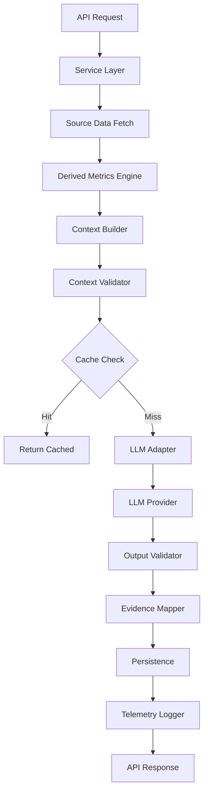
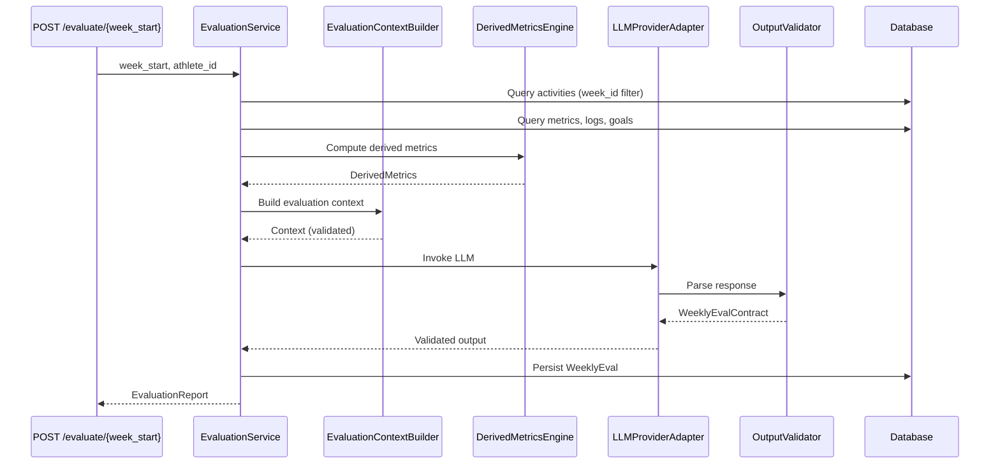
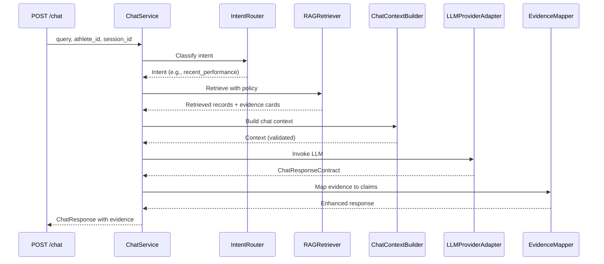

# Design Document: Context Engineering Refactor

## Overview

This design document specifies the technical architecture for transforming the Fitness Coaching Platform's AI subsystem from an ad-hoc implementation into a formal Context Engineering (CE) architecture. The refactor introduces structured prompt management, typed context building, intent-aware retrieval, output validation, evidence traceability, and comprehensive telemetry.

### Design Goals

1. **Separation of Concerns**: Decouple prompt templates, context assembly, LLM invocation, and output validation into distinct, testable components
2. **Versioned Artifacts**: Enable rollback and A/B testing through versioned system instructions, task templates, and domain knowledge
3. **Type Safety**: Enforce contracts using Pydantic v2 schemas for inputs, outputs, and intermediate data structures
4. **Evidence Traceability**: Link every AI claim to source database records for verification and debugging
5. **Observability**: Capture invocation telemetry (token counts, latency, model used) for performance monitoring
6. **Maintainability**: Replace string concatenation and embedded logic with declarative YAML configs and Jinja2 templates

### System Context

The Fitness Coaching Platform provides AI-powered coaching through two primary operations:

1. **Weekly Evaluation**: Analyzes athlete's training week (activities, metrics, logs) and generates structured assessment with scores, strengths, areas for improvement, and recommendations
2. **Coach Chat**: Responds to athlete queries by retrieving relevant historical data and providing contextual answers

Current implementation issues:
- Prompts embedded as string literals in service code
- Context building scattered across multiple services
- No systematic evidence linking between AI claims and source data
- Week_ID bug causing incorrect activity filtering
- No telemetry for debugging LLM performance issues
- Tight coupling between services and LLM invocation logic

### Architecture Principles

1. **Layered Prompts**: System instructions (persona/behavior) separate from task instructions (analytical objectives)
2. **Intent-Driven Retrieval**: Classify queries into intents (recent_performance, trend_analysis, etc.) with tailored retrieval policies
3. **Derived-First**: Compute metrics deterministically before LLM invocation to reduce hallucination
4. **Fail-Fast Validation**: Validate context completeness and output schemas with explicit error handling
5. **Model Agnostic**: Abstract LLM provider details behind adapter interface supporting Mixtral and Llama backends


## Architecture

### Module Structure

The new `app/ai/` module organizes Context Engineering components into 9 subdirectories:

```
app/ai/
├── __init__.py
├── contracts/          # Pydantic input/output schemas
│   ├── __init__.py
│   ├── evaluation_contract.py
│   ├── chat_contract.py
│   └── evidence_card.py
├── prompts/            # Versioned Jinja2 templates
│   ├── system/
│   │   ├── coach_persona_v1.0.0.j2
│   │   └── coach_persona_v1.1.0.j2
│   └── tasks/
│       ├── weekly_eval_v1.0.0.j2
│       ├── chat_response_v1.0.0.j2
│       └── goal_analysis_v1.0.0.j2
├── config/             # YAML configuration files
│   ├── domain_knowledge.yaml
│   ├── model_profiles.yaml
│   └── retrieval_policies.yaml
├── context/            # Context builders per operation
│   ├── __init__.py
│   ├── builder.py              # Base ContextBuilder class
│   ├── evaluation_context.py   # EvaluationContextBuilder
│   └── chat_context.py         # ChatContextBuilder
├── retrieval/          # RAG and intent routing
│   ├── __init__.py
│   ├── intent_router.py        # Query intent classification
│   ├── retrieval_policy.py     # Intent-specific retrieval rules
│   ├── rag_retriever.py        # FAISS-based retrieval
│   └── evidence_card.py        # Evidence card generation
├── derived/            # Deterministic metric computation
│   ├── __init__.py
│   ├── metrics_engine.py       # DerivedMetricsEngine
│   ├── completeness_scorer.py  # Data completeness scoring
│   └── confidence_scorer.py    # Hybrid confidence computation
├── adapter/            # LLM provider abstraction
│   ├── __init__.py
│   ├── llm_adapter.py          # LLMProviderAdapter interface
│   └── langchain_adapter.py    # LangChain implementation
├── tools/              # LangChain StructuredTools
│   ├── __init__.py
│   ├── get_recent_activities.py
│   ├── get_athlete_goals.py
│   └── get_weekly_metrics.py
├── validators/         # Context and output validation
│   ├── __init__.py
│   ├── context_validator.py    # Token budget enforcement
│   └── output_validator.py     # Schema validation with retry
└── telemetry/          # Invocation logging
    ├── __init__.py
    ├── invocation_logger.py
    └── invocations.jsonl       # Log file (daily rotation)
```

### Context Pipeline Architecture

The Context Engineering pipeline follows a linear flow from data gathering through LLM invocation to persistence:



**Pipeline Stages**:

1. **Source Data Fetch**: Query database for activities, metrics, logs, goals
2. **Derived Metrics Engine**: Compute weekly aggregates, effort distribution, training load, recovery metrics
3. **Context Builder**: Assemble layered context (system → task → domain → retrieved → conversation)
4. **Context Validator**: Enforce token budgets (3200 eval, 2400 chat), check completeness
5. **Cache Check**: Hash context and check for existing evaluation (skip LLM if found)
6. **LLM Adapter**: Invoke Mixtral (primary) or Llama (fallback) via LangChain
7. **Output Validator**: Parse response against Pydantic schema, retry on failure (max 3 attempts)
8. **Evidence Mapper**: Link AI claims to source record IDs
9. **Persistence**: Store evaluation/response with evidence_data JSONB field
10. **Telemetry Logger**: Write invocation record (tokens, latency, model, success status)

### Data Flow Diagrams

#### Weekly Evaluation Flow



#### Coach Chat Flow




## Components and Interfaces

### 1. Prompt Management

#### System Instructions

**Purpose**: Define AI persona, behavioral constraints, and output format expectations

**Storage**: `app/ai/prompts/system/coach_persona_v{version}.j2`

**Template Structure**:
```jinja2
{# System Instructions v1.0.0 #}
{# Persona Definition #}
You are an expert fitness coach with certifications in:
- Exercise physiology
- Sports nutrition
- Strength and conditioning

{# Behavioral Constraints #}
You MUST:
- Base all assessments on provided data only (no assumptions)
- Provide specific, actionable recommendations
- Reference actual metrics when making claims
- Acknowledge data gaps explicitly

You MUST NOT:
- Provide medical advice
- Make assumptions about athlete's health conditions
- Recommend supplements without context

{# Output Format #}
Respond using the specified output schema with:
- Structured fields (no free-form text blocks)
- Confidence scores for all assessments
- Evidence references for each claim
```

**Configuration Injection**: Variables from `app/ai/config/coach_persona.yaml`:
```yaml
coach_name: "AI Coach"
certifications:
  - "Exercise Physiology"
  - "Sports Nutrition"
tone: "supportive and data-driven"
max_recommendations: 5
```

**Interface**:
```python
class SystemInstructionsLoader:
    def load(self, version: str = "1.0.0") -> str:
        """Load and render system instructions template"""
        
    def list_versions(self) -> List[str]:
        """List available system instruction versions"""
```

#### Task Instructions

**Purpose**: Specify analytical objectives and output schema for each operation type

**Storage**: `app/ai/prompts/tasks/{operation}_v{version}.j2`

**Template Structure** (weekly_eval_v1.0.0.j2):
```jinja2
{# Task: Weekly Evaluation #}
{# Objective #}
Analyze the athlete's training week and generate a comprehensive evaluation report.

{# Input Description #}
You will receive:
- Activities: List of workouts with distance, duration, HR, elevation
- Metrics: Body measurements (weight, body fat, waist, RHR, sleep)
- Logs: Daily nutrition logs (calories, macros, adherence)
- Derived Metrics: Pre-computed aggregates (total distance, effort distribution, training load)
- Goals: Active athlete goals with target dates

{# Analytical Focus #}
Evaluate:
1. Training consistency and volume trends
2. Effort distribution (easy/moderate/hard/max)
3. Recovery adequacy (rest days, consecutive training days)
4. Nutrition adherence and macro balance
5. Progress toward stated goals

{# Output Schema Reference #}
Respond using WeeklyEvalContract schema:
- overall_score: int (0-100)
- strengths: List[str] (min 1, max 5)
- areas_for_improvement: List[str] (min 1, max 5)
- recommendations: List[Recommendation] (priority 1-5, max 5 total)
- confidence_score: float (0.0-1.0)
```

**Runtime Parameters**:
```python
{
    "athlete_id": 123,
    "week_id": "2024-W15",
    "period_start": "2024-04-08",
    "period_end": "2024-04-14"
}
```

**Interface**:
```python
class TaskInstructionsLoader:
    def load(self, operation: str, version: str = "1.0.0", params: Dict[str, Any] = None) -> str:
        """Load and render task instructions with runtime parameters"""
        
    def validate_token_limit(self, rendered: str, max_tokens: int = 800) -> bool:
        """Ensure rendered instructions fit within token budget"""
```

#### Domain Knowledge Layer

**Purpose**: Store sport science reference values as data (not code)

**Storage**: `app/ai/config/domain_knowledge.yaml`

**Schema**:
```yaml
training_zones:
  z1_recovery:
    hr_pct_max: [50, 60]
    rpe: [1, 2]
    description: "Active recovery, very easy effort"
  z2_aerobic:
    hr_pct_max: [60, 70]
    rpe: [3, 4]
    description: "Aerobic base building, conversational pace"
  z3_tempo:
    hr_pct_max: [70, 80]
    rpe: [5, 6]
    description: "Tempo effort, comfortably hard"
  z4_threshold:
    hr_pct_max: [80, 90]
    rpe: [7, 8]
    description: "Lactate threshold, hard effort"
  z5_vo2max:
    hr_pct_max: [90, 100]
    rpe: [9, 10]
    description: "VO2 max intervals, maximum effort"

effort_levels:
  easy:
    zones: ["z1_recovery", "z2_aerobic"]
    target_pct: 80  # 80% of training should be easy
  moderate:
    zones: ["z3_tempo"]
    target_pct: 15
  hard:
    zones: ["z4_threshold"]
    target_pct: 5
  max:
    zones: ["z5_vo2max"]
    target_pct: 0  # Rare, only for specific workouts

recovery_guidelines:
  rest_days_per_week: 1
  max_consecutive_training_days: 6
  hard_sessions_per_week: 2
  recovery_week_frequency: 4  # Every 4th week

nutrition_targets:
  protein_g_per_kg: [1.6, 2.2]
  carbs_pct_calories: [45, 65]
  fat_pct_calories: [20, 35]
```

**Interface**:
```python
@dataclass
class TrainingZone:
    name: str
    hr_pct_max: Tuple[int, int]
    rpe: Tuple[int, int]
    description: str

@dataclass
class DomainKnowledge:
    training_zones: Dict[str, TrainingZone]
    effort_levels: Dict[str, Any]
    recovery_guidelines: Dict[str, int]
    nutrition_targets: Dict[str, Any]

class DomainKnowledgeLoader:
    def load(self) -> DomainKnowledge:
        """Load and validate domain knowledge from YAML"""
        
    def validate_schema(self) -> bool:
        """Validate YAML structure on application startup"""
```

### 2. Context Building

#### ContextBuilder Base Class

**Purpose**: Enforce layered context assembly with token budget validation

**Interface**:
```python
from abc import ABC, abstractmethod
from dataclasses import dataclass
from typing import List, Dict, Any, Optional
import tiktoken

@dataclass
class Context:
    """Structured context object with typed layers"""
    system_instructions: str
    task_instructions: str
    domain_knowledge: Dict[str, Any]
    retrieved_data: List[Dict[str, Any]]
    conversation_history: Optional[List[Dict[str, str]]] = None
    token_count: int = 0
    
    def to_messages(self) -> List[Dict[str, str]]:
        """Convert to LangChain message format"""
        messages = [
            {"role": "system", "content": self.system_instructions},
            {"role": "user", "content": self._format_task_and_data()}
        ]
        if self.conversation_history:
            messages.extend(self.conversation_history)
        return messages
    
    def _format_task_and_data(self) -> str:
        """Format task instructions, domain knowledge, and retrieved data"""
        parts = [
            "# Task Instructions",
            self.task_instructions,
            "",
            "# Domain Knowledge",
            json.dumps(self.domain_knowledge, indent=2),
            "",
            "# Retrieved Data",
            json.dumps(self.retrieved_data, indent=2)
        ]
        return "\n".join(parts)

class ContextBudgetExceeded(Exception):
    """Raised when context exceeds token budget"""
    def __init__(self, actual: int, budget: int):
        self.actual = actual
        self.budget = budget
        super().__init__(f"Context size {actual} exceeds budget {budget}")

class ContextBuilder(ABC):
    """Base class for context builders"""
    
    def __init__(self, token_budget: int):
        self.token_budget = token_budget
        self.encoding = tiktoken.get_encoding("cl100k_base")
        self._system_instructions: Optional[str] = None
        self._task_instructions: Optional[str] = None
        self._domain_knowledge: Optional[Dict] = None
        self._retrieved_data: List[Dict] = []
        self._conversation_history: List[Dict] = []
    
    def add_system_instructions(self, instructions: str) -> 'ContextBuilder':
        """Add system instructions layer"""
        self._system_instructions = instructions
        return self
    
    def add_task_instructions(self, instructions: str) -> 'ContextBuilder':
        """Add task instructions layer"""
        self._task_instructions = instructions
        return self
    
    def add_domain_knowledge(self, knowledge: Dict[str, Any]) -> 'ContextBuilder':
        """Add domain knowledge layer"""
        self._domain_knowledge = knowledge
        return self
    
    def add_retrieved_data(self, data: List[Dict[str, Any]]) -> 'ContextBuilder':
        """Add retrieved data layer"""
        self._retrieved_data.extend(data)
        return self
    
    def add_conversation_history(self, history: List[Dict[str, str]]) -> 'ContextBuilder':
        """Add conversation history (for chat operations)"""
        self._conversation_history = history
        return self
    
    def build(self) -> Context:
        """Build and validate context"""
        # Validate required layers
        if not self._system_instructions:
            raise ValueError("System instructions required")
        if not self._task_instructions:
            raise ValueError("Task instructions required")
        
        # Create context object
        context = Context(
            system_instructions=self._system_instructions,
            task_instructions=self._task_instructions,
            domain_knowledge=self._domain_knowledge or {},
            retrieved_data=self._retrieved_data,
            conversation_history=self._conversation_history if self._conversation_history else None
        )
        
        # Count tokens
        context.token_count = self._count_tokens(context)
        
        # Validate budget
        if context.token_count > self.token_budget:
            raise ContextBudgetExceeded(context.token_count, self.token_budget)
        
        return context
    
    def _count_tokens(self, context: Context) -> int:
        """Count tokens in context using tiktoken"""
        messages = context.to_messages()
        total = 0
        for message in messages:
            # Count tokens in message content
            total += len(self.encoding.encode(message["content"]))
            # Add overhead for message formatting (role, etc.)
            total += 4
        return total
    
    @abstractmethod
    def gather_data(self, **kwargs) -> 'ContextBuilder':
        """Gather operation-specific data (implemented by subclasses)"""
        pass
```

#### EvaluationContextBuilder

**Purpose**: Build context for weekly evaluation operations

**Implementation**:
```python
from datetime import date
from sqlalchemy.orm import Session
from app.models.strava_activity import StravaActivity
from app.models.weekly_measurement import WeeklyMeasurement
from app.models.daily_log import DailyLog
from app.models.athlete_goal import AthleteGoal

class EvaluationContextBuilder(ContextBuilder):
    """Context builder for weekly evaluations"""
    
    def __init__(self, db: Session, token_budget: int = 3200):
        super().__init__(token_budget)
        self.db = db
    
    def gather_data(
        self,
        athlete_id: int,
        week_id: str,
        period_start: date,
        period_end: date
    ) -> 'EvaluationContextBuilder':
        """Gather all data for weekly evaluation"""
        
        # Query activities using week_id field (fixes bug)
        activities = self.db.query(StravaActivity).filter(
            StravaActivity.week_id == week_id
        ).order_by(StravaActivity.start_date).all()
        
        # Query metrics
        metrics = self.db.query(WeeklyMeasurement).filter(
            WeeklyMeasurement.week_start >= period_start,
            WeeklyMeasurement.week_start <= period_end
        ).all()
        
        # Query logs
        logs = self.db.query(DailyLog).filter(
            DailyLog.log_date >= period_start,
            DailyLog.log_date <= period_end
        ).all()
        
        # Query active goals
        goals = self.db.query(AthleteGoal).filter(
            AthleteGoal.athlete_id == athlete_id,
            AthleteGoal.status == "active"
        ).all()
        
        # Format as evidence cards
        activity_cards = [self._format_activity_card(a) for a in activities]
        metric_cards = [self._format_metric_card(m) for m in metrics]
        log_cards = [self._format_log_card(l) for l in logs]
        goal_cards = [self._format_goal_card(g) for g in goals]
        
        # Add to retrieved data
        self.add_retrieved_data(activity_cards + metric_cards + log_cards + goal_cards)
        
        return self
    
    def _format_activity_card(self, activity: StravaActivity) -> Dict[str, Any]:
        """Format activity as evidence card"""
        return {
            "type": "activity",
            "id": activity.id,
            "date": activity.start_date.isoformat(),
            "activity_type": activity.activity_type,
            "distance_km": round(activity.distance_m / 1000, 2) if activity.distance_m else None,
            "duration_min": round(activity.moving_time_s / 60, 1) if activity.moving_time_s else None,
            "elevation_m": activity.elevation_m,
            "avg_hr": activity.avg_hr,
            "max_hr": activity.max_hr
        }
    
    def _format_metric_card(self, metric: WeeklyMeasurement) -> Dict[str, Any]:
        """Format metric as evidence card"""
        return {
            "type": "metric",
            "id": metric.id,
            "week_start": metric.week_start.isoformat(),
            "weight_kg": metric.weight_kg,
            "body_fat_pct": metric.body_fat_pct,
            "waist_cm": metric.waist_cm,
            "rhr_bpm": metric.rhr_bpm,
            "sleep_avg_hrs": metric.sleep_avg_hrs
        }
    
    def _format_log_card(self, log: DailyLog) -> Dict[str, Any]:
        """Format log as evidence card"""
        return {
            "type": "log",
            "id": log.id,
            "date": log.log_date.isoformat(),
            "calories_in": log.calories_in,
            "protein_g": log.protein_g,
            "carbs_g": log.carbs_g,
            "fat_g": log.fat_g,
            "adherence_score": log.adherence_score
        }
    
    def _format_goal_card(self, goal: AthleteGoal) -> Dict[str, Any]:
        """Format goal as evidence card"""
        return {
            "type": "goal",
            "id": goal.id,
            "title": goal.title,
            "target_date": goal.target_date.isoformat() if goal.target_date else None,
            "category": goal.category
        }
```


### 3. Derived Metrics Engine

**Purpose**: Compute calculated metrics deterministically before LLM invocation to reduce hallucination and provide complete analytical context

**Interface**:
```python
from dataclasses import dataclass
from typing import List, Dict
from datetime import date

@dataclass
class DerivedMetrics:
    """Computed metrics for a training week"""
    # Volume metrics
    total_distance_km: float
    total_duration_min: float
    total_elevation_m: float
    activity_count: int
    
    # Effort distribution
    easy_pct: float
    moderate_pct: float
    hard_pct: float
    max_pct: float
    
    # Training load
    training_load: float  # sum of (duration × effort_multiplier)
    
    # Recovery metrics
    rest_days_count: int
    consecutive_training_days: int
    
    # Heart rate analysis
    avg_heart_rate: Optional[float]
    hr_zone_distribution: Dict[str, float]  # z1-z5 percentages
    
    # Completeness indicators
    has_hr_data: bool
    has_power_data: bool
    has_effort_data: bool

class DerivedMetricsEngine:
    """Computes derived metrics from raw activity data"""
    
    def __init__(self, domain_knowledge: DomainKnowledge):
        self.domain_knowledge = domain_knowledge
    
    def compute(
        self,
        activities: List[StravaActivity],
        week_start: date,
        week_end: date
    ) -> DerivedMetrics:
        """Compute all derived metrics for a week"""
        
        # Volume metrics
        total_distance = sum(a.distance_m or 0 for a in activities) / 1000
        total_duration = sum(a.moving_time_s or 0 for a in activities) / 60
        total_elevation = sum(a.elevation_m or 0 for a in activities)
        
        # Effort distribution
        effort_counts = self._compute_effort_distribution(activities)
        total_activities = len(activities)
        
        # Training load
        training_load = self._compute_training_load(activities)
        
        # Recovery metrics
        rest_days, consecutive_days = self._compute_recovery_metrics(
            activities, week_start, week_end
        )
        
        # Heart rate analysis
        avg_hr, hr_zones = self._compute_hr_metrics(activities)
        
        # Completeness
        has_hr = any(a.avg_hr is not None for a in activities)
        has_power = any(getattr(a, 'avg_power', None) is not None for a in activities)
        has_effort = any(getattr(a, 'perceived_exertion', None) is not None for a in activities)
        
        return DerivedMetrics(
            total_distance_km=round(total_distance, 2),
            total_duration_min=round(total_duration, 1),
            total_elevation_m=round(total_elevation, 0),
            activity_count=total_activities,
            easy_pct=round(effort_counts.get('easy', 0) / total_activities * 100, 1) if total_activities > 0 else 0,
            moderate_pct=round(effort_counts.get('moderate', 0) / total_activities * 100, 1) if total_activities > 0 else 0,
            hard_pct=round(effort_counts.get('hard', 0) / total_activities * 100, 1) if total_activities > 0 else 0,
            max_pct=round(effort_counts.get('max', 0) / total_activities * 100, 1) if total_activities > 0 else 0,
            training_load=round(training_load, 1),
            rest_days_count=rest_days,
            consecutive_training_days=consecutive_days,
            avg_heart_rate=round(avg_hr, 1) if avg_hr else None,
            hr_zone_distribution=hr_zones,
            has_hr_data=has_hr,
            has_power_data=has_power,
            has_effort_data=has_effort
        )
    
    def _compute_effort_distribution(self, activities: List[StravaActivity]) -> Dict[str, int]:
        """Classify activities by effort level"""
        effort_counts = {'easy': 0, 'moderate': 0, 'hard': 0, 'max': 0}
        
        for activity in activities:
            if not activity.avg_hr:
                continue
            
            # Classify based on HR zones from domain knowledge
            effort_level = self._classify_effort(activity.avg_hr, activity.max_hr)
            if effort_level:
                effort_counts[effort_level] += 1
        
        return effort_counts
    
    def _classify_effort(self, avg_hr: int, max_hr: Optional[int]) -> Optional[str]:
        """Classify effort level based on heart rate"""
        if not max_hr:
            max_hr = 190  # Default estimate
        
        hr_pct = (avg_hr / max_hr) * 100
        
        # Map to effort levels using domain knowledge
        for level, config in self.domain_knowledge.effort_levels.items():
            for zone_name in config['zones']:
                zone = self.domain_knowledge.training_zones[zone_name]
                if zone.hr_pct_max[0] <= hr_pct <= zone.hr_pct_max[1]:
                    return level
        
        return None
    
    def _compute_training_load(self, activities: List[StravaActivity]) -> float:
        """Compute training load using duration × effort multiplier"""
        effort_multipliers = {
            'easy': 1.0,
            'moderate': 2.0,
            'hard': 3.0,
            'max': 4.0
        }
        
        total_load = 0.0
        for activity in activities:
            duration_min = (activity.moving_time_s or 0) / 60
            effort = self._classify_effort(activity.avg_hr, activity.max_hr) if activity.avg_hr else 'easy'
            multiplier = effort_multipliers.get(effort, 1.0)
            total_load += duration_min * multiplier
        
        return total_load
    
    def _compute_recovery_metrics(
        self,
        activities: List[StravaActivity],
        week_start: date,
        week_end: date
    ) -> Tuple[int, int]:
        """Compute rest days and consecutive training days"""
        # Create set of training dates
        training_dates = {a.start_date.date() for a in activities}
        
        # Count rest days
        total_days = (week_end - week_start).days + 1
        rest_days = total_days - len(training_dates)
        
        # Find longest consecutive training streak
        consecutive = 0
        max_consecutive = 0
        current_date = week_start
        
        while current_date <= week_end:
            if current_date in training_dates:
                consecutive += 1
                max_consecutive = max(max_consecutive, consecutive)
            else:
                consecutive = 0
            current_date += timedelta(days=1)
        
        return rest_days, max_consecutive
    
    def _compute_hr_metrics(
        self,
        activities: List[StravaActivity]
    ) -> Tuple[Optional[float], Dict[str, float]]:
        """Compute average HR and zone distribution"""
        hr_activities = [a for a in activities if a.avg_hr]
        
        if not hr_activities:
            return None, {}
        
        avg_hr = sum(a.avg_hr for a in hr_activities) / len(hr_activities)
        
        # Compute zone distribution
        zone_counts = {f'z{i}': 0 for i in range(1, 6)}
        for activity in hr_activities:
            zone = self._classify_hr_zone(activity.avg_hr, activity.max_hr)
            if zone:
                zone_counts[zone] += 1
        
        # Convert to percentages
        total = len(hr_activities)
        zone_pct = {zone: round(count / total * 100, 1) for zone, count in zone_counts.items()}
        
        return avg_hr, zone_pct
    
    def _classify_hr_zone(self, avg_hr: int, max_hr: Optional[int]) -> Optional[str]:
        """Classify HR into training zone"""
        if not max_hr:
            max_hr = 190
        
        hr_pct = (avg_hr / max_hr) * 100
        
        for zone_name, zone in self.domain_knowledge.training_zones.items():
            if zone.hr_pct_max[0] <= hr_pct <= zone.hr_pct_max[1]:
                return zone_name.split('_')[0]  # Extract z1, z2, etc.
        
        return None
```

### 4. Intent-Aware RAG System

#### Intent Router

**Purpose**: Classify user queries into named intents to enable targeted retrieval policies

**Intent Taxonomy**:
1. **recent_performance**: "How did my last run go?" → Retrieve last 14 days
2. **trend_analysis**: "Am I improving?" → Retrieve last 90 days
3. **goal_progress**: "Am I on track for my marathon?" → Retrieve goals + related activities
4. **recovery_status**: "Should I rest today?" → Retrieve last 7 days + effort scores
5. **training_plan**: "What should I do this week?" → Retrieve goals + recent activities
6. **comparison**: "How does this compare to last month?" → Retrieve specified periods
7. **general**: Fallback for unclear queries → Retrieve last 30 days

**Implementation**:
```python
from enum import Enum
from typing import Dict, Any
import re

class Intent(Enum):
    RECENT_PERFORMANCE = "recent_performance"
    TREND_ANALYSIS = "trend_analysis"
    GOAL_PROGRESS = "goal_progress"
    RECOVERY_STATUS = "recovery_status"
    TRAINING_PLAN = "training_plan"
    COMPARISON = "comparison"
    GENERAL = "general"

class IntentRouter:
    """Classifies user queries into intents"""
    
    def __init__(self):
        # Intent patterns (keyword-based classification)
        self.patterns = {
            Intent.RECENT_PERFORMANCE: [
                r'\b(last|recent|yesterday|today)\b.*\b(run|workout|activity|session)\b',
                r'\bhow did\b.*\b(go|perform)\b',
                r'\b(latest|newest)\b'
            ],
            Intent.TREND_ANALYSIS: [
                r'\b(improving|progress|trend|getting better|getting worse)\b',
                r'\b(over time|past month|past weeks)\b',
                r'\bcompare.*\b(week|month)\b'
            ],
            Intent.GOAL_PROGRESS: [
                r'\b(goal|target|marathon|race|event)\b',
                r'\bon track\b',
                r'\bready for\b'
            ],
            Intent.RECOVERY_STATUS: [
                r'\b(rest|recover|tired|fatigue|sore)\b',
                r'\bshould i\b.*\b(rest|train)\b',
                r'\b(ready|prepared)\b.*\b(workout|training)\b'
            ],
            Intent.TRAINING_PLAN: [
                r'\bwhat should\b.*\b(do|train)\b',
                r'\b(plan|schedule|next)\b.*\b(week|workout)\b',
                r'\brecommend\b'
            ],
            Intent.COMPARISON: [
                r'\bcompare\b',
                r'\b(vs|versus|compared to)\b',
                r'\b(better|worse) than\b'
            ]
        }
    
    def classify(self, query: str) -> Intent:
        """Classify query into intent"""
        query_lower = query.lower()
        
        # Check patterns in priority order
        for intent, patterns in self.patterns.items():
            for pattern in patterns:
                if re.search(pattern, query_lower):
                    return intent
        
        # Default to general
        return Intent.GENERAL
    
    def get_retrieval_policy(self, intent: Intent) -> Dict[str, Any]:
        """Get retrieval policy for intent"""
        policies = {
            Intent.RECENT_PERFORMANCE: {
                "days_back": 14,
                "max_activities": 20,
                "include_goals": False,
                "include_metrics": True
            },
            Intent.TREND_ANALYSIS: {
                "days_back": 90,
                "max_activities": 50,
                "include_goals": True,
                "include_metrics": True
            },
            Intent.GOAL_PROGRESS: {
                "days_back": 180,
                "max_activities": 30,
                "include_goals": True,
                "include_metrics": False
            },
            Intent.RECOVERY_STATUS: {
                "days_back": 7,
                "max_activities": 10,
                "include_goals": False,
                "include_metrics": True
            },
            Intent.TRAINING_PLAN: {
                "days_back": 30,
                "max_activities": 20,
                "include_goals": True,
                "include_metrics": False
            },
            Intent.COMPARISON: {
                "days_back": 60,
                "max_activities": 40,
                "include_goals": False,
                "include_metrics": True
            },
            Intent.GENERAL: {
                "days_back": 30,
                "max_activities": 20,
                "include_goals": True,
                "include_metrics": True
            }
        }
        
        return policies[intent]
```

#### RAG Retriever

**Purpose**: Retrieve relevant athlete data using FAISS vector search with intent-specific policies

**Implementation**:
```python
from datetime import datetime, timedelta
from typing import List, Dict, Any
from sqlalchemy.orm import Session

class RAGRetriever:
    """Retrieves relevant data using FAISS and intent policies"""
    
    def __init__(self, db: Session, rag_system: RAGSystem):
        self.db = db
        self.rag_system = rag_system
    
    def retrieve(
        self,
        query: str,
        athlete_id: int,
        intent: Intent,
        policy: Dict[str, Any]
    ) -> List[Dict[str, Any]]:
        """Retrieve data according to intent policy"""
        
        # Calculate date range
        end_date = datetime.now().date()
        start_date = end_date - timedelta(days=policy['days_back'])
        
        # Retrieve activities
        activities = self.db.query(StravaActivity).filter(
            StravaActivity.start_date >= datetime.combine(start_date, datetime.min.time()),
            StravaActivity.start_date <= datetime.combine(end_date, datetime.max.time())
        ).order_by(StravaActivity.start_date.desc()).limit(policy['max_activities']).all()
        
        evidence_cards = []
        
        # Add activity cards
        for activity in activities:
            evidence_cards.append({
                "type": "activity",
                "source_id": activity.id,
                "source_date": activity.start_date.isoformat(),
                "relevance_score": 1.0,  # Direct query match
                "data": {
                    "activity_type": activity.activity_type,
                    "distance_km": round(activity.distance_m / 1000, 2) if activity.distance_m else None,
                    "duration_min": round(activity.moving_time_s / 60, 1) if activity.moving_time_s else None,
                    "avg_hr": activity.avg_hr
                }
            })
        
        # Add goals if policy requires
        if policy['include_goals']:
            goals = self.db.query(AthleteGoal).filter(
                AthleteGoal.athlete_id == athlete_id,
                AthleteGoal.status == "active"
            ).all()
            
            for goal in goals:
                evidence_cards.append({
                    "type": "goal",
                    "source_id": goal.id,
                    "source_date": goal.created_at.isoformat(),
                    "relevance_score": 0.9,
                    "data": {
                        "title": goal.title,
                        "target_date": goal.target_date.isoformat() if goal.target_date else None,
                        "category": goal.category
                    }
                })
        
        # Add metrics if policy requires
        if policy['include_metrics']:
            metrics = self.db.query(WeeklyMeasurement).filter(
                WeeklyMeasurement.week_start >= start_date,
                WeeklyMeasurement.week_start <= end_date
            ).order_by(WeeklyMeasurement.week_start.desc()).limit(4).all()
            
            for metric in metrics:
                evidence_cards.append({
                    "type": "metric",
                    "source_id": metric.id,
                    "source_date": metric.week_start.isoformat(),
                    "relevance_score": 0.8,
                    "data": {
                        "weight_kg": metric.weight_kg,
                        "rhr_bpm": metric.rhr_bpm,
                        "sleep_avg_hrs": metric.sleep_avg_hrs
                    }
                })
        
        # Limit total cards to respect token budget
        return evidence_cards[:20]
```


### 5. LLM Provider Adapter

**Purpose**: Abstract LLM provider details to support multiple backends (Mixtral, Llama) with automatic fallback

**Interface**:
```python
from abc import ABC, abstractmethod
from typing import Dict, Any, Optional
from dataclasses import dataclass

@dataclass
class LLMConfig:
    """LLM configuration"""
    model_name: str
    temperature: float
    max_tokens: int
    top_p: float = 0.9
    timeout_seconds: int = 30

@dataclass
class LLMResponse:
    """LLM response with metadata"""
    content: Dict[str, Any]  # Parsed structured output
    model_used: str
    tokens_used: int
    latency_ms: int

class LLMProviderAdapter(ABC):
    """Abstract LLM provider interface"""
    
    @abstractmethod
    async def invoke(
        self,
        context: Context,
        output_contract: Type[BaseModel],
        config: LLMConfig
    ) -> LLMResponse:
        """Invoke LLM with context and output schema"""
        pass

class LangChainAdapter(LLMProviderAdapter):
    """LangChain-based LLM adapter with fallback support"""
    
    def __init__(self, primary_model: str = "mixtral:8x7b-instruct", fallback_model: str = "llama3.1:8b-instruct"):
        self.primary_model = primary_model
        self.fallback_model = fallback_model
        self.ollama_endpoint = "http://localhost:11434"
    
    async def invoke(
        self,
        context: Context,
        output_contract: Type[BaseModel],
        config: LLMConfig
    ) -> LLMResponse:
        """Invoke LLM with automatic fallback"""
        
        # Try primary model first
        try:
            return await self._invoke_model(
                context,
                output_contract,
                config,
                self.primary_model
            )
        except (TimeoutError, ConnectionError) as e:
            logger.warning(f"Primary model {self.primary_model} failed: {e}, falling back to {self.fallback_model}")
            
            # Fallback to secondary model
            return await self._invoke_model(
                context,
                output_contract,
                config,
                self.fallback_model
            )
    
    async def _invoke_model(
        self,
        context: Context,
        output_contract: Type[BaseModel],
        config: LLMConfig,
        model_name: str
    ) -> LLMResponse:
        """Invoke specific model"""
        from langchain_ollama import ChatOllama
        import time
        
        start_time = time.time()
        
        # Create LLM instance
        llm = ChatOllama(
            base_url=self.ollama_endpoint,
            model=model_name,
            temperature=config.temperature,
            num_predict=config.max_tokens
        )
        
        # Bind structured output
        llm_with_structure = llm.with_structured_output(output_contract)
        
        # Convert context to messages
        messages = context.to_messages()
        
        # Invoke
        result = await llm_with_structure.ainvoke(messages)
        
        # Calculate latency
        latency_ms = int((time.time() - start_time) * 1000)
        
        # Estimate tokens (rough approximation)
        tokens_used = context.token_count + len(str(result)) // 4
        
        return LLMResponse(
            content=result.model_dump(),
            model_used=model_name,
            tokens_used=tokens_used,
            latency_ms=latency_ms
        )
```

### 6. Output Validation

**Purpose**: Validate LLM responses against Pydantic schemas with retry logic

**Contracts**:
```python
from pydantic import BaseModel, Field, field_validator
from typing import List, Optional

class Recommendation(BaseModel):
    """Single recommendation with priority"""
    text: str = Field(..., min_length=10, max_length=500)
    priority: int = Field(..., ge=1, le=5)
    category: str = Field(..., pattern="^(training|nutrition|recovery|mindset)$")

class WeeklyEvalContract(BaseModel):
    """Output contract for weekly evaluations"""
    overall_score: int = Field(..., ge=0, le=100, description="Overall performance score")
    strengths: List[str] = Field(..., min_length=1, max_length=5, description="Specific achievements")
    areas_for_improvement: List[str] = Field(..., min_length=1, max_length=5, description="Areas needing attention")
    recommendations: List[Recommendation] = Field(..., max_length=5, description="Actionable recommendations")
    confidence_score: float = Field(..., ge=0.0, le=1.0, description="Hybrid confidence score")
    
    @field_validator('strengths', 'areas_for_improvement')
    @classmethod
    def validate_list_items(cls, v: List[str]) -> List[str]:
        """Ensure list items are non-empty and reasonable length"""
        for item in v:
            if len(item) < 10:
                raise ValueError(f"Item too short: {item}")
            if len(item) > 500:
                raise ValueError(f"Item too long: {item}")
        return v

class EvidenceCard(BaseModel):
    """Evidence linking claim to source"""
    claim_text: str = Field(..., description="Specific claim from AI response")
    source_type: str = Field(..., pattern="^(activity|goal|metric|log)$")
    source_id: int = Field(..., description="Database record ID")
    source_date: str = Field(..., description="ISO date of source record")
    relevance_score: float = Field(..., ge=0.0, le=1.0)

class ChatResponseContract(BaseModel):
    """Output contract for chat responses"""
    response_text: str = Field(..., min_length=20, max_length=2000)
    evidence_cards: List[EvidenceCard] = Field(default_factory=list, max_length=10)
    confidence_score: float = Field(..., ge=0.0, le=1.0)
    follow_up_suggestions: List[str] = Field(default_factory=list, max_length=3)
```

**Validator**:
```python
from pydantic import ValidationError
from typing import Type, TypeVar

T = TypeVar('T', bound=BaseModel)

class OutputValidator:
    """Validates LLM outputs with retry logic"""
    
    def __init__(self, max_retries: int = 3):
        self.max_retries = max_retries
    
    async def validate(
        self,
        raw_output: Dict[str, Any],
        contract: Type[T]
    ) -> T:
        """Validate output against contract"""
        try:
            return contract(**raw_output)
        except ValidationError as e:
            logger.error(f"Output validation failed: {e.errors()}")
            raise ValueError(f"Schema validation failed: {e.errors()}")
    
    async def validate_with_retry(
        self,
        llm_adapter: LLMProviderAdapter,
        context: Context,
        contract: Type[T],
        config: LLMConfig
    ) -> T:
        """Validate with retry on failure"""
        
        for attempt in range(self.max_retries):
            try:
                response = await llm_adapter.invoke(context, contract, config)
                validated = await self.validate(response.content, contract)
                return validated
            except ValueError as e:
                if attempt == self.max_retries - 1:
                    raise
                
                logger.warning(f"Validation failed (attempt {attempt + 1}/{self.max_retries}): {e}")
                
                # Add schema guidance to context for retry
                context.add_conversation_history([
                    {"role": "assistant", "content": "Schema validation failed"},
                    {"role": "user", "content": f"Please ensure response matches: {contract.model_json_schema()}"}
                ])
```

### 7. Confidence Scoring

**Purpose**: Compute hybrid confidence scores combining system metrics (70%) and LLM self-assessment (30%)

**Implementation**:
```python
from dataclasses import dataclass
from typing import List, Dict, Any
from datetime import datetime, timedelta

@dataclass
class ConfidenceComponents:
    """Components of confidence score"""
    data_completeness: float  # 0.0-1.0
    data_recency: float       # 0.0-1.0
    retrieval_quality: float  # 0.0-1.0
    system_confidence: float  # Weighted average
    llm_confidence: float     # LLM self-assessment
    final_confidence: float   # Hybrid score

class ConfidenceScorer:
    """Computes hybrid confidence scores"""
    
    def compute(
        self,
        derived_metrics: DerivedMetrics,
        evidence_cards: List[Dict[str, Any]],
        last_activity_date: Optional[datetime],
        llm_confidence: float
    ) -> ConfidenceComponents:
        """Compute confidence score components"""
        
        # Data completeness (40% weight)
        completeness = self._compute_completeness(derived_metrics)
        
        # Data recency (30% weight)
        recency = self._compute_recency(last_activity_date)
        
        # Retrieval quality (30% weight)
        retrieval = self._compute_retrieval_quality(evidence_cards)
        
        # System confidence (weighted average)
        system_conf = (
            completeness * 0.4 +
            recency * 0.3 +
            retrieval * 0.3
        )
        
        # Final hybrid confidence (70% system, 30% LLM)
        final_conf = system_conf * 0.7 + llm_confidence * 0.3
        
        return ConfidenceComponents(
            data_completeness=completeness,
            data_recency=recency,
            retrieval_quality=retrieval,
            system_confidence=system_conf,
            llm_confidence=llm_confidence,
            final_confidence=final_conf
        )
    
    def _compute_completeness(self, metrics: DerivedMetrics) -> float:
        """Score data completeness"""
        score = 0.0
        
        # Heart rate data (40%)
        if metrics.has_hr_data:
            score += 0.4
        
        # Power data (30%)
        if metrics.has_power_data:
            score += 0.3
        
        # Effort data (30%)
        if metrics.has_effort_data:
            score += 0.3
        
        return min(score, 1.0)
    
    def _compute_recency(self, last_activity_date: Optional[datetime]) -> float:
        """Score data recency"""
        if not last_activity_date:
            return 0.4
        
        days_since = (datetime.now() - last_activity_date).days
        
        if days_since <= 7:
            return 1.0
        elif days_since <= 14:
            return 0.7
        else:
            return 0.4
    
    def _compute_retrieval_quality(self, evidence_cards: List[Dict[str, Any]]) -> float:
        """Score retrieval quality based on evidence card count"""
        count = len(evidence_cards)
        
        if count >= 5:
            return 1.0
        elif count >= 3:
            return 0.7
        elif count >= 1:
            return 0.4
        else:
            return 0.0
```

### 8. Evidence Mapping

**Purpose**: Link AI claims to source database records for verification

**Implementation**:
```python
from typing import List, Dict, Any
import re

class EvidenceMapper:
    """Maps AI claims to source evidence"""
    
    def map_evidence(
        self,
        response: Dict[str, Any],
        evidence_cards: List[Dict[str, Any]]
    ) -> Dict[str, Any]:
        """Enhance response with evidence mappings"""
        
        # Extract claims from response
        claims = self._extract_claims(response)
        
        # Match claims to evidence cards
        mapped_evidence = []
        for claim in claims:
            matching_cards = self._find_matching_evidence(claim, evidence_cards)
            for card in matching_cards:
                mapped_evidence.append({
                    "claim_text": claim,
                    "source_type": card["type"],
                    "source_id": card["source_id"],
                    "source_date": card["source_date"],
                    "relevance_score": card["relevance_score"]
                })
        
        # Add evidence to response
        response["evidence_data"] = mapped_evidence
        return response
    
    def _extract_claims(self, response: Dict[str, Any]) -> List[str]:
        """Extract specific claims from response"""
        claims = []
        
        # Extract from strengths
        if "strengths" in response:
            claims.extend(response["strengths"])
        
        # Extract from areas_for_improvement
        if "areas_for_improvement" in response:
            claims.extend(response["areas_for_improvement"])
        
        # Extract from recommendations
        if "recommendations" in response:
            claims.extend([r["text"] for r in response["recommendations"]])
        
        return claims
    
    def _find_matching_evidence(
        self,
        claim: str,
        evidence_cards: List[Dict[str, Any]]
    ) -> List[Dict[str, Any]]:
        """Find evidence cards matching claim"""
        matches = []
        claim_lower = claim.lower()
        
        for card in evidence_cards:
            # Check if claim references this evidence
            if self._claim_references_evidence(claim_lower, card):
                matches.append(card)
        
        return matches[:3]  # Limit to top 3 matches
    
    def _claim_references_evidence(self, claim: str, card: Dict[str, Any]) -> bool:
        """Check if claim references evidence card"""
        card_type = card["type"]
        
        # Activity references
        if card_type == "activity":
            activity_keywords = ["run", "workout", "activity", "session", "training"]
            if any(kw in claim for kw in activity_keywords):
                return True
        
        # Metric references
        elif card_type == "metric":
            metric_keywords = ["weight", "body fat", "rhr", "sleep", "measurement"]
            if any(kw in claim for kw in metric_keywords):
                return True
        
        # Goal references
        elif card_type == "goal":
            goal_keywords = ["goal", "target", "marathon", "race", "event"]
            if any(kw in claim for kw in goal_keywords):
                return True
        
        # Log references
        elif card_type == "log":
            log_keywords = ["nutrition", "calories", "protein", "carbs", "adherence"]
            if any(kw in claim for kw in log_keywords):
                return True
        
        return False
```

### 9. Telemetry

**Purpose**: Log invocation metadata for performance monitoring and debugging

**Implementation**:
```python
import json
import logging
from datetime import datetime
from pathlib import Path
from typing import Dict, Any, Optional

class InvocationLogger:
    """Logs LLM invocations to JSONL"""
    
    def __init__(self, log_dir: str = "app/ai/telemetry"):
        self.log_dir = Path(log_dir)
        self.log_dir.mkdir(parents=True, exist_ok=True)
    
    def log_invocation(
        self,
        operation_type: str,
        athlete_id: int,
        model_used: str,
        context_token_count: int,
        response_token_count: int,
        latency_ms: int,
        success: bool,
        error_message: Optional[str] = None
    ) -> None:
        """Log invocation record"""
        
        record = {
            "timestamp": datetime.now().isoformat(),
            "operation_type": operation_type,
            "athlete_id": athlete_id,
            "model_used": model_used,
            "context_token_count": context_token_count,
            "response_token_count": response_token_count,
            "total_tokens": context_token_count + response_token_count,
            "latency_ms": latency_ms,
            "success": success,
            "error_message": error_message
        }
        
        # Write to daily log file
        log_file = self.log_dir / f"invocations_{datetime.now().strftime('%Y-%m-%d')}.jsonl"
        with open(log_file, 'a') as f:
            f.write(json.dumps(record) + '\n')
    
    def rotate_logs(self, keep_days: int = 30) -> None:
        """Delete log files older than keep_days"""
        cutoff = datetime.now() - timedelta(days=keep_days)
        
        for log_file in self.log_dir.glob("invocations_*.jsonl"):
            # Extract date from filename
            date_str = log_file.stem.split('_')[1]
            file_date = datetime.strptime(date_str, '%Y-%m-%d')
            
            if file_date < cutoff:
                log_file.unlink()
                logger.info(f"Deleted old log file: {log_file}")
```


## Data Models

### Database Schema Changes

#### WeeklyEval Model (Existing - No Changes Required)

The existing `WeeklyEval` model already supports the evidence_data field:

```python
class WeeklyEval(Base, TimestampMixin):
    __tablename__ = 'weekly_evals'
    
    id: str = Column(String(36), primary_key=True)
    week_id: str = Column(String(36), nullable=False, unique=True)
    input_hash: str = Column(String(64), nullable=False)
    llm_model: str = Column(String(100), nullable=True)
    raw_llm_response: str = Column(String, nullable=True)
    parsed_output_json: dict = Column(JSON, nullable=True)
    generated_at: datetime = Column(DateTime, nullable=True)
    evidence_map_json: dict = Column(JSON, nullable=True)  # Stores evidence cards
```

**Backward Compatibility**: Existing records with `evidence_map_json = null` remain valid and readable.

#### StravaActivity Model Enhancement

**Required Change**: Add `week_id` field and index for correct weekly filtering

```python
class StravaActivity(Base, TimestampMixin):
    __tablename__ = 'strava_activities'
    
    # ... existing fields ...
    
    week_id: str = Column(String(8), nullable=True, index=True)  # Format: YYYY-WW
```

**Migration Script**:
```python
# alembic/versions/xxx_add_week_id_to_activities.py

def upgrade():
    # Add week_id column
    op.add_column('strava_activities', sa.Column('week_id', sa.String(8), nullable=True))
    
    # Backfill week_id from start_date
    connection = op.get_bind()
    connection.execute("""
        UPDATE strava_activities
        SET week_id = strftime('%Y-W%W', start_date)
        WHERE week_id IS NULL
    """)
    
    # Create index
    op.create_index('ix_strava_activities_week_id', 'strava_activities', ['week_id'])

def downgrade():
    op.drop_index('ix_strava_activities_week_id')
    op.drop_column('strava_activities', 'week_id')
```

### Configuration Files

#### domain_knowledge.yaml

```yaml
# Sport science reference values
training_zones:
  z1_recovery:
    hr_pct_max: [50, 60]
    rpe: [1, 2]
    description: "Active recovery, very easy effort"
    
  z2_aerobic:
    hr_pct_max: [60, 70]
    rpe: [3, 4]
    description: "Aerobic base building, conversational pace"
    
  z3_tempo:
    hr_pct_max: [70, 80]
    rpe: [5, 6]
    description: "Tempo effort, comfortably hard"
    
  z4_threshold:
    hr_pct_max: [80, 90]
    rpe: [7, 8]
    description: "Lactate threshold, hard effort"
    
  z5_vo2max:
    hr_pct_max: [90, 100]
    rpe: [9, 10]
    description: "VO2 max intervals, maximum effort"

effort_levels:
  easy:
    zones: ["z1_recovery", "z2_aerobic"]
    target_pct: 80
    multiplier: 1.0
    
  moderate:
    zones: ["z3_tempo"]
    target_pct: 15
    multiplier: 2.0
    
  hard:
    zones: ["z4_threshold"]
    target_pct: 5
    multiplier: 3.0
    
  max:
    zones: ["z5_vo2max"]
    target_pct: 0
    multiplier: 4.0

recovery_guidelines:
  rest_days_per_week: 1
  max_consecutive_training_days: 6
  hard_sessions_per_week: 2
  recovery_week_frequency: 4

nutrition_targets:
  protein_g_per_kg: [1.6, 2.2]
  carbs_pct_calories: [45, 65]
  fat_pct_calories: [20, 35]
  calorie_deficit_max_pct: 20
```

#### model_profiles.yaml

```yaml
# LLM model configurations
models:
  mixtral:
    name: "mixtral:8x7b-instruct"
    provider: "ollama"
    temperature: 0.1
    max_tokens: 2048
    timeout_seconds: 30
    use_cases: ["evaluation", "chat"]
    
  llama:
    name: "llama3.1:8b-instruct"
    provider: "ollama"
    temperature: 0.1
    max_tokens: 2048
    timeout_seconds: 30
    use_cases: ["evaluation", "chat"]

operations:
  weekly_evaluation:
    primary_model: "mixtral"
    fallback_model: "llama"
    token_budget: 3200
    temperature: 0.1
    system_version: "1.0.0"
    task_version: "1.0.0"
    
  coach_chat:
    primary_model: "mixtral"
    fallback_model: "llama"
    token_budget: 2400
    temperature: 0.7
    system_version: "1.0.0"
    task_version: "1.0.0"
```

#### retrieval_policies.yaml

```yaml
# Intent-specific retrieval policies
intents:
  recent_performance:
    days_back: 14
    max_activities: 20
    include_goals: false
    include_metrics: true
    include_logs: true
    
  trend_analysis:
    days_back: 90
    max_activities: 50
    include_goals: true
    include_metrics: true
    include_logs: false
    
  goal_progress:
    days_back: 180
    max_activities: 30
    include_goals: true
    include_metrics: false
    include_logs: false
    
  recovery_status:
    days_back: 7
    max_activities: 10
    include_goals: false
    include_metrics: true
    include_logs: true
    
  training_plan:
    days_back: 30
    max_activities: 20
    include_goals: true
    include_metrics: false
    include_logs: false
    
  comparison:
    days_back: 60
    max_activities: 40
    include_goals: false
    include_metrics: true
    include_logs: false
    
  general:
    days_back: 30
    max_activities: 20
    include_goals: true
    include_metrics: true
    include_logs: true
```


## Correctness Properties

*A property is a characteristic or behavior that should hold true across all valid executions of a system—essentially, a formal statement about what the system should do. Properties serve as the bridge between human-readable specifications and machine-verifiable correctness guarantees.*

### Acceptance Criteria Testing Prework

Before defining correctness properties, I analyzed each acceptance criterion to determine testability:

**Phase 1: Foundation Layer**

1.1.1 System instructions stored in versioned Jinja2 templates
  Thoughts: This is about file organization and storage format. We can test that files exist at expected paths and have valid Jinja2 syntax.
  Testable: yes - example

1.1.2 System instruction validation for required sections
  Thoughts: This is a rule that should apply to all system instruction templates. We can generate random templates and validate they contain required sections.
  Testable: yes - property

1.1.3 Multiple instruction versions with semantic versioning
  Thoughts: This is about file naming conventions and version management. We can test that version parsing works correctly.
  Testable: yes - property

1.1.4 Configuration variable injection from YAML
  Thoughts: This is about template rendering with variables. We can test that all variables in templates are properly substituted.
  Testable: yes - property

1.1.5 Logging of system instruction version used
  Thoughts: This is about telemetry. We can test that invocation logs contain version information.
  Testable: yes - property

1.2.1 Task instructions organized by operation type
  Thoughts: This is about file organization. We can test that files exist at expected paths.
  Testable: yes - example

1.2.2 Task instruction loading by operation type
  Thoughts: This is about the loader interface. We can test that requesting an operation type returns the correct template.
  Testable: yes - property

1.2.3 Task instruction rendering with runtime parameters
  Thoughts: This is template rendering. We can test that parameters are properly injected.
  Testable: yes - property

1.2.4 Task instruction validation for required fields
  Thoughts: This is a rule for all task templates. We can validate structure.
  Testable: yes - property

1.2.5 Maximum rendered size of 800 tokens
  Thoughts: This is a constraint that should hold for all rendered templates. We can test token counting.
  Testable: yes - property

1.3.1 Domain knowledge loaded from YAML
  Thoughts: This is about file loading. We can test that the loader returns structured data.
  Testable: yes - example

1.3.2-1.3.4 Domain knowledge includes specific sections
  Thoughts: These are structural requirements. We can validate schema.
  Testable: yes - property (combined)

1.3.5 Domain knowledge returned as structured data
  Thoughts: This is about the return type. We can test type validation.
  Testable: yes - property

1.3.6 Domain knowledge schema validation on startup
  Thoughts: This is about startup validation. We can test that invalid YAML is rejected.
  Testable: yes - property

**Phase 2: Context Building & RAG**

2.1.1 Query classification into seven intents
  Thoughts: This is about the intent router. We can test that all queries map to one of the seven intents.
  Testable: yes - property

2.1.2-2.1.5 Intent-specific retrieval policies
  Thoughts: These are rules for each intent. We can test that each intent triggers correct retrieval.
  Testable: yes - property (one per intent)

2.1.6 Activity limit of 20 records
  Thoughts: This is a constraint on retrieval. We can test that results never exceed 20.
  Testable: yes - property

2.1.7 Evidence card generation for retrieved activities
  Thoughts: This is a rule for all retrievals. We can test that evidence cards are created.
  Testable: yes - property

2.2.1 ContextBuilder base class provided
  Thoughts: This is about class existence. We can test that the class is importable.
  Testable: yes - example

2.2.2 ContextBuilder implements required methods
  Thoughts: This is about interface compliance. We can test that methods exist.
  Testable: yes - example

2.2.3 Layer ordering enforcement
  Thoughts: This is a rule for context building. We can test that layers are ordered correctly.
  Testable: yes - property

2.2.4 Token budget validation
  Thoughts: This is a constraint. We can test that exceeding budget raises exception.
  Testable: yes - property

2.2.5 ContextBudgetExceeded exception with details
  Thoughts: This is about error handling. We can test exception properties.
  Testable: yes - property

2.2.6 Structured Context object returned
  Thoughts: This is about return type. We can test type validation.
  Testable: yes - property

2.3.1-2.3.4 Derived metrics computation
  Thoughts: These are calculations. We can test that metrics are computed correctly for known inputs.
  Testable: yes - property (one per metric type)

2.3.5 Week_ID field usage for filtering
  Thoughts: This is the bug fix. We can test that queries use week_id field.
  Testable: yes - property

2.3.6 DerivedMetrics dataclass with all fields
  Thoughts: This is about data structure. We can test that all fields are populated.
  Testable: yes - property

**Phase 3: LLM Integration & Output Contracts**

3.1.1-3.1.2 Model backend support and default
  Thoughts: This is about adapter configuration. We can test that both models are supported.
  Testable: yes - example

3.1.3 Automatic fallback on failure
  Thoughts: This is error handling behavior. We can test that failures trigger fallback.
  Testable: yes - property

3.1.4 LangChain ChatOllama interface usage
  Thoughts: This is about implementation detail. We can test that the correct class is used.
  Testable: yes - example

3.1.5 Model configuration parameters
  Thoughts: This is about parameter passing. We can test that models are configured correctly.
  Testable: yes - property

3.1.6 Model logging
  Thoughts: This is telemetry. We can test that logs contain model information.
  Testable: yes - property

3.1.7 Unified invoke() method
  Thoughts: This is about interface. We can test that the method exists and accepts correct parameters.
  Testable: yes - example

3.2.1 Output contracts as Pydantic v2 models
  Thoughts: This is about file organization. We can test that contracts exist.
  Testable: yes - example

3.2.2-3.2.3 Specific contract definitions
  Thoughts: These are schema definitions. We can test that contracts have required fields.
  Testable: yes - example

3.2.4 Response parsing against contract
  Thoughts: This is validation behavior. We can test that parsing works.
  Testable: yes - property

3.2.5 OutputValidationError on parsing failure
  Thoughts: This is error handling. We can test that invalid responses raise errors.
  Testable: yes - property

3.2.6 with_structured_output() usage
  Thoughts: This is implementation detail. We can test that the method is called.
  Testable: yes - example

3.2.7 Confidence score validation
  Thoughts: This is a constraint. We can test that scores are in valid range.
  Testable: yes - property

3.3.1 Hybrid confidence score computation
  Thoughts: This is a calculation. We can test the weighted average formula.
  Testable: yes - property

3.3.2-3.3.5 System confidence components
  Thoughts: These are calculations. We can test each component.
  Testable: yes - property (one per component)

3.3.6 LLM self-assessment prompting
  Thoughts: This is about prompt content. We can test that prompts request confidence.
  Testable: yes - example

3.3.7 Weighted average combination
  Thoughts: This is a calculation. We can test the formula.
  Testable: yes - property

**Phase 4: Evidence & Telemetry**

4.1.1 Evidence card generation for claims
  Thoughts: This is a rule for all responses. We can test that cards are generated.
  Testable: yes - property

4.1.2 Evidence card field requirements
  Thoughts: This is schema validation. We can test that cards have required fields.
  Testable: yes - property

4.1.3-4.1.4 Evidence card creation and association
  Thoughts: These are about the mapping process. We can test that cards are created and linked.
  Testable: yes - property

4.1.5 Evidence storage in JSONB field
  Thoughts: This is about persistence. We can test that data is stored correctly.
  Testable: yes - property

4.1.6 Backward compatibility
  Thoughts: This is about handling null values. We can test that old records are readable.
  Testable: yes - property

4.1.7 Source ID validation
  Thoughts: This is referential integrity. We can test that IDs reference existing records.
  Testable: yes - property

4.2.1 Invocation record logging
  Thoughts: This is telemetry. We can test that records are created.
  Testable: yes - property

4.2.2 Invocation log field requirements
  Thoughts: This is schema validation. We can test that logs have required fields.
  Testable: yes - property

4.2.3 Log writing to JSONL
  Thoughts: This is about file format. We can test that logs are valid JSONL.
  Testable: yes - property

4.2.4 Error logging on failure
  Thoughts: This is error handling. We can test that failures are logged.
  Testable: yes - property

4.2.5 Token counting with tiktoken
  Thoughts: This is about the counting method. We can test that tiktoken is used.
  Testable: yes - example

4.2.6 Latency measurement
  Thoughts: This is timing. We can test that latency is measured.
  Testable: yes - property

4.2.7 Daily log rotation
  Thoughts: This is file management. We can test that old logs are deleted.
  Testable: yes - property

**Phase 5: Tool Integration & Migration**

5.1.1 LangChain StructuredTools definition
  Thoughts: This is about file organization. We can test that tools exist.
  Testable: yes - example

5.1.2-5.1.4 Specific tool definitions
  Thoughts: These are about tool interfaces. We can test that tools exist and accept correct parameters.
  Testable: yes - example

5.1.5 Tool parameter validation
  Thoughts: This is validation behavior. We can test that invalid parameters are rejected.
  Testable: yes - property

5.1.6 Tool invocation logging
  Thoughts: This is telemetry. We can test that tool calls are logged.
  Testable: yes - property

5.1.7 Web search tools disabled by default
  Thoughts: This is configuration. We can test that web search is not enabled.
  Testable: yes - example

5.2.1 Week_ID field usage in queries
  Thoughts: This is the bug fix. We can test that queries filter by week_id.
  Testable: yes - property

5.2.2 No week_id computation from start_date
  Thoughts: This is about query logic. We can test that start_date is not used for filtering.
  Testable: yes - property

5.2.3 Week_ID population on create/update
  Thoughts: This is about data persistence. We can test that week_id is set.
  Testable: yes - property

5.2.4 Week_ID format validation
  Thoughts: This is format validation. We can test regex matching.
  Testable: yes - property

5.2.5 Migration script for backfill
  Thoughts: This is about data migration. We can test that the script populates null values.
  Testable: yes - example

5.2.6 Database index creation
  Thoughts: This is about schema changes. We can test that the index exists.
  Testable: yes - example

5.3.1-5.3.3 Service refactoring
  Thoughts: These are about code organization. We can test that services use new components.
  Testable: yes - example

5.3.4 API contract preservation
  Thoughts: This is about backward compatibility. We can test that function signatures are unchanged.
  Testable: yes - property

5.3.5 Database schema compatibility
  Thoughts: This is about backward compatibility. We can test that old records are readable.
  Testable: yes - property

5.3.6 Deprecated prompt file removal
  Thoughts: This is about cleanup. We can test that old files are deleted.
  Testable: yes - example

5.3.7 Import updates
  Thoughts: This is about code organization. We can test that imports reference new modules.
  Testable: yes - example

5.4.1-5.4.6 Testing requirements
  Thoughts: These are about test coverage. We can test that tests exist and pass.
  Testable: yes - example

5.4.7 Code coverage requirement
  Thoughts: This is a metric. We can test that coverage meets threshold.
  Testable: yes - example

### Property Reflection

After analyzing all acceptance criteria, I identified the following redundancies:

1. **Intent-specific retrieval policies (2.1.2-2.1.5)** can be combined into a single property: "For any intent, retrieval follows the policy defined for that intent"

2. **Derived metrics computation (2.3.1-2.3.4)** can be combined: "For any week of activities, all derived metrics are computed correctly"

3. **System confidence components (3.3.2-3.3.5)** can be combined: "For any evaluation context, system confidence is computed from completeness, recency, and retrieval quality"

4. **Week_ID usage (5.2.1-5.2.2)** can be combined: "For any weekly query, activities are filtered using the week_id field, not computed from start_date"

5. **Service refactoring (5.3.1-5.3.3)** are implementation details, not functional properties

6. **Testing requirements (5.4.1-5.4.7)** are meta-requirements about the test suite itself, not system properties

### Correctness Properties


### Property 1: System Instruction Template Validation

*For any* system instruction template, when loaded and parsed, it must contain the required sections: persona, behavioral_constraints, and output_format.

**Validates: Requirements 1.1.2**

### Property 2: Template Version Parsing

*For any* template filename following the pattern `{name}_v{version}.j2`, the version string must parse as valid semantic versioning (MAJOR.MINOR.PATCH).

**Validates: Requirements 1.1.3**

### Property 3: Configuration Variable Injection

*For any* system instruction template with Jinja2 variables, when rendered with configuration from coach_persona.yaml, all variables must be successfully substituted with no undefined variables remaining.

**Validates: Requirements 1.1.4**

### Property 4: Invocation Logging Completeness

*For any* LLM invocation, the telemetry log must contain the system_instruction_version field with a non-null value.

**Validates: Requirements 1.1.5**

### Property 5: Task Instruction Parameter Injection

*For any* task instruction template with runtime parameters, when rendered, all parameter placeholders must be replaced with actual values.

**Validates: Requirements 1.2.3**

### Property 6: Task Instruction Field Validation

*For any* task instruction template, when loaded, it must contain the required fields: objective, input_description, and output_schema_reference.

**Validates: Requirements 1.2.4**

### Property 7: Task Instruction Token Budget

*For any* task instruction template, when rendered with any valid parameters, the token count must not exceed 800 tokens.

**Validates: Requirements 1.2.5**

### Property 8: Domain Knowledge Schema Validation

*For any* domain_knowledge.yaml file, when loaded, it must contain all required sections: training_zones, effort_levels, recovery_guidelines, and nutrition_targets, each with valid structure.

**Validates: Requirements 1.3.2, 1.3.3, 1.3.4, 1.3.6**

### Property 9: Domain Knowledge Type Safety

*For any* domain knowledge loader invocation, the returned object must be a DomainKnowledge dataclass with all fields properly typed.

**Validates: Requirements 1.3.5**

### Property 10: Intent Classification Completeness

*For any* user query string, the intent router must classify it into exactly one of the seven defined intents (recent_performance, trend_analysis, goal_progress, recovery_status, training_plan, comparison, general).

**Validates: Requirements 2.1.1**

### Property 11: Intent-Driven Retrieval Policy

*For any* classified intent, the RAG system must retrieve data according to the policy defined for that intent (correct days_back, max_activities, and inclusion flags).

**Validates: Requirements 2.1.2, 2.1.3, 2.1.4, 2.1.5**

### Property 12: Retrieval Activity Limit

*For any* RAG retrieval operation, the number of returned activity records must not exceed 20.

**Validates: Requirements 2.1.6**

### Property 13: Evidence Card Generation

*For any* retrieved activity, metric, log, or goal, an evidence card must be generated with all required fields: type, source_id, source_date, relevance_score, and data.

**Validates: Requirements 2.1.7**

### Property 14: Context Layer Ordering

*For any* context built using ContextBuilder, the layers must appear in the correct order: system instructions → task instructions → domain knowledge → retrieved data → conversation history.

**Validates: Requirements 2.2.3**

### Property 15: Token Budget Enforcement

*For any* context that exceeds the operation-specific token budget, the ContextBuilder must raise a ContextBudgetExceeded exception with actual and budget token counts.

**Validates: Requirements 2.2.4, 2.2.5**

### Property 16: Context Structure Validation

*For any* successfully built context, it must be a Context object with all required fields populated: system_instructions, task_instructions, domain_knowledge, retrieved_data, and token_count.

**Validates: Requirements 2.2.6**

### Property 17: Derived Metrics Computation

*For any* list of activities within a week, the DerivedMetricsEngine must compute all metrics correctly: total_distance_km, total_duration_min, total_elevation_m, activity_count, effort distribution percentages, training_load, rest_days_count, consecutive_training_days, avg_heart_rate, and hr_zone_distribution.

**Validates: Requirements 2.3.1, 2.3.2, 2.3.3, 2.3.4**

### Property 18: Week_ID Field Usage

*For any* query for activities in a specific week, the filter must use the StravaActivity.week_id field, not a computed value from start_date.

**Validates: Requirements 2.3.5, 5.2.1, 5.2.2**

### Property 19: Derived Metrics Completeness

*For any* DerivedMetrics object returned by the engine, all fields must be populated (non-null for required fields, with appropriate defaults for optional fields).

**Validates: Requirements 2.3.6**

### Property 20: LLM Fallback Behavior

*For any* LLM invocation where the primary model (Mixtral) fails with a timeout or connection error, the adapter must automatically retry with the fallback model (Llama).

**Validates: Requirements 3.1.3**

### Property 21: LLM Configuration Parameters

*For any* LLM invocation, the model must be configured with the specified parameters: temperature, top_p, and max_tokens from the operation config.

**Validates: Requirements 3.1.5**

### Property 22: Model Usage Logging

*For any* successful LLM invocation, the telemetry log must contain the model_used field indicating which model (Mixtral or Llama) was used.

**Validates: Requirements 3.1.6**

### Property 23: Output Contract Parsing

*For any* LLM response, when parsed against the specified OutputContract, either the parsing succeeds and returns a valid contract instance, or it raises an OutputValidationError.

**Validates: Requirements 3.2.4, 3.2.5**

### Property 24: Confidence Score Range Validation

*For any* output contract with a confidence_score field, the value must be between 0.0 and 1.0 (inclusive).

**Validates: Requirements 3.2.7**

### Property 25: Hybrid Confidence Computation

*For any* evaluation with system confidence S and LLM confidence L, the final confidence must equal (0.7 × S) + (0.3 × L).

**Validates: Requirements 3.3.1, 3.3.7**

### Property 26: System Confidence Components

*For any* evaluation context, the system confidence must be computed as a weighted average of data_completeness (40%), data_recency (30%), and retrieval_quality (30%).

**Validates: Requirements 3.3.2, 3.3.3, 3.3.4, 3.3.5**

### Property 27: Evidence Card Field Completeness

*For any* evidence card, it must contain all required fields: claim_text, source_type, source_id, source_date, and relevance_score.

**Validates: Requirements 4.1.2**

### Property 28: Evidence Card Creation

*For any* RAG retrieval that returns N records, at least N evidence cards must be created (one per retrieved record).

**Validates: Requirements 4.1.3**

### Property 29: Evidence Persistence

*For any* WeeklyEval record with evidence cards, the evidence_map_json field must contain a valid JSON array of evidence card objects.

**Validates: Requirements 4.1.5**

### Property 30: Evidence Backward Compatibility

*For any* existing WeeklyEval record with evidence_map_json = null, the record must remain readable and queryable without errors.

**Validates: Requirements 4.1.6**

### Property 31: Evidence Source Validation

*For any* evidence card with source_type and source_id, the source_id must reference an existing record in the corresponding table (activities, goals, metrics, or logs).

**Validates: Requirements 4.1.7**

### Property 32: Invocation Log Creation

*For any* LLM invocation (successful or failed), an invocation record must be written to the telemetry log.

**Validates: Requirements 4.2.1**

### Property 33: Invocation Log Field Completeness

*For any* invocation log record, it must contain all required fields: timestamp, operation_type, athlete_id, model_used, context_token_count, response_token_count, latency_ms, and success_status.

**Validates: Requirements 4.2.2**

### Property 34: JSONL Format Validation

*For any* line in the invocations.jsonl file, it must be valid JSON that can be parsed into a dictionary.

**Validates: Requirements 4.2.3**

### Property 35: Error Logging

*For any* failed LLM invocation, the invocation log must contain the error_type and error_message fields with non-null values.

**Validates: Requirements 4.2.4**

### Property 36: Latency Measurement

*For any* LLM invocation, the latency_ms field must represent the time from context build start to response parse completion, measured in milliseconds.

**Validates: Requirements 4.2.6**

### Property 37: Log Rotation

*For any* invocation log file older than the configured retention period (default 30 days), the file must be deleted during rotation.

**Validates: Requirements 4.2.7**

### Property 38: Tool Parameter Validation

*For any* LangChain StructuredTool invocation with parameters, if the parameters do not match the tool's Pydantic schema, a validation error must be raised.

**Validates: Requirements 5.1.5**

### Property 39: Tool Invocation Logging

*For any* tool invocation, the telemetry log must contain an entry with tool_name, parameters, and result_count.

**Validates: Requirements 5.1.6**

### Property 40: Week_ID Population

*For any* StravaActivity record created or updated, the week_id field must be populated with a value matching the ISO week format (YYYY-WW).

**Validates: Requirements 5.2.3**

### Property 41: Week_ID Format Validation

*For any* week_id value, it must match the regex pattern `^\d{4}-W\d{2}$`.

**Validates: Requirements 5.2.4**

### Property 42: API Contract Preservation

*For any* refactored service method, the function signature (name, parameters, return type) must remain unchanged from the original implementation.

**Validates: Requirements 5.3.4**

### Property 43: Database Schema Compatibility

*For any* existing WeeklyEval record in the database, it must remain readable and deserializable after the refactor.

**Validates: Requirements 5.3.5**


## Error Handling

### Error Taxonomy

The Context Engineering system defines specific exception types for different failure modes:

#### 1. Context Building Errors

```python
class ContextBudgetExceeded(Exception):
    """Raised when context exceeds token budget"""
    def __init__(self, actual: int, budget: int):
        self.actual = actual
        self.budget = budget
        super().__init__(f"Context size {actual} exceeds budget {budget}")

class ContextValidationError(Exception):
    """Raised when context is missing required layers"""
    def __init__(self, missing_layers: List[str]):
        self.missing_layers = missing_layers
        super().__init__(f"Missing required layers: {', '.join(missing_layers)}")
```

**Handling Strategy**:
- Log error with context details (athlete_id, operation_type, token_count)
- Return HTTP 400 with user-friendly message: "Unable to generate evaluation due to excessive data volume. Please contact support."
- Do not retry (budget exceeded is deterministic)

#### 2. LLM Invocation Errors

```python
class LLMTimeoutError(Exception):
    """Raised when LLM invocation times out"""
    def __init__(self, model: str, timeout_seconds: int):
        self.model = model
        self.timeout_seconds = timeout_seconds
        super().__init__(f"LLM {model} timed out after {timeout_seconds}s")

class LLMConnectionError(Exception):
    """Raised when LLM endpoint is unreachable"""
    def __init__(self, endpoint: str):
        self.endpoint = endpoint
        super().__init__(f"Cannot connect to LLM endpoint: {endpoint}")
```

**Handling Strategy**:
- Automatic fallback to secondary model (Mixtral → Llama)
- Log fallback event with reason
- If both models fail, return HTTP 503 with message: "AI service temporarily unavailable. Please try again in a few minutes."
- Retry up to 2 times with exponential backoff (1s, 2s)

#### 3. Output Validation Errors

```python
class OutputValidationError(Exception):
    """Raised when LLM output fails schema validation"""
    def __init__(self, errors: List[Dict[str, Any]], raw_output: str):
        self.errors = errors
        self.raw_output = raw_output
        super().__init__(f"Output validation failed: {errors}")
```

**Handling Strategy**:
- Retry up to 3 times with schema guidance in prompt
- Log validation errors and raw output (truncated to 500 chars)
- If all retries fail, return HTTP 500 with message: "Unable to generate valid evaluation. Please try again."
- Alert monitoring system after 3 consecutive failures

#### 4. Data Integrity Errors

```python
class EvidenceSourceNotFound(Exception):
    """Raised when evidence references non-existent source"""
    def __init__(self, source_type: str, source_id: int):
        self.source_type = source_type
        self.source_id = source_id
        super().__init__(f"Evidence source not found: {source_type}#{source_id}")

class WeekIDFormatError(Exception):
    """Raised when week_id has invalid format"""
    def __init__(self, week_id: str):
        self.week_id = week_id
        super().__init__(f"Invalid week_id format: {week_id} (expected YYYY-WW)")
```

**Handling Strategy**:
- Log error with full context
- For EvidenceSourceNotFound: Remove invalid evidence card and continue
- For WeekIDFormatError: Return HTTP 400 with message: "Invalid week identifier format"
- Do not retry (data integrity errors require manual intervention)

#### 5. Configuration Errors

```python
class DomainKnowledgeSchemaError(Exception):
    """Raised when domain knowledge YAML has invalid schema"""
    def __init__(self, errors: List[str]):
        self.errors = errors
        super().__init__(f"Domain knowledge schema errors: {errors}")

class TemplateNotFoundError(Exception):
    """Raised when template file is missing"""
    def __init__(self, template_path: str):
        self.template_path = template_path
        super().__init__(f"Template not found: {template_path}")
```

**Handling Strategy**:
- Fail fast on application startup (do not start server)
- Log detailed error with file path and schema violations
- Return clear error message to operator
- No retry (configuration errors require code/file changes)

### Error Recovery Patterns

#### Pattern 1: Automatic Fallback

```python
async def invoke_with_fallback(context: Context, config: LLMConfig) -> LLMResponse:
    """Invoke LLM with automatic fallback"""
    try:
        return await invoke_primary_model(context, config)
    except (LLMTimeoutError, LLMConnectionError) as e:
        logger.warning(f"Primary model failed: {e}, falling back")
        return await invoke_fallback_model(context, config)
```

#### Pattern 2: Retry with Guidance

```python
async def validate_with_retry(
    llm_adapter: LLMProviderAdapter,
    context: Context,
    contract: Type[BaseModel],
    max_retries: int = 3
) -> BaseModel:
    """Validate output with retry and schema guidance"""
    for attempt in range(max_retries):
        try:
            response = await llm_adapter.invoke(context, contract, config)
            return contract(**response.content)
        except ValidationError as e:
            if attempt == max_retries - 1:
                raise OutputValidationError(e.errors(), str(response.content))
            
            # Add schema guidance for retry
            context.add_conversation_history([
                {"role": "assistant", "content": "Schema validation failed"},
                {"role": "user", "content": f"Ensure response matches: {contract.model_json_schema()}"}
            ])
```

#### Pattern 3: Graceful Degradation

```python
def build_context_with_degradation(
    builder: ContextBuilder,
    data: Dict[str, Any],
    token_budget: int
) -> Context:
    """Build context with graceful degradation if budget exceeded"""
    try:
        return builder.build()
    except ContextBudgetExceeded as e:
        logger.warning(f"Context budget exceeded, reducing retrieved data")
        
        # Remove oldest retrieved data until budget met
        while builder.token_count > token_budget and len(builder._retrieved_data) > 5:
            builder._retrieved_data.pop(0)
        
        return builder.build()
```

### Monitoring and Alerting

**Metrics to Track**:
1. LLM invocation success rate (target: >95%)
2. Fallback trigger rate (target: <5%)
3. Output validation failure rate (target: <2%)
4. Average latency per operation (target: <5s eval, <3s chat)
5. Token budget exceeded rate (target: <1%)

**Alert Conditions**:
1. Success rate drops below 90% for 5 minutes → Page on-call
2. Fallback rate exceeds 10% for 10 minutes → Warning notification
3. Validation failure rate exceeds 5% for 5 minutes → Warning notification
4. Average latency exceeds 10s for 5 minutes → Warning notification
5. Any configuration error on startup → Critical alert


## Testing Strategy

### Dual Testing Approach

The Context Engineering refactor requires both unit tests and property-based tests for comprehensive coverage:

**Unit Tests**: Verify specific examples, edge cases, error conditions, and integration points
**Property Tests**: Verify universal properties across all inputs using randomized testing

Both approaches are complementary and necessary. Unit tests catch concrete bugs in specific scenarios, while property tests verify general correctness across the input space.

### Property-Based Testing Configuration

**Library**: Use `hypothesis` for Python property-based testing

**Configuration**:
```python
from hypothesis import given, settings, strategies as st

# Configure for minimum 100 iterations per test
@settings(max_examples=100, deadline=None)
@given(...)
def test_property_name(...):
    pass
```

**Tagging Convention**:
Each property test must reference its design document property:
```python
def test_property_1_system_instruction_validation():
    """
    Feature: context-engineering-refactor
    Property 1: For any system instruction template, when loaded and parsed,
    it must contain the required sections: persona, behavioral_constraints,
    and output_format.
    """
    pass
```

### Test Organization

```
tests/
├── unit/
│   ├── test_prompt_loading.py
│   ├── test_context_builder.py
│   ├── test_derived_metrics.py
│   ├── test_intent_router.py
│   ├── test_llm_adapter.py
│   ├── test_output_validation.py
│   ├── test_confidence_scorer.py
│   ├── test_evidence_mapper.py
│   └── test_telemetry.py
├── property/
│   ├── test_properties_phase1.py  # Properties 1-9
│   ├── test_properties_phase2.py  # Properties 10-19
│   ├── test_properties_phase3.py  # Properties 20-26
│   ├── test_properties_phase4.py  # Properties 27-37
│   └── test_properties_phase5.py  # Properties 38-43
├── integration/
│   ├── test_evaluation_pipeline.py
│   ├── test_chat_pipeline.py
│   ├── test_week_id_bug_fix.py
│   └── test_migration_compatibility.py
└── fixtures/
    ├── sample_activities.py
    ├── sample_templates.py
    └── sample_configs.py
```

### Phase-Specific Testing

#### Phase 1: Foundation Layer

**Unit Tests**:
- Template file loading and parsing
- Jinja2 variable substitution
- YAML configuration loading
- Domain knowledge schema validation
- Version string parsing

**Property Tests**:
- Property 2: Template version parsing (generate random version strings)
- Property 3: Configuration variable injection (generate random templates with variables)
- Property 7: Task instruction token budget (generate random parameters, ensure <800 tokens)
- Property 8: Domain knowledge schema validation (generate random YAML structures)

**Example Property Test**:
```python
from hypothesis import given, settings
from hypothesis import strategies as st
import re

@settings(max_examples=100)
@given(
    major=st.integers(min_value=0, max_value=99),
    minor=st.integers(min_value=0, max_value=99),
    patch=st.integers(min_value=0, max_value=99)
)
def test_property_2_version_parsing(major, minor, patch):
    """
    Feature: context-engineering-refactor
    Property 2: For any template filename following the pattern {name}_v{version}.j2,
    the version string must parse as valid semantic versioning.
    """
    from app.ai.prompts.loader import parse_version
    
    version_str = f"{major}.{minor}.{patch}"
    filename = f"coach_persona_v{version_str}.j2"
    
    parsed = parse_version(filename)
    
    assert parsed.major == major
    assert parsed.minor == minor
    assert parsed.patch == patch
```

#### Phase 2: Context Building & RAG

**Unit Tests**:
- ContextBuilder layer ordering
- Token counting with tiktoken
- Intent classification for known queries
- Retrieval policy loading
- Evidence card formatting

**Property Tests**:
- Property 10: Intent classification completeness (generate random queries)
- Property 12: Retrieval activity limit (generate random activity sets, ensure ≤20)
- Property 14: Context layer ordering (build contexts with random data, verify order)
- Property 15: Token budget enforcement (generate contexts exceeding budget, verify exception)
- Property 17: Derived metrics computation (generate random activities, verify calculations)
- Property 18: Week_ID field usage (generate queries, verify SQL uses week_id column)

**Example Property Test**:
```python
@settings(max_examples=100)
@given(
    query=st.text(min_size=5, max_size=200)
)
def test_property_10_intent_classification(query):
    """
    Feature: context-engineering-refactor
    Property 10: For any user query string, the intent router must classify it
    into exactly one of the seven defined intents.
    """
    from app.ai.retrieval.intent_router import IntentRouter, Intent
    
    router = IntentRouter()
    intent = router.classify(query)
    
    # Must be one of the seven intents
    assert intent in [
        Intent.RECENT_PERFORMANCE,
        Intent.TREND_ANALYSIS,
        Intent.GOAL_PROGRESS,
        Intent.RECOVERY_STATUS,
        Intent.TRAINING_PLAN,
        Intent.COMPARISON,
        Intent.GENERAL
    ]
```

#### Phase 3: LLM Integration & Output Contracts

**Unit Tests**:
- LLM adapter initialization
- Model configuration parameter passing
- Output contract schema definitions
- Pydantic validation for known invalid outputs
- Confidence score calculation formulas

**Property Tests**:
- Property 21: LLM configuration parameters (verify temperature, top_p, max_tokens set)
- Property 24: Confidence score range validation (generate random scores, verify 0.0-1.0)
- Property 25: Hybrid confidence computation (generate random S and L, verify formula)
- Property 26: System confidence components (generate random metrics, verify weighted average)

**Example Property Test**:
```python
@settings(max_examples=100)
@given(
    system_conf=st.floats(min_value=0.0, max_value=1.0),
    llm_conf=st.floats(min_value=0.0, max_value=1.0)
)
def test_property_25_hybrid_confidence(system_conf, llm_conf):
    """
    Feature: context-engineering-refactor
    Property 25: For any evaluation with system confidence S and LLM confidence L,
    the final confidence must equal (0.7 × S) + (0.3 × L).
    """
    from app.ai.derived.confidence_scorer import ConfidenceScorer
    
    scorer = ConfidenceScorer()
    
    # Mock components
    components = scorer.compute(
        derived_metrics=mock_metrics,
        evidence_cards=mock_cards,
        last_activity_date=datetime.now(),
        llm_confidence=llm_conf
    )
    
    expected = system_conf * 0.7 + llm_conf * 0.3
    
    # Allow small floating point error
    assert abs(components.final_confidence - expected) < 0.001
```

#### Phase 4: Evidence & Telemetry

**Unit Tests**:
- Evidence card field validation
- Evidence source ID lookup
- JSONL file writing
- Log rotation logic
- Backward compatibility with null evidence_map_json

**Property Tests**:
- Property 27: Evidence card field completeness (generate random cards, verify fields)
- Property 28: Evidence card creation (generate N retrievals, verify ≥N cards)
- Property 31: Evidence source validation (generate cards, verify IDs exist in DB)
- Property 34: JSONL format validation (parse log files, verify valid JSON)
- Property 36: Latency measurement (verify latency_ms > 0 and reasonable)

**Example Property Test**:
```python
@settings(max_examples=100)
@given(
    num_activities=st.integers(min_value=1, max_value=50)
)
def test_property_28_evidence_card_creation(num_activities, db_session):
    """
    Feature: context-engineering-refactor
    Property 28: For any RAG retrieval that returns N records,
    at least N evidence cards must be created.
    """
    from app.ai.retrieval.rag_retriever import RAGRetriever
    from app.ai.retrieval.intent_router import Intent
    
    # Create N mock activities
    activities = [create_mock_activity() for _ in range(num_activities)]
    db_session.add_all(activities)
    db_session.commit()
    
    retriever = RAGRetriever(db_session, mock_rag_system)
    evidence_cards = retriever.retrieve(
        query="test query",
        athlete_id=1,
        intent=Intent.RECENT_PERFORMANCE,
        policy={"days_back": 14, "max_activities": 50}
    )
    
    assert len(evidence_cards) >= num_activities
```

#### Phase 5: Tool Integration & Migration

**Unit Tests**:
- LangChain tool parameter schemas
- Tool invocation with valid/invalid parameters
- Week_ID format regex validation
- Migration script execution
- API contract preservation (function signatures)

**Property Tests**:
- Property 38: Tool parameter validation (generate random params, verify validation)
- Property 40: Week_ID population (create activities, verify week_id set)
- Property 41: Week_ID format validation (generate random week_ids, verify regex)
- Property 42: API contract preservation (verify signatures unchanged)

**Example Property Test**:
```python
@settings(max_examples=100)
@given(
    year=st.integers(min_value=2020, max_value=2030),
    week=st.integers(min_value=1, max_value=53)
)
def test_property_41_week_id_format(year, week):
    """
    Feature: context-engineering-refactor
    Property 41: For any week_id value, it must match the regex pattern ^\d{4}-W\d{2}$.
    """
    import re
    from app.ai.context.evaluation_context import format_week_id
    
    week_id = format_week_id(year, week)
    
    pattern = r'^\d{4}-W\d{2}$'
    assert re.match(pattern, week_id) is not None
    
    # Verify components
    assert week_id.startswith(str(year))
    assert f"W{week:02d}" in week_id
```

### Integration Testing

**Critical Integration Tests**:

1. **End-to-End Evaluation Pipeline**:
   - Create athlete with activities, metrics, logs
   - Trigger weekly evaluation
   - Verify WeeklyEval record created with evidence_data
   - Verify telemetry log written
   - Verify confidence score computed

2. **End-to-End Chat Pipeline**:
   - Create athlete with historical data
   - Send chat query
   - Verify intent classification
   - Verify RAG retrieval
   - Verify response with evidence cards

3. **Week_ID Bug Fix Validation**:
   - Create activities with specific week_id values
   - Query for week
   - Verify correct activities returned (not computed from start_date)

4. **Migration Compatibility**:
   - Load existing WeeklyEval records (pre-refactor)
   - Verify readable without errors
   - Verify API responses unchanged

### Coverage Requirements

**Minimum Coverage**: 85% for `app/ai/` modules

**Coverage Breakdown**:
- `app/ai/contracts/`: 90% (simple Pydantic models)
- `app/ai/prompts/`: 80% (file I/O, template rendering)
- `app/ai/context/`: 90% (core logic, critical path)
- `app/ai/retrieval/`: 85% (RAG and intent routing)
- `app/ai/derived/`: 95% (deterministic calculations)
- `app/ai/adapter/`: 85% (LLM invocation, fallback)
- `app/ai/validators/`: 90% (validation logic)
- `app/ai/telemetry/`: 80% (logging, file I/O)

**Exclusions**:
- `__init__.py` files
- Type stubs
- Debug/development utilities

### Test Execution

**Local Development**:
```bash
# Run all tests
pytest tests/

# Run only unit tests
pytest tests/unit/

# Run only property tests
pytest tests/property/

# Run with coverage
pytest --cov=app/ai --cov-report=html tests/

# Run specific phase tests
pytest tests/property/test_properties_phase1.py
```

**CI/CD Pipeline**:
```yaml
test:
  script:
    - pytest tests/unit/ --junitxml=unit-results.xml
    - pytest tests/property/ --junitxml=property-results.xml
    - pytest tests/integration/ --junitxml=integration-results.xml
    - pytest --cov=app/ai --cov-report=xml --cov-fail-under=85
  artifacts:
    reports:
      junit:
        - unit-results.xml
        - property-results.xml
        - integration-results.xml
      coverage_report:
        coverage_format: cobertura
        path: coverage.xml
```

### Test Data Management

**Fixtures**:
- Use `pytest` fixtures for database setup/teardown
- Use `hypothesis` strategies for property test data generation
- Use factory functions for creating test objects

**Example Fixture**:
```python
import pytest
from sqlalchemy import create_engine
from sqlalchemy.orm import sessionmaker
from app.models.base import Base

@pytest.fixture
def db_session():
    """Create in-memory database for testing"""
    engine = create_engine("sqlite:///:memory:")
    Base.metadata.create_all(engine)
    Session = sessionmaker(bind=engine)
    session = Session()
    
    yield session
    
    session.close()
    Base.metadata.drop_all(engine)

@pytest.fixture
def sample_activities(db_session):
    """Create sample activities for testing"""
    activities = [
        StravaActivity(
            id=i,
            strava_id=f"strava_{i}",
            activity_type="Run",
            start_date=datetime(2024, 4, i+1),
            week_id=f"2024-W{14 + i//7:02d}",
            distance_m=5000 + i*1000,
            moving_time_s=1800 + i*60,
            avg_hr=140 + i
        )
        for i in range(10)
    ]
    db_session.add_all(activities)
    db_session.commit()
    return activities
```


## Implementation Guidance

### Sprint 1: Foundation Layer (Week 1)

**Objective**: Establish prompt management, domain knowledge, and configuration infrastructure

**Tasks**:
1. Create `app/ai/` module structure with 9 subdirectories
2. Implement `SystemInstructionsLoader` with version parsing
3. Implement `TaskInstructionsLoader` with parameter injection
4. Create `domain_knowledge.yaml` with training zones, effort levels, recovery guidelines
5. Implement `DomainKnowledgeLoader` with schema validation
6. Write unit tests for loaders
7. Write property tests for Properties 1-9

**Deliverables**:
- `app/ai/prompts/system/coach_persona_v1.0.0.j2`
- `app/ai/prompts/tasks/weekly_eval_v1.0.0.j2`
- `app/ai/prompts/tasks/chat_response_v1.0.0.j2`
- `app/ai/config/domain_knowledge.yaml`
- `app/ai/config/model_profiles.yaml`
- Loader classes with tests (85%+ coverage)

**Success Criteria**:
- All Phase 1 property tests pass
- Domain knowledge loads successfully on startup
- Templates render without errors

### Sprint 2: Context Building & RAG (Week 2)

**Objective**: Implement context builders, derived metrics engine, and intent-aware RAG

**Tasks**:
1. Implement `ContextBuilder` base class with token budget enforcement
2. Implement `EvaluationContextBuilder` with week_id filtering
3. Implement `DerivedMetricsEngine` with all 8+ metrics
4. Implement `IntentRouter` with 7 intent patterns
5. Implement `RAGRetriever` with intent-specific policies
6. Create `retrieval_policies.yaml`
7. Write unit tests for context building and RAG
8. Write property tests for Properties 10-19

**Deliverables**:
- `app/ai/context/builder.py`
- `app/ai/context/evaluation_context.py`
- `app/ai/derived/metrics_engine.py`
- `app/ai/retrieval/intent_router.py`
- `app/ai/retrieval/rag_retriever.py`
- `app/ai/config/retrieval_policies.yaml`
- Context and RAG tests (85%+ coverage)

**Success Criteria**:
- All Phase 2 property tests pass
- Context building respects token budgets
- Week_ID bug is fixed (activities filtered by week_id field)
- Intent classification works for sample queries

**Migration Note**: Create Alembic migration for `week_id` field:
```bash
alembic revision -m "add_week_id_to_activities"
# Edit migration file with upgrade/downgrade logic
alembic upgrade head
```

### Sprint 3: LLM Integration & Output Contracts (Week 3)

**Objective**: Implement LLM adapter with fallback, output validation, and confidence scoring

**Tasks**:
1. Implement `LLMProviderAdapter` interface
2. Implement `LangChainAdapter` with Mixtral/Llama fallback
3. Define `WeeklyEvalContract` and `ChatResponseContract` Pydantic models
4. Implement `OutputValidator` with retry logic
5. Implement `ConfidenceScorer` with hybrid scoring
6. Implement `CompletenessScorer` for data quality assessment
7. Write unit tests for adapter and validation
8. Write property tests for Properties 20-26

**Deliverables**:
- `app/ai/adapter/llm_adapter.py`
- `app/ai/adapter/langchain_adapter.py`
- `app/ai/contracts/evaluation_contract.py`
- `app/ai/contracts/chat_contract.py`
- `app/ai/validators/output_validator.py`
- `app/ai/derived/confidence_scorer.py`
- `app/ai/derived/completeness_scorer.py`
- Adapter and validation tests (85%+ coverage)

**Success Criteria**:
- All Phase 3 property tests pass
- LLM invocations succeed with Mixtral
- Fallback to Llama works on timeout
- Output validation catches schema violations
- Confidence scores are in valid range (0.0-1.0)

### Sprint 4: Evidence & Telemetry (Week 4)

**Objective**: Implement evidence mapping and invocation telemetry

**Tasks**:
1. Implement `EvidenceCard` Pydantic model
2. Implement `EvidenceMapper` with claim extraction and matching
3. Implement `InvocationLogger` with JSONL writing
4. Add log rotation logic (30-day retention)
5. Update `WeeklyEval` persistence to include evidence_data
6. Write unit tests for evidence and telemetry
7. Write property tests for Properties 27-37

**Deliverables**:
- `app/ai/contracts/evidence_card.py`
- `app/ai/retrieval/evidence_card.py` (generation)
- `app/ai/telemetry/invocation_logger.py`
- `app/ai/telemetry/invocations.jsonl` (log file)
- Evidence and telemetry tests (85%+ coverage)

**Success Criteria**:
- All Phase 4 property tests pass
- Evidence cards link claims to source records
- Invocation logs capture all required fields
- Log rotation deletes files older than 30 days
- Backward compatibility maintained (null evidence_map_json readable)

### Sprint 5: Tool Integration & Migration (Week 5)

**Objective**: Implement LangChain tools, migrate services, and validate end-to-end

**Tasks**:
1. Implement `GetRecentActivities` LangChain StructuredTool
2. Implement `GetAthleteGoals` LangChain StructuredTool
3. Implement `GetWeeklyMetrics` LangChain StructuredTool
4. Refactor `EvaluationService` to use `EvaluationContextBuilder`
5. Refactor `LangChainEvalService` to use `LLMProviderAdapter`
6. Refactor `RAGService` to use `IntentRouter` and `RAGRetriever`
7. Write integration tests for end-to-end pipelines
8. Write property tests for Properties 38-43
9. Run migration compatibility tests
10. Update documentation

**Deliverables**:
- `app/ai/tools/get_recent_activities.py`
- `app/ai/tools/get_athlete_goals.py`
- `app/ai/tools/get_weekly_metrics.py`
- Refactored `app/services/evaluation_engine.py`
- Refactored `app/services/langchain_eval_service.py`
- Refactored `app/services/rag_service.py`
- Integration tests (end-to-end evaluation and chat)
- Migration compatibility tests
- Updated README and API documentation

**Success Criteria**:
- All Phase 5 property tests pass
- All integration tests pass
- Existing API contracts preserved (no breaking changes)
- Existing WeeklyEval records readable
- Old prompt files removed from `app/prompts/`
- Overall test coverage ≥85% for `app/ai/`

**Deprecation**:
After validation, remove old files:
- `app/prompts/evaluation_prompt.txt`
- `app/prompts/goal_setting_prompt.txt`
- `app/prompts/system_prompt.txt`

### Implementation Best Practices

#### 1. Incremental Development

- Implement one component at a time
- Write tests before implementation (TDD)
- Run tests frequently during development
- Commit working code after each component

#### 2. Type Safety

- Use type hints for all function signatures
- Use Pydantic models for data validation
- Use dataclasses for internal data structures
- Enable mypy strict mode for `app/ai/`

#### 3. Error Handling

- Define specific exception types (don't use generic Exception)
- Log errors with full context (athlete_id, operation_type, etc.)
- Provide user-friendly error messages
- Implement retry logic for transient failures

#### 4. Performance Optimization

- Cache domain knowledge (load once on startup)
- Use database indexes (week_id, athlete_id)
- Limit retrieved data (max 20 activities)
- Stream large responses (don't load all in memory)

#### 5. Observability

- Log all LLM invocations with telemetry
- Track token counts and latency
- Monitor success rates and fallback triggers
- Set up alerts for degraded performance

#### 6. Backward Compatibility

- Preserve existing API contracts
- Support null evidence_map_json in WeeklyEval
- Maintain database schema compatibility
- Provide migration scripts for schema changes

### Code Review Checklist

Before merging each sprint:

**Functionality**:
- [ ] All acceptance criteria met
- [ ] All property tests pass (100 iterations each)
- [ ] All unit tests pass
- [ ] Integration tests pass (if applicable)
- [ ] Manual testing completed

**Code Quality**:
- [ ] Type hints on all functions
- [ ] Docstrings on all public methods
- [ ] No commented-out code
- [ ] No debug print statements
- [ ] Consistent naming conventions

**Testing**:
- [ ] Test coverage ≥85% for new code
- [ ] Property tests reference design properties
- [ ] Edge cases covered
- [ ] Error conditions tested
- [ ] Integration points tested

**Documentation**:
- [ ] README updated (if applicable)
- [ ] API documentation updated (if applicable)
- [ ] Configuration examples provided
- [ ] Migration guide provided (if schema changes)

**Performance**:
- [ ] No N+1 queries
- [ ] Database indexes created
- [ ] Token budgets respected
- [ ] Latency within targets (<5s eval, <3s chat)

**Security**:
- [ ] No PII in logs
- [ ] Input validation on all user data
- [ ] SQL injection prevention (use parameterized queries)
- [ ] No hardcoded secrets

### Rollout Strategy

**Phase 1: Canary Deployment (10% traffic)**
- Deploy to staging environment
- Run smoke tests
- Monitor error rates and latency
- Validate evidence cards and telemetry

**Phase 2: Gradual Rollout (50% traffic)**
- Deploy to production with feature flag
- Route 50% of evaluation requests to new system
- Compare results with old system
- Monitor for regressions

**Phase 3: Full Rollout (100% traffic)**
- Route all traffic to new system
- Disable old code paths
- Remove deprecated prompt files
- Archive old service implementations

**Rollback Plan**:
- Feature flag to revert to old system
- Database schema changes are additive (no data loss)
- Old WeeklyEval records remain readable
- Rollback window: 7 days

### Success Metrics

**Technical Metrics**:
- Test coverage ≥85% for `app/ai/`
- All 43 correctness properties pass
- LLM invocation success rate >95%
- Average latency <5s for evaluation, <3s for chat
- Fallback trigger rate <5%

**Quality Metrics**:
- Output validation failure rate <2%
- Evidence card generation rate 100%
- Confidence score accuracy (validated against human assessments)
- Zero data loss during migration

**Operational Metrics**:
- Zero downtime during deployment
- Rollback capability maintained
- Monitoring and alerting operational
- Documentation complete and accurate


## Summary

This design document specifies a comprehensive Context Engineering architecture for the Fitness Coaching Platform's AI subsystem. The refactor transforms an ad-hoc implementation into a formal, testable, and maintainable system with clear separation of concerns.

### Key Architectural Decisions

1. **Layered Prompts**: System instructions (persona/behavior) separated from task instructions (analytical objectives) enable independent versioning and A/B testing

2. **Intent-Driven Retrieval**: Query classification into 7 intents with tailored retrieval policies optimizes context relevance and token budget utilization

3. **Derived-First Computation**: Calculating metrics deterministically before LLM invocation reduces hallucination and provides complete analytical context

4. **Model Abstraction**: LLM adapter with automatic fallback (Mixtral → Llama) ensures reliability and enables future provider changes

5. **Evidence Traceability**: Linking every AI claim to source database records enables verification, debugging, and trust building

6. **Hybrid Confidence**: Combining system metrics (70%) with LLM self-assessment (30%) provides reliable confidence scores

7. **Comprehensive Telemetry**: Logging invocation metadata (tokens, latency, model, success) enables performance monitoring and debugging

### Implementation Phases

The refactor is organized into 5 sprints, each building on the previous:

- **Sprint 1**: Foundation (prompts, config, domain knowledge)
- **Sprint 2**: Context building and RAG (fixes week_id bug)
- **Sprint 3**: LLM integration and output validation
- **Sprint 4**: Evidence tracking and telemetry
- **Sprint 5**: Tool integration and service migration

### Correctness Guarantees

The design specifies 43 correctness properties that must hold for all valid inputs. These properties are verified through property-based testing with minimum 100 iterations each, ensuring comprehensive coverage of the input space.

### Backward Compatibility

The refactor maintains full backward compatibility:
- Existing API contracts preserved (no breaking changes)
- Database schema changes are additive only
- Old WeeklyEval records remain readable
- Rollback capability maintained through feature flags

### Success Criteria

The refactor is considered successful when:
- All 43 correctness properties pass
- Test coverage ≥85% for `app/ai/` modules
- LLM invocation success rate >95%
- Average latency <5s for evaluation, <3s for chat
- Zero data loss during migration
- Zero downtime during deployment

This design provides a solid foundation for reliable, maintainable, and extensible AI-powered coaching features.

