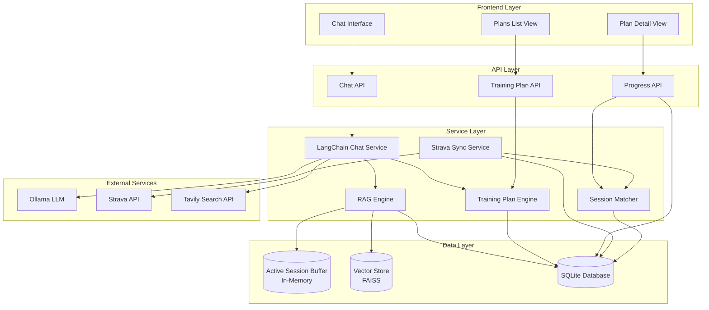
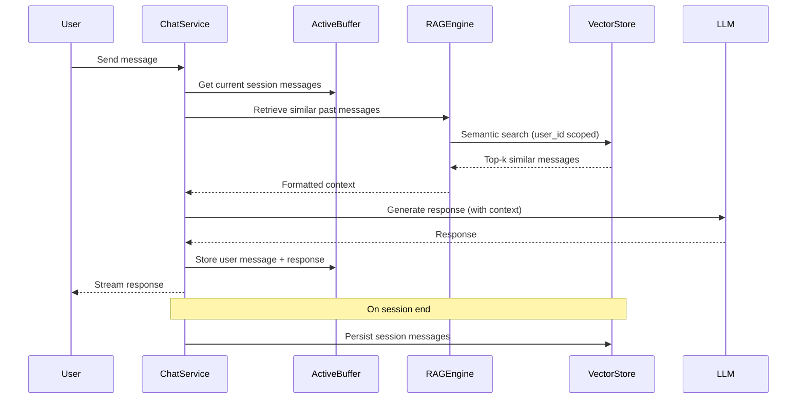
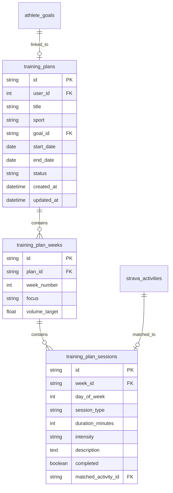
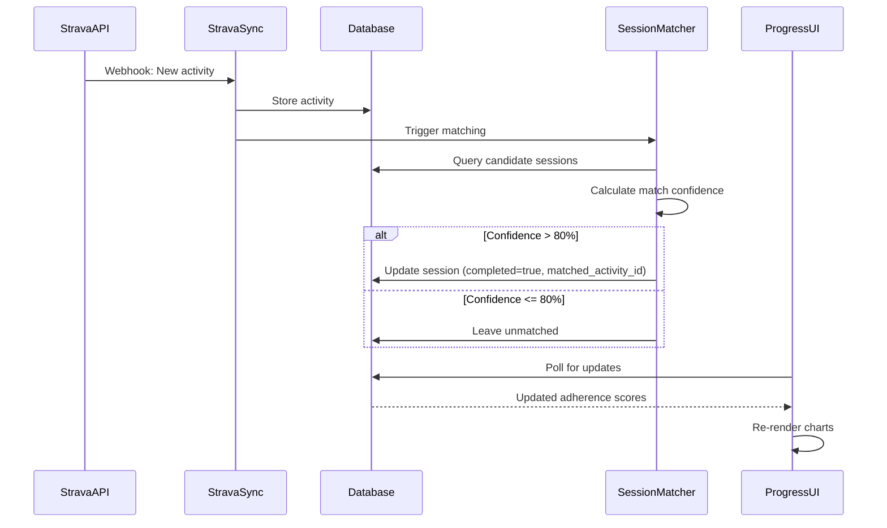

# Design Document: Fitness Platform Chat & Training Upgrade

## Overview

This design document specifies the technical architecture for upgrading the Fitness Platform with three interconnected features:

1. **Context-Engineered Chat**: Replaces blind history with a two-layer RAG-based retrieval system (Active Session Buffer + Vector Store) for intelligent context management
2. **Training Plan Engine**: AI-powered generation, parsing, and storage of personalized training plans with activity-aware recommendations
3. **Plan Progress Screen**: Visual tracking interface with automatic Strava sync and adherence scoring

The upgrade transforms the chat from a simple message history system into an intelligent context retrieval engine, enables structured storage and generation of training plans, and provides athletes with real-time progress tracking automatically synchronized with their Strava activities.

### Technology Stack

- **Backend**: FastAPI (Python 3.12+)
- **Database**: SQLite with SQLAlchemy ORM
- **Vector Store**: FAISS with nomic-embed-text embeddings (768-dim)
- **LLM**: Ollama (Mistral) with LangChain integration
- **Frontend**: Vanilla JavaScript with server-sent events (SSE)
- **External APIs**: Strava API v3, Tavily Search API

### Design Principles

- **User-scoped security**: All data access filtered by user_id
- **Additive-only migrations**: Schema changes never drop or modify existing data
- **Performance-first**: p95 latency targets for all user-facing operations
- **Separation of concerns**: Clear boundaries between chat, training, and progress tracking
- **Testability**: Property-based testing for core algorithms (parsing, matching, scoring)

## Architecture

### High-Level System Architecture



### Context-Engineered Chat Architecture

The chat system implements a two-layer context retrieval strategy:

**Layer 1: Active Session Buffer (In-Memory)**
- Stores all messages from the current chat session
- Provides immediate access to recent conversation context
- Cleared when session ends or user navigates away
- Implementation: Python list in ChatService instance

**Layer 2: Vector Store (FAISS + SQLite)**
- Stores embeddings of all historical chat messages
- Enables semantic similarity search across past conversations
- Scoped to user_id for security
- Key format: `chat:{user_id}:{session_id}:{date}:eval_{score}`

**Retrieval Flow**:



### Training Plan Engine Architecture

The Training Plan Engine handles generation, parsing, storage, and retrieval of training plans:

**Components**:
- **Plan Generator**: LLM-based generation with activity-aware prompts
- **Plan Parser**: Converts AI-generated text to structured data
- **Plan Pretty-Printer**: Formats structured data back to human-readable text
- **Plan Storage**: Relational database with three-table schema

**Database Schema**:




### Plan Progress Screen Architecture

The Progress Screen provides visual tracking with automatic updates:

**UI Components**:
- **Plans List View**: Card-based grid showing all plans with adherence scores
- **Plan Detail View**: Comprehensive view with timeline, session grid, and adherence chart

**Data Flow**:



## Components and Interfaces

### 1. RAG Engine Component

**Purpose**: Manages context retrieval for chat using two-layer architecture

**Interface**:

```python
class RAGEngine:
    def __init__(self, db: Session, index_path: str, ollama_endpoint: str):
        """Initialize RAG engine with vector store and active buffer"""
        
    def retrieve_context(
        self, 
        query: str, 
        user_id: int, 
        active_session_messages: List[ChatMessage],
        top_k: int = 5
    ) -> str:
        """
        Retrieve context from both layers.
        
        Args:
            query: User's current message
            user_id: Requesting user ID (for scoping)
            active_session_messages: Current session messages
            top_k: Number of similar messages to retrieve
            
        Returns:
            Formatted context string combining both layers
        """
        
    def persist_session(
        self, 
        user_id: int, 
        session_id: int, 
        messages: List[ChatMessage],
        eval_score: Optional[float] = None
    ) -> None:
        """
        Persist session messages to vector store.
        
        Key format: chat:{user_id}:{session_id}:{date}:eval_{score}
        """
        
    def delete_session(self, user_id: int, session_id: int) -> None:
        """Remove session from vector store and database"""
        
    def search_similar(
        self, 
        query_embedding: np.ndarray, 
        user_id: int, 
        top_k: int
    ) -> List[Dict[str, Any]]:
        """Search vector store with user_id filter"""
```


**Performance Requirements**:
- Vector retrieval: < 500ms at p95
- Session persistence: < 2 seconds
- Session deletion: < 2 seconds

**Security**:
- All vector queries MUST include user_id filter
- Metadata stored in database with user_id column
- FAISS index positions mapped to metadata via FaissMetadata table

### 2. Training Plan Engine Component

**Purpose**: Generate, parse, store, and retrieve training plans

**Interface**:

```python
class TrainingPlanEngine:
    def __init__(self, db: Session, llm_client: LLMClient):
        """Initialize with database and LLM client"""
        
    async def generate_plan(
        self,
        user_id: int,
        goal_id: str,
        sport: str,
        duration_weeks: int,
        recent_activities: List[StravaActivity],
        weekly_metrics: Dict[str, Any]
    ) -> TrainingPlan:
        """
        Generate activity-aware training plan.
        
        Args:
            user_id: Athlete user ID
            goal_id: Linked goal ID
            sport: Primary sport (running, cycling, swimming)
            duration_weeks: Plan duration
            recent_activities: Last 4 weeks of activities
            weekly_metrics: Aggregated training load metrics
            
        Returns:
            Structured TrainingPlan object
        """
        
    def parse_plan(self, plan_text: str) -> TrainingPlan:
        """
        Parse AI-generated plan text into structured object.
        
        Raises:
            ValueError: If plan format is invalid
        """
        
    def pretty_print(self, plan: TrainingPlan) -> str:
        """Format TrainingPlan object to human-readable text"""
        
    def save_plan(self, plan: TrainingPlan) -> str:
        """
        Persist plan to database.
        
        Returns:
            Plan ID
        """
        
    def get_plan(self, plan_id: str, user_id: int) -> Optional[TrainingPlan]:
        """Retrieve plan with user_id scoping"""
        
    def list_plans(self, user_id: int) -> List[TrainingPlan]:
        """List all plans for user"""
        
    def update_plan(self, plan_id: str, user_id: int, updates: Dict[str, Any]) -> TrainingPlan:
        """Update existing plan (creates new version)"""
```

**Plan Data Structure**:

```python
@dataclass
class TrainingSession:
    day_of_week: int  # 1-7 (Monday-Sunday)
    session_type: str  # "easy_run", "interval", "long_run", "rest", etc.
    duration_minutes: int
    intensity: str  # "easy", "moderate", "hard", "recovery"
    description: str
    completed: bool = False
    matched_activity_id: Optional[str] = None

@dataclass
class TrainingWeek:
    week_number: int
    focus: str  # "Base building", "Intensity", "Recovery", etc.
    volume_target: float  # Total hours or distance
    sessions: List[TrainingSession]

@dataclass
class TrainingPlan:
    id: Optional[str]
    user_id: int
    title: str
    sport: str
    goal_id: Optional[str]
    start_date: date
    end_date: date
    status: str  # "draft", "active", "completed", "abandoned"
    weeks: List[TrainingWeek]
    created_at: Optional[datetime]
    updated_at: Optional[datetime]
```


### 3. Session Matcher Component

**Purpose**: Automatically match Strava activities to planned training sessions

**Interface**:

```python
class SessionMatcher:
    def __init__(self, db: Session):
        """Initialize with database session"""
        
    def match_activity(self, activity: StravaActivity) -> Optional[str]:
        """
        Match activity to a planned session.
        
        Args:
            activity: Newly imported Strava activity
            
        Returns:
            Matched session ID if confidence > 80%, None otherwise
        """
        
    def calculate_match_confidence(
        self,
        activity: StravaActivity,
        session: TrainingSession
    ) -> float:
        """
        Calculate match confidence score (0-100).
        
        Factors:
        - Time proximity (within 24 hours)
        - Sport type match
        - Duration similarity (±20%)
        - Intensity alignment
        
        Returns:
            Confidence score 0-100
        """
        
    def find_candidate_sessions(
        self,
        activity: StravaActivity,
        user_id: int
    ) -> List[TrainingSession]:
        """
        Find candidate sessions within 24 hours of activity.
        
        Returns:
            List of unmatched sessions in active plans
        """
```

**Matching Algorithm**:

```python
def calculate_match_confidence(activity, session):
    score = 0.0
    
    # Time proximity (40 points)
    time_diff_hours = abs((activity.start_date - session.scheduled_date).total_seconds() / 3600)
    if time_diff_hours <= 2:
        score += 40
    elif time_diff_hours <= 12:
        score += 30
    elif time_diff_hours <= 24:
        score += 20
    
    # Sport type match (30 points)
    if activity.activity_type.lower() == session.session_type.split('_')[1].lower():
        score += 30
    
    # Duration similarity (20 points)
    duration_ratio = activity.moving_time_s / (session.duration_minutes * 60)
    if 0.8 <= duration_ratio <= 1.2:
        score += 20
    elif 0.6 <= duration_ratio <= 1.4:
        score += 10
    
    # Intensity alignment (10 points)
    if matches_intensity(activity, session.intensity):
        score += 10
    
    return score
```


### 4. Chat Tools Component

**Purpose**: Provide LLM with tools to access athlete data and save plans

**Tool Definitions**:

```python
# Tool 1: Save Athlete Goal
{
    "name": "save_athlete_goal",
    "description": "Save a fitness goal for the athlete",
    "parameters": {
        "goal_type": "string (weight_loss, performance, endurance, etc.)",
        "target_value": "number (optional)",
        "target_date": "string ISO date (optional)",
        "description": "string (detailed goal description)"
    }
}

# Tool 2: Get My Goals
{
    "name": "get_my_goals",
    "description": "Retrieve athlete's saved goals",
    "parameters": {}
}

# Tool 3: Get My Recent Activities
{
    "name": "get_my_recent_activities",
    "description": "Retrieve recent Strava activities",
    "parameters": {
        "days": "number (default: 28)"
    }
}

# Tool 4: Get My Weekly Metrics
{
    "name": "get_my_weekly_metrics",
    "description": "Retrieve aggregated training metrics",
    "parameters": {
        "weeks": "number (default: 4)"
    }
}

# Tool 5: Save Training Plan
{
    "name": "save_training_plan",
    "description": "Persist a generated training plan",
    "parameters": {
        "title": "string",
        "sport": "string",
        "goal_id": "string (optional)",
        "start_date": "string ISO date",
        "weeks": "array of week objects"
    }
}

# Tool 6: Get Training Plan
{
    "name": "get_training_plan",
    "description": "Retrieve an existing training plan",
    "parameters": {
        "plan_id": "string"
    }
}

# Tool 7: Search Web
{
    "name": "search_web",
    "description": "Search for current fitness information",
    "parameters": {
        "query": "string"
    }
}
```

**Tool Implementation Pattern**:

```python
async def execute_tool(tool_name: str, parameters: Dict[str, Any], user_id: int):
    """
    Execute tool with user_id scoping.
    
    All tools MUST:
    1. Validate user_id is present
    2. Filter all database queries by user_id
    3. Log tool invocation
    4. Handle errors gracefully
    """
    if tool_name == "get_my_recent_activities":
        days = parameters.get("days", 28)
        activities = db.query(StravaActivity)\
            .filter(StravaActivity.athlete_id == user_id)\
            .filter(StravaActivity.start_date >= datetime.now() - timedelta(days=days))\
            .order_by(StravaActivity.start_date.desc())\
            .all()
        return [format_activity(a) for a in activities]
```


### 5. Progress Screen Component

**Purpose**: Display training plan progress with adherence metrics

**API Endpoints**:

```python
# GET /api/training-plans
# List all plans for authenticated user
{
    "plans": [
        {
            "id": "uuid",
            "title": "Marathon Training",
            "sport": "running",
            "goal": "Sub-4 hour marathon",
            "start_date": "2024-01-01",
            "end_date": "2024-04-01",
            "status": "active",
            "adherence_percentage": 85.5,
            "total_sessions": 48,
            "completed_sessions": 41
        }
    ]
}

# GET /api/training-plans/{plan_id}
# Get detailed plan with all weeks and sessions
{
    "plan": {
        "id": "uuid",
        "title": "Marathon Training",
        "sport": "running",
        "goal_id": "uuid",
        "start_date": "2024-01-01",
        "end_date": "2024-04-01",
        "status": "active",
        "overall_adherence": 85.5,
        "weeks": [
            {
                "week_number": 1,
                "focus": "Base building",
                "volume_target": 30.0,
                "adherence": 100.0,
                "sessions": [
                    {
                        "day_of_week": 1,
                        "session_type": "easy_run",
                        "duration_minutes": 45,
                        "intensity": "easy",
                        "description": "Easy pace, focus on form",
                        "completed": true,
                        "matched_activity": {
                            "id": "uuid",
                            "strava_id": 12345,
                            "distance_m": 7500,
                            "moving_time_s": 2700
                        }
                    }
                ]
            }
        ]
    }
}

# GET /api/training-plans/{plan_id}/adherence
# Get adherence time series for charting
{
    "adherence_by_week": [
        {"week": 1, "adherence": 100.0},
        {"week": 2, "adherence": 85.7},
        {"week": 3, "adherence": 71.4}
    ],
    "overall_adherence": 85.5
}
```

**UI Components**:

```javascript
// Plans List View
class PlansListView {
    async loadPlans() {
        const response = await fetch('/api/training-plans');
        const data = await response.json();
        this.renderPlanCards(data.plans);
    }
    
    renderPlanCards(plans) {
        // Render card grid with:
        // - Title, sport, goal
        // - Date range
        // - Progress bar (adherence %)
        // - Status badge
    }
}

// Plan Detail View
class PlanDetailView {
    async loadPlan(planId) {
        const response = await fetch(`/api/training-plans/${planId}`);
        const data = await response.json();
        this.renderPlanDetail(data.plan);
    }
    
    renderPlanDetail(plan) {
        // Render:
        // - Header with title, sport, goal, dates
        // - Overall progress bar
        // - Weekly timeline
        // - Session grid (calendar view)
        // - Adherence chart (line chart)
    }
}
```


## Data Models

### Database Schema

**New Tables**:

```sql
-- Training Plans
CREATE TABLE IF NOT EXISTS training_plans (
    id TEXT PRIMARY KEY,  -- UUID
    user_id INTEGER NOT NULL,
    title TEXT NOT NULL,
    sport TEXT NOT NULL,
    goal_id TEXT,  -- FK to athlete_goals.id
    start_date DATE NOT NULL,
    end_date DATE NOT NULL,
    status TEXT NOT NULL DEFAULT 'draft',  -- draft, active, completed, abandoned
    created_at TIMESTAMP NOT NULL DEFAULT CURRENT_TIMESTAMP,
    updated_at TIMESTAMP NOT NULL DEFAULT CURRENT_TIMESTAMP,
    FOREIGN KEY (user_id) REFERENCES athletes(id) ON DELETE CASCADE,
    FOREIGN KEY (goal_id) REFERENCES athlete_goals(id) ON DELETE SET NULL
);

CREATE INDEX idx_training_plans_user_id ON training_plans(user_id);
CREATE INDEX idx_training_plans_status ON training_plans(status);

-- Training Plan Weeks
CREATE TABLE IF NOT EXISTS training_plan_weeks (
    id TEXT PRIMARY KEY,  -- UUID
    plan_id TEXT NOT NULL,
    week_number INTEGER NOT NULL,
    focus TEXT,
    volume_target REAL,
    FOREIGN KEY (plan_id) REFERENCES training_plans(id) ON DELETE CASCADE,
    UNIQUE(plan_id, week_number)
);

CREATE INDEX idx_training_plan_weeks_plan_id ON training_plan_weeks(plan_id);

-- Training Plan Sessions
CREATE TABLE IF NOT EXISTS training_plan_sessions (
    id TEXT PRIMARY KEY,  -- UUID
    week_id TEXT NOT NULL,
    day_of_week INTEGER NOT NULL,  -- 1-7
    session_type TEXT NOT NULL,
    duration_minutes INTEGER NOT NULL,
    intensity TEXT NOT NULL,
    description TEXT,
    completed BOOLEAN NOT NULL DEFAULT 0,
    matched_activity_id TEXT,  -- FK to strava_activities.id
    FOREIGN KEY (week_id) REFERENCES training_plan_weeks(id) ON DELETE CASCADE,
    FOREIGN KEY (matched_activity_id) REFERENCES strava_activities(id) ON DELETE SET NULL,
    CHECK (day_of_week >= 1 AND day_of_week <= 7)
);

CREATE INDEX idx_training_plan_sessions_week_id ON training_plan_sessions(week_id);
CREATE INDEX idx_training_plan_sessions_completed ON training_plan_sessions(completed);
CREATE INDEX idx_training_plan_sessions_matched_activity ON training_plan_sessions(matched_activity_id);
```

**Modified Tables**:

```sql
-- Add user_id to FaissMetadata for vector store scoping
ALTER TABLE faiss_metadata ADD COLUMN user_id INTEGER;
CREATE INDEX idx_faiss_metadata_user_id ON faiss_metadata(user_id);

-- Existing tables remain unchanged (additive-only)
-- - athletes
-- - chat_sessions
-- - chat_messages
-- - athlete_goals
-- - strava_activities
```


### SQLAlchemy Models

```python
# app/models/training_plan.py
from sqlalchemy import Column, String, Integer, Date, DateTime, ForeignKey
from sqlalchemy.orm import relationship
from app.models.base import Base, TimestampMixin
import uuid

class TrainingPlan(Base, TimestampMixin):
    __tablename__ = 'training_plans'
    
    id = Column(String(36), primary_key=True, default=lambda: str(uuid.uuid4()))
    user_id = Column(Integer, ForeignKey('athletes.id', ondelete='CASCADE'), nullable=False, index=True)
    title = Column(String(255), nullable=False)
    sport = Column(String(50), nullable=False)
    goal_id = Column(String(36), ForeignKey('athlete_goals.id', ondelete='SET NULL'), nullable=True)
    start_date = Column(Date, nullable=False)
    end_date = Column(Date, nullable=False)
    status = Column(String(20), nullable=False, default='draft')
    
    # Relationships
    weeks = relationship('TrainingPlanWeek', back_populates='plan', cascade='all, delete-orphan')
    goal = relationship('AthleteGoal', backref='training_plans')
    athlete = relationship('Athlete', backref='training_plans')

# app/models/training_plan_week.py
class TrainingPlanWeek(Base):
    __tablename__ = 'training_plan_weeks'
    
    id = Column(String(36), primary_key=True, default=lambda: str(uuid.uuid4()))
    plan_id = Column(String(36), ForeignKey('training_plans.id', ondelete='CASCADE'), nullable=False, index=True)
    week_number = Column(Integer, nullable=False)
    focus = Column(String(255), nullable=True)
    volume_target = Column(Float, nullable=True)
    
    # Relationships
    plan = relationship('TrainingPlan', back_populates='weeks')
    sessions = relationship('TrainingPlanSession', back_populates='week', cascade='all, delete-orphan')

# app/models/training_plan_session.py
class TrainingPlanSession(Base):
    __tablename__ = 'training_plan_sessions'
    
    id = Column(String(36), primary_key=True, default=lambda: str(uuid.uuid4()))
    week_id = Column(String(36), ForeignKey('training_plan_weeks.id', ondelete='CASCADE'), nullable=False, index=True)
    day_of_week = Column(Integer, nullable=False)
    session_type = Column(String(50), nullable=False)
    duration_minutes = Column(Integer, nullable=False)
    intensity = Column(String(20), nullable=False)
    description = Column(Text, nullable=True)
    completed = Column(Boolean, nullable=False, default=False)
    matched_activity_id = Column(String(36), ForeignKey('strava_activities.id', ondelete='SET NULL'), nullable=True)
    
    # Relationships
    week = relationship('TrainingPlanWeek', back_populates='sessions')
    matched_activity = relationship('StravaActivity', backref='matched_sessions')
```


### Vector Store Schema

**FAISS Index**:
- Dimension: 768 (nomic-embed-text)
- Index type: IndexFlatIP (inner product for cosine similarity)
- Normalization: All vectors L2-normalized before indexing

**Metadata Storage** (SQLite):

```python
class FaissMetadata(Base):
    __tablename__ = 'faiss_metadata'
    
    id = Column(Integer, primary_key=True)
    faiss_index = Column(Integer, nullable=False, unique=True)  # Position in FAISS index
    user_id = Column(Integer, nullable=False, index=True)  # NEW: User scoping
    entity_type = Column(String(50), nullable=False)  # 'chat_message', 'activity', etc.
    entity_id = Column(String(36), nullable=False)
    key = Column(String(255), nullable=False)  # chat:{user_id}:{session_id}:{date}:eval_{score}
    text = Column(Text, nullable=False)
    created_at = Column(DateTime, nullable=False, default=datetime.utcnow)
```

**Key Format for Chat Messages**:
```
chat:{user_id}:{session_id}:{date}:eval_{score}

Examples:
- chat:1:42:2024-01-15:eval_8.5
- chat:1:43:2024-01-16:eval_9.2
- chat:2:10:2024-01-15:eval_7.8
```

## Algorithms

### 1. Context Retrieval Algorithm

```python
def retrieve_context(query: str, user_id: int, active_messages: List[ChatMessage], top_k: int = 5) -> str:
    """
    Two-layer context retrieval.
    
    Layer 1: Active session buffer (immediate context)
    Layer 2: Vector store (historical context)
    """
    context_parts = []
    
    # Layer 1: Active Session Buffer
    if active_messages:
        context_parts.append("=== Current Session ===")
        for msg in active_messages[-10:]:  # Last 10 messages
            context_parts.append(f"{msg.role}: {msg.content}")
    
    # Layer 2: Vector Store
    query_embedding = generate_embedding(query)
    similar_messages = search_vector_store(
        embedding=query_embedding,
        user_id=user_id,  # CRITICAL: User scoping
        top_k=top_k
    )
    
    if similar_messages:
        context_parts.append("\n=== Relevant Past Conversations ===")
        for msg in similar_messages:
            context_parts.append(f"[{msg['date']}] {msg['text']}")
    
    return "\n".join(context_parts)
```

### 2. Session Persistence Algorithm

```python
def persist_session(user_id: int, session_id: int, messages: List[ChatMessage], eval_score: Optional[float] = None):
    """
    Persist session to vector store with proper key format.
    """
    date_str = datetime.now().strftime("%Y-%m-%d")
    score_str = f"eval_{eval_score:.1f}" if eval_score else "eval_0.0"
    
    for i, msg in enumerate(messages):
        # Generate embedding
        embedding = generate_embedding(msg.content)
        
        # Create key
        key = f"chat:{user_id}:{session_id}:{date_str}:{score_str}"
        
        # Add to FAISS index
        faiss_index_position = faiss_index.ntotal
        faiss_index.add(embedding.reshape(1, -1))
        
        # Store metadata
        metadata = FaissMetadata(
            faiss_index=faiss_index_position,
            user_id=user_id,
            entity_type='chat_message',
            entity_id=str(msg.id),
            key=key,
            text=msg.content
        )
        db.add(metadata)
    
    db.commit()
    save_faiss_index()
```


### 3. Training Plan Parser Algorithm

```python
def parse_plan(plan_text: str) -> TrainingPlan:
    """
    Parse AI-generated training plan text into structured object.
    
    Expected format:
    # Training Plan: [Title]
    Sport: [sport]
    Duration: [X] weeks
    Start Date: [YYYY-MM-DD]
    
    ## Week 1: [Focus]
    Volume Target: [X] hours
    
    ### Monday - [Session Type]
    Duration: [X] minutes
    Intensity: [easy/moderate/hard]
    Description: [details]
    
    ### Tuesday - Rest
    ...
    """
    lines = plan_text.strip().split('\n')
    
    # Parse header
    title = extract_title(lines)
    sport = extract_field(lines, 'Sport')
    duration_weeks = extract_field(lines, 'Duration', type=int)
    start_date = extract_field(lines, 'Start Date', type=date)
    
    # Parse weeks
    weeks = []
    current_week = None
    current_session = None
    
    for line in lines:
        if line.startswith('## Week'):
            if current_week:
                weeks.append(current_week)
            current_week = parse_week_header(line)
        elif line.startswith('### '):
            if current_session:
                current_week.sessions.append(current_session)
            current_session = parse_session_header(line)
        elif current_session and line.startswith('Duration:'):
            current_session.duration_minutes = extract_duration(line)
        elif current_session and line.startswith('Intensity:'):
            current_session.intensity = extract_intensity(line)
        elif current_session and line.startswith('Description:'):
            current_session.description = extract_description(line)
    
    # Add last week and session
    if current_session:
        current_week.sessions.append(current_session)
    if current_week:
        weeks.append(current_week)
    
    # Validate
    if not title or not sport or not weeks:
        raise ValueError("Invalid plan format: missing required fields")
    
    return TrainingPlan(
        title=title,
        sport=sport,
        start_date=start_date,
        end_date=start_date + timedelta(weeks=duration_weeks),
        weeks=weeks
    )
```

### 4. Plan Pretty-Printer Algorithm

```python
def pretty_print(plan: TrainingPlan) -> str:
    """
    Format TrainingPlan object to human-readable text.
    
    Inverse of parse_plan() - must satisfy round-trip property.
    """
    lines = []
    
    # Header
    lines.append(f"# Training Plan: {plan.title}")
    lines.append(f"Sport: {plan.sport}")
    lines.append(f"Duration: {len(plan.weeks)} weeks")
    lines.append(f"Start Date: {plan.start_date.isoformat()}")
    lines.append("")
    
    # Weeks
    for week in plan.weeks:
        lines.append(f"## Week {week.week_number}: {week.focus}")
        if week.volume_target:
            lines.append(f"Volume Target: {week.volume_target} hours")
        lines.append("")
        
        # Sessions
        for session in week.sessions:
            day_name = ['Monday', 'Tuesday', 'Wednesday', 'Thursday', 'Friday', 'Saturday', 'Sunday'][session.day_of_week - 1]
            lines.append(f"### {day_name} - {session.session_type.replace('_', ' ').title()}")
            lines.append(f"Duration: {session.duration_minutes} minutes")
            lines.append(f"Intensity: {session.intensity}")
            if session.description:
                lines.append(f"Description: {session.description}")
            lines.append("")
    
    return "\n".join(lines)
```


### 5. Session Matching Algorithm

```python
def match_activity(activity: StravaActivity, user_id: int) -> Optional[str]:
    """
    Match activity to planned session.
    
    Returns session_id if confidence > 80%, None otherwise.
    """
    # Find candidate sessions (within 24 hours, unmatched, active plans)
    candidates = find_candidate_sessions(activity, user_id)
    
    if not candidates:
        return None
    
    # Calculate confidence for each candidate
    best_match = None
    best_confidence = 0.0
    
    for session in candidates:
        confidence = calculate_match_confidence(activity, session)
        if confidence > best_confidence:
            best_confidence = confidence
            best_match = session
    
    # Match if confidence exceeds threshold
    if best_confidence >= 80.0:
        return best_match.id
    
    return None

def calculate_match_confidence(activity: StravaActivity, session: TrainingPlanSession) -> float:
    """
    Calculate match confidence (0-100).
    
    Scoring:
    - Time proximity: 40 points (within 2h=40, 12h=30, 24h=20)
    - Sport type: 30 points (exact match)
    - Duration: 20 points (±20%=20, ±40%=10)
    - Intensity: 10 points (HR zones match)
    """
    score = 0.0
    
    # Time proximity (40 points)
    scheduled_datetime = get_scheduled_datetime(session)
    time_diff_hours = abs((activity.start_date - scheduled_datetime).total_seconds() / 3600)
    
    if time_diff_hours <= 2:
        score += 40
    elif time_diff_hours <= 12:
        score += 30
    elif time_diff_hours <= 24:
        score += 20
    
    # Sport type match (30 points)
    activity_sport = normalize_sport_type(activity.activity_type)
    session_sport = extract_sport_from_session_type(session.session_type)
    
    if activity_sport == session_sport:
        score += 30
    
    # Duration similarity (20 points)
    activity_duration_min = activity.moving_time_s / 60
    duration_ratio = activity_duration_min / session.duration_minutes
    
    if 0.8 <= duration_ratio <= 1.2:  # Within 20%
        score += 20
    elif 0.6 <= duration_ratio <= 1.4:  # Within 40%
        score += 10
    
    # Intensity alignment (10 points)
    if activity.avg_hr and matches_intensity_zone(activity.avg_hr, session.intensity):
        score += 10
    
    return score

def matches_intensity_zone(avg_hr: int, intensity: str) -> bool:
    """
    Check if heart rate matches intensity level.
    
    Zones (% of max HR ~= 220 - age):
    - easy: 60-70%
    - moderate: 70-80%
    - hard: 80-90%
    - recovery: <60%
    """
    # Simplified: assume max HR = 180 (adjust based on athlete profile)
    max_hr = 180
    hr_percentage = (avg_hr / max_hr) * 100
    
    if intensity == 'easy' and 60 <= hr_percentage <= 70:
        return True
    elif intensity == 'moderate' and 70 <= hr_percentage <= 80:
        return True
    elif intensity == 'hard' and 80 <= hr_percentage <= 90:
        return True
    elif intensity == 'recovery' and hr_percentage < 60:
        return True
    
    return False
```


### 6. Adherence Score Calculation Algorithm

```python
def calculate_session_adherence(session: TrainingPlanSession) -> float:
    """
    Per-session adherence: 100% if completed, 0% otherwise.
    """
    return 100.0 if session.completed else 0.0

def calculate_week_adherence(week: TrainingPlanWeek) -> float:
    """
    Per-week adherence: percentage of completed sessions.
    """
    if not week.sessions:
        return 0.0
    
    completed_count = sum(1 for s in week.sessions if s.completed)
    return (completed_count / len(week.sessions)) * 100.0

def calculate_plan_adherence(plan: TrainingPlan) -> float:
    """
    Overall plan adherence: percentage of completed sessions across all weeks.
    """
    total_sessions = 0
    completed_sessions = 0
    
    for week in plan.weeks:
        for session in week.sessions:
            total_sessions += 1
            if session.completed:
                completed_sessions += 1
    
    if total_sessions == 0:
        return 0.0
    
    return (completed_sessions / total_sessions) * 100.0

def get_adherence_time_series(plan: TrainingPlan) -> List[Dict[str, Any]]:
    """
    Get adherence by week for charting.
    """
    return [
        {
            'week': week.week_number,
            'adherence': calculate_week_adherence(week)
        }
        for week in plan.weeks
    ]
```

### 7. Multi-Step Tool Orchestration Algorithm

```python
async def handle_chat_message(message: str, user_id: int, session_id: int) -> str:
    """
    Multi-step tool orchestration for chat.
    
    Flow:
    1. Retrieve context (active buffer + vector store)
    2. Generate initial response with tool calls
    3. Execute tools sequentially
    4. Generate final response with tool results
    """
    # Step 1: Retrieve context
    active_messages = get_active_session_messages(session_id)
    context = retrieve_context(message, user_id, active_messages)
    
    # Step 2: Initial LLM call
    response = await llm_client.chat(
        messages=[
            {"role": "system", "content": system_prompt + "\n\n" + context},
            *[{"role": m.role, "content": m.content} for m in active_messages],
            {"role": "user", "content": message}
        ],
        tools=get_tool_definitions()
    )
    
    # Step 3: Execute tools if requested
    tool_results = []
    while response.tool_calls:
        for tool_call in response.tool_calls:
            result = await execute_tool(
                tool_name=tool_call.name,
                parameters=tool_call.parameters,
                user_id=user_id  # CRITICAL: User scoping
            )
            tool_results.append({
                "tool_call_id": tool_call.id,
                "result": result
            })
        
        # Continue conversation with tool results
        response = await llm_client.chat(
            messages=[...previous_messages, response, tool_results],
            tools=get_tool_definitions()
        )
    
    # Step 4: Return final response
    return response.content
```

