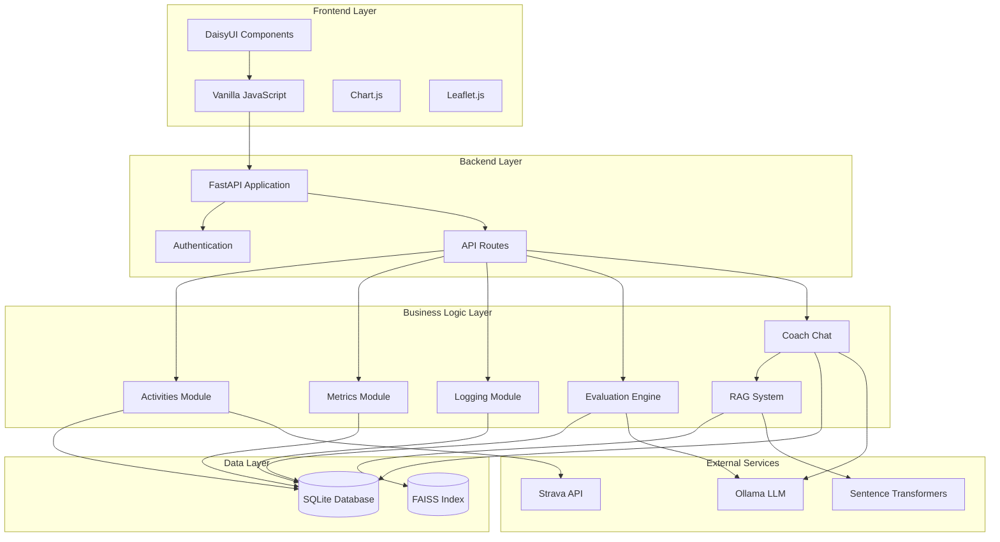
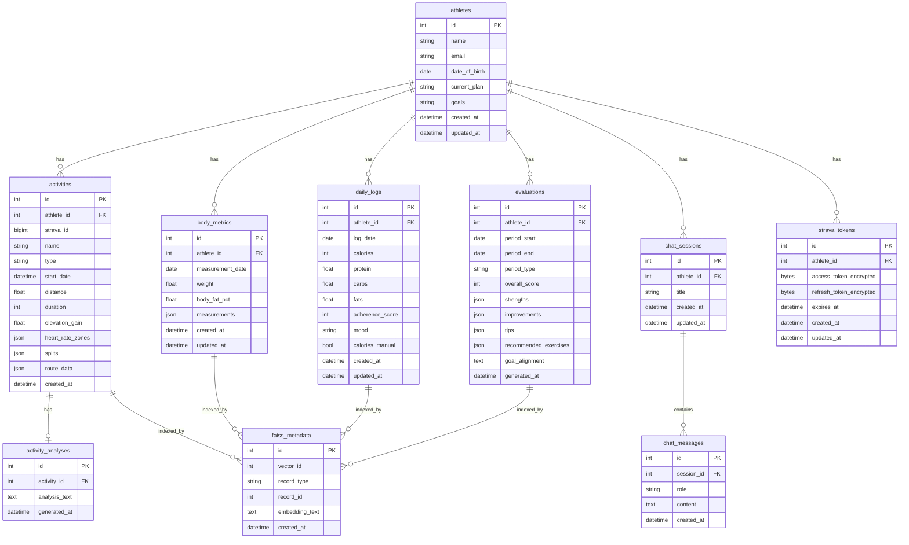

# Design Document: Fitness Platform V2

## Overview

The Fitness Platform V2 transforms the existing Fitness Evaluator from a basic dashboard into a comprehensive athlete coaching platform. The system provides integrated activity tracking, body metrics management, daily nutrition logging, AI-powered evaluations, and an intelligent coaching chat interface with RAG-based context retrieval.

### System Goals

- Provide athletes with a unified platform for tracking all aspects of training and nutrition
- Deliver personalized, context-aware coaching through AI-powered analysis and conversational interface
- Enable data-driven decision making through comprehensive visualization and reporting
- Maintain high performance and accessibility across all devices and screen sizes
- Ensure data security and privacy for sensitive athlete information

### Key Features

1. **Modern UI Framework**: DaisyUI-based responsive interface with persistent sidebar navigation
2. **Activity Management**: Strava-integrated activity tracking with detailed visualization and AI analysis
3. **Body Metrics Tracking**: Comprehensive body composition monitoring with trend analysis
4. **Daily Logging**: Nutrition and adherence tracking with intelligent macro calculation
5. **Evaluation Engine**: Structured coaching reports with actionable feedback
6. **Coach Chat with RAG**: Conversational AI interface with semantic search across athlete data
7. **Dashboard**: Compact overview with key stats, charts, and quick actions

### Technology Stack

**Frontend:**
- DaisyUI (Tailwind CSS component library)
- Vanilla JavaScript (ES6+)
- Chart.js (data visualization)
- Leaflet.js (activity maps)
- Server-Sent Events (LLM streaming)

**Backend:**
- FastAPI (Python web framework)
- SQLite (database)
- Alembic (database migrations)
- Pydantic (data validation)

**AI/ML:**
- Ollama (local LLM server, default model: Mistral)
- FAISS (vector similarity search)
- sentence-transformers (all-MiniLM-L6-v2 for embeddings)

**Integrations:**
- Strava API (OAuth 2.0)
- Fernet (symmetric encryption for tokens)

## Architecture

### High-Level Architecture



### System Architecture Layers

**Presentation Layer:**
- Responsive UI components built with DaisyUI
- Client-side JavaScript for interactivity and API communication
- Chart.js for data visualization
- Leaflet.js for activity map rendering
- Markdown rendering for chat responses

**API Layer:**
- RESTful API endpoints for CRUD operations
- Server-Sent Events endpoint for LLM streaming
- Request validation using Pydantic models
- Error handling and response formatting
- Rate limiting and CSRF protection

**Business Logic Layer:**
- Activities Module: Activity management, filtering, sorting, AI analysis
- Metrics Module: Body metrics CRUD, trend analysis, visualization data preparation
- Logging Module: Daily log management, macro calculation, inline editing
- Evaluation Engine: Report generation, data aggregation, LLM orchestration
- Coach Chat: Message handling, session management, response streaming
- RAG System: Embedding generation, FAISS indexing, semantic search

**Data Layer:**
- SQLite database for structured data persistence
- FAISS index for vector similarity search
- Database migrations managed by Alembic
- Foreign key constraints for referential integrity

**Integration Layer:**
- Strava Client: OAuth flow, token management, activity sync
- LLM Client: Ollama API communication, streaming, prompt engineering
- Embedding Service: sentence-transformers model for vector generation

### Data Flow Patterns

**Activity Sync Flow:**
1. Scheduled job triggers Strava sync
2. Strava Client fetches new activities using encrypted tokens
3. Activities Module persists new records to database
4. RAG System generates embeddings and updates FAISS index
5. Dashboard reflects updated activity count

**Coach Chat Flow:**
1. Athlete sends message via chat interface
2. RAG System generates query embedding
3. FAISS search retrieves top 5 relevant records
4. Chat module constructs prompt with context and history
5. LLM Client streams response via Server-Sent Events
6. Frontend displays response in real-time
7. Complete message persisted to database

**Evaluation Generation Flow:**
1. Athlete requests evaluation for time period
2. Evaluation Engine queries activities, metrics, logs for period
3. Data aggregated and formatted for LLM context
4. LLM Client generates structured evaluation
5. Evaluation persisted with metadata
6. RAG System indexes evaluation for future retrieval

## Components and Interfaces

### Frontend Components

#### Navigation Sidebar Component

**Purpose**: Persistent navigation across all pages

**Behavior**:
- Displays navigation links for Dashboard, Activities, Metrics, Logs, Evaluations, Chat, Settings
- Highlights active page based on current route
- Collapses to hamburger menu at viewport width < 768px
- Maintains state across page navigation

**Interface**:
```javascript
class NavigationSidebar {
  constructor(containerId, currentRoute)
  render()
  setActiveRoute(route)
  toggleMobile()
}
```

#### Activity List Component

**Purpose**: Display paginated, filterable, sortable activity table

**Behavior**:
- Renders activity records in table format
- Supports filtering by type, date range, distance
- Supports sorting by date, distance, duration, elevation
- Pagination with configurable page size
- Click row to navigate to detail view

**Interface**:
```javascript
class ActivityList {
  constructor(containerId, activities)
  render()
  applyFilters(filters)
  applySorting(column, direction)
  setPage(pageNumber)
  onRowClick(activityId)
}
```

#### Activity Detail Component

**Purpose**: Display detailed activity information with map and analysis

**Behavior**:
- Renders activity metadata (time, distance, pace, elevation, HR zones)
- Displays route on Leaflet.js map with zoom/pan controls
- Shows split data in table format
- Displays AI-generated effort analysis if available
- Handles missing map data gracefully

**Interface**:
```javascript
class ActivityDetail {
  constructor(containerId, activity)
  render()
  renderMap(routeData)
  renderSplits(splits)
  renderAnalysis(analysisText)
}
```

#### Body Metrics Form Component

**Purpose**: Data entry for body measurements

**Behavior**:
- Form fields for weight, body fat %, circumferences
- Real-time validation with error messages
- Submit handler with API integration
- Edit mode for existing records (within 24 hours)

**Interface**:
```javascript
class MetricsForm {
  constructor(containerId, existingMetric = null)
  render()
  validate()
  submit()
  onSuccess(callback)
  onError(callback)
}
```

#### Metrics Chart Component

**Purpose**: Visualize body metrics trends over time

**Behavior**:
- Line charts for weight, body fat %, circumferences
- Time range selector (7d, 30d, 90d, 1y, all)
- Hover tooltips with exact values and dates
- Responsive sizing
- Handles insufficient data gracefully

**Interface**:
```javascript
class MetricsChart {
  constructor(containerId, metricType, data)
  render()
  setTimeRange(range)
  update(newData)
  destroy()
}
```

#### Daily Log List Component

**Purpose**: Display and manage daily logs with inline editing

**Behavior**:
- Renders logs in reverse chronological order
- Inline editing for all fields
- Real-time validation during edit
- Visual feedback for save/cancel operations
- Macro auto-calculation display

**Interface**:
```javascript
class DailyLogList {
  constructor(containerId, logs)
  render()
  enableInlineEdit(logId, field)
  saveEdit(logId, field, value)
  cancelEdit(logId, field)
  calculateMacros(protein, carbs, fats)
}
```

#### Coach Chat Component

**Purpose**: Conversational interface with streaming LLM responses

**Behavior**:
- Full-height chat interface with message history
- Message input with Enter to send, Shift+Enter for newline
- Real-time streaming of coach responses
- Markdown rendering for formatted responses
- Auto-scroll to latest message
- Session management (new session, load previous)

**Interface**:
```javascript
class CoachChat {
  constructor(containerId, sessionId = null)
  render()
  sendMessage(text)
  streamResponse(eventSource)
  appendMessageChunk(chunk)
  loadSession(sessionId)
  createNewSession()
  renderMarkdown(text)
}
```

#### Dashboard Component

**Purpose**: Compact overview of athlete status

**Behavior**:
- Stats bar with key metrics
- Progress charts (activity volume, weight trend)
- Recent activities and logs lists
- Latest evaluation summary
- Quick action buttons

**Interface**:
```javascript
class Dashboard {
  constructor(containerId)
  render()
  loadStats()
  renderCharts()
  renderRecentActivities()
  renderRecentLogs()
  renderLatestEvaluation()
}
```

### Backend API Endpoints

#### Activities Endpoints

```
GET /api/activities
  Query params: page, page_size, type, date_from, date_to, sort_by, sort_dir
  Response: { activities: [...], total: int, page: int, page_size: int }

GET /api/activities/{activity_id}
  Response: { activity: {...}, splits: [...], route: {...}, analysis: {...} }

POST /api/activities/sync
  Triggers Strava sync
  Response: { synced_count: int, new_activities: [...] }

GET /api/activities/{activity_id}/analysis
  Generates or retrieves AI effort analysis
  Response: { analysis_text: str, generated_at: datetime }
```

#### Metrics Endpoints

```
GET /api/metrics
  Query params: date_from, date_to
  Response: { metrics: [...] }

POST /api/metrics
  Body: { weight, body_fat_pct, measurements: {...}, date }
  Response: { metric: {...} }

PUT /api/metrics/{metric_id}
  Body: { weight, body_fat_pct, measurements: {...} }
  Response: { metric: {...} }

GET /api/metrics/trends
  Query params: metric_type, time_range
  Response: { data_points: [...], trend_analysis: str }
```

#### Logging Endpoints

```
GET /api/logs
  Query params: date_from, date_to, page, page_size
  Response: { logs: [...], total: int }

POST /api/logs
  Body: { date, calories, protein, carbs, fats, adherence, mood }
  Response: { log: {...} }

PUT /api/logs/{log_id}
  Body: { calories, protein, carbs, fats, adherence, mood }
  Response: { log: {...} }

POST /api/logs/calculate-macros
  Body: { protein, carbs, fats }
  Response: { calculated_calories: int }
```

#### Evaluation Endpoints

```
GET /api/evaluations
  Query params: date_from, date_to, page, page_size
  Response: { evaluations: [...], total: int }

POST /api/evaluations/generate
  Body: { period_start, period_end, period_type }
  Response: { evaluation: {...} }

GET /api/evaluations/{evaluation_id}
  Response: { evaluation: {...} }
```

#### Chat Endpoints

```
GET /api/chat/sessions
  Response: { sessions: [...] }

POST /api/chat/sessions
  Body: { title }
  Response: { session: {...} }

GET /api/chat/sessions/{session_id}/messages
  Response: { messages: [...] }

POST /api/chat/sessions/{session_id}/messages
  Body: { content }
  Response: { message: {...} }

GET /api/chat/stream (Server-Sent Events)
  Query params: session_id, message
  Streams: { event: "chunk", data: str } | { event: "done", data: null }
```

#### Settings Endpoints

```
GET /api/settings/profile
  Response: { profile: {...} }

PUT /api/settings/profile
  Body: { name, email, date_of_birth }
  Response: { profile: {...} }

GET /api/settings/strava
  Response: { connected: bool, athlete_name: str }

POST /api/settings/strava/connect
  Initiates OAuth flow
  Response: { auth_url: str }

POST /api/settings/strava/disconnect
  Response: { success: bool }

GET /api/settings/llm
  Response: { model, temperature, endpoint }

PUT /api/settings/llm
  Body: { model, temperature }
  Response: { settings: {...} }

GET /api/settings/export
  Response: JSON file download with all athlete data
```

### Backend Service Classes

#### StravaClient

**Purpose**: Manage Strava API integration and OAuth

**Methods**:
```python
class StravaClient:
    def __init__(self, db_session)
    def get_authorization_url(self, athlete_id: int) -> str
    def exchange_code(self, code: str, athlete_id: int) -> dict
    def refresh_token(self, athlete_id: int) -> str
    def get_activities(self, athlete_id: int, after: datetime) -> List[dict]
    def sync_activities(self, athlete_id: int) -> int
    def disconnect(self, athlete_id: int) -> bool
    def _encrypt_token(self, token: str) -> str
    def _decrypt_token(self, encrypted: str) -> str
```

#### LLMClient

**Purpose**: Communicate with Ollama for LLM capabilities

**Methods**:
```python
class LLMClient:
    def __init__(self, endpoint: str, model: str, temperature: float)
    def generate_response(self, prompt: str, system_prompt: str) -> str
    def stream_response(self, prompt: str, system_prompt: str) -> Iterator[str]
    def generate_evaluation(self, context: dict) -> dict
    def generate_effort_analysis(self, activity: dict) -> str
    def generate_trend_analysis(self, metrics: List[dict]) -> str
    def _build_prompt(self, user_message: str, context: str, history: List[dict]) -> str
    def _retry_request(self, func, max_retries: int = 3)
```

#### RAGSystem

**Purpose**: Manage embeddings and semantic search

**Methods**:
```python
class RAGSystem:
    def __init__(self, db_session, faiss_index_path: str)
    def initialize_index(self) -> None
    def generate_embedding(self, text: str) -> np.ndarray
    def index_activity(self, activity: Activity) -> None
    def index_metric(self, metric: BodyMetric) -> None
    def index_log(self, log: DailyLog) -> None
    def index_evaluation(self, evaluation: Evaluation) -> None
    def search(self, query: str, top_k: int = 5) -> List[dict]
    def save_index(self) -> None
    def load_index(self) -> None
    def _format_activity_text(self, activity: Activity) -> str
    def _format_metric_text(self, metric: BodyMetric) -> str
    def _format_log_text(self, log: DailyLog) -> str
    def _format_evaluation_text(self, evaluation: Evaluation) -> str
```

#### EvaluationEngine

**Purpose**: Generate structured coaching evaluations

**Methods**:
```python
class EvaluationEngine:
    def __init__(self, db_session, llm_client: LLMClient)
    def generate_evaluation(self, athlete_id: int, period_start: date, period_end: date) -> Evaluation
    def _gather_activities(self, athlete_id: int, start: date, end: date) -> List[Activity]
    def _gather_metrics(self, athlete_id: int, start: date, end: date) -> List[BodyMetric]
    def _gather_logs(self, athlete_id: int, start: date, end: date) -> List[DailyLog]
    def _build_context(self, activities: List, metrics: List, logs: List) -> dict
    def _parse_evaluation_response(self, response: str) -> dict
```

## Data Models

### Database Schema



### Pydantic Models

#### Activity Models

```python
class ActivityBase(BaseModel):
    name: str
    type: str
    start_date: datetime
    distance: float
    duration: int
    elevation_gain: float

class ActivityCreate(ActivityBase):
    strava_id: int
    heart_rate_zones: Optional[dict]
    splits: Optional[List[dict]]
    route_data: Optional[dict]

class ActivityResponse(ActivityBase):
    id: int
    athlete_id: int
    strava_id: int
    heart_rate_zones: Optional[dict]
    splits: Optional[List[dict]]
    route_data: Optional[dict]
    analysis: Optional[str]
    created_at: datetime
    
    class Config:
        from_attributes = True
```

#### Metrics Models

```python
class BodyMetricBase(BaseModel):
    measurement_date: date
    weight: float = Field(ge=30, le=300)
    body_fat_pct: Optional[float] = Field(None, ge=3, le=60)
    measurements: Optional[dict]

class BodyMetricCreate(BodyMetricBase):
    pass

class BodyMetricUpdate(BaseModel):
    weight: Optional[float] = Field(None, ge=30, le=300)
    body_fat_pct: Optional[float] = Field(None, ge=3, le=60)
    measurements: Optional[dict]

class BodyMetricResponse(BodyMetricBase):
    id: int
    athlete_id: int
    created_at: datetime
    updated_at: datetime
    
    class Config:
        from_attributes = True
```

#### Logging Models

```python
class DailyLogBase(BaseModel):
    log_date: date
    calories: int = Field(ge=0, le=10000)
    protein: float = Field(ge=0, le=1000)
    carbs: float = Field(ge=0, le=1000)
    fats: float = Field(ge=0, le=1000)
    adherence_score: int = Field(ge=0, le=100)
    mood: Optional[str]

class DailyLogCreate(DailyLogBase):
    calories_manual: bool = False

class DailyLogUpdate(BaseModel):
    calories: Optional[int] = Field(None, ge=0, le=10000)
    protein: Optional[float] = Field(None, ge=0, le=1000)
    carbs: Optional[float] = Field(None, ge=0, le=1000)
    fats: Optional[float] = Field(None, ge=0, le=1000)
    adherence_score: Optional[int] = Field(None, ge=0, le=100)
    mood: Optional[str]
    calories_manual: Optional[bool]

class DailyLogResponse(DailyLogBase):
    id: int
    athlete_id: int
    calories_manual: bool
    created_at: datetime
    updated_at: datetime
    
    class Config:
        from_attributes = True
```

#### Evaluation Models

```python
class EvaluationBase(BaseModel):
    period_start: date
    period_end: date
    period_type: str
    overall_score: int = Field(ge=0, le=100)
    strengths: List[str]
    improvements: List[str]
    tips: List[str]
    recommended_exercises: List[str]
    goal_alignment: str

class EvaluationCreate(BaseModel):
    period_start: date
    period_end: date
    period_type: str

class EvaluationResponse(EvaluationBase):
    id: int
    athlete_id: int
    generated_at: datetime
    
    class Config:
        from_attributes = True
```

#### Chat Models

```python
class ChatSessionBase(BaseModel):
    title: str

class ChatSessionCreate(ChatSessionBase):
    pass

class ChatSessionResponse(ChatSessionBase):
    id: int
    athlete_id: int
    created_at: datetime
    updated_at: datetime
    message_count: int
    
    class Config:
        from_attributes = True

class ChatMessageBase(BaseModel):
    role: str  # "user" or "assistant"
    content: str

class ChatMessageCreate(ChatMessageBase):
    session_id: int

class ChatMessageResponse(ChatMessageBase):
    id: int
    session_id: int
    created_at: datetime
    
    class Config:
        from_attributes = True
```

