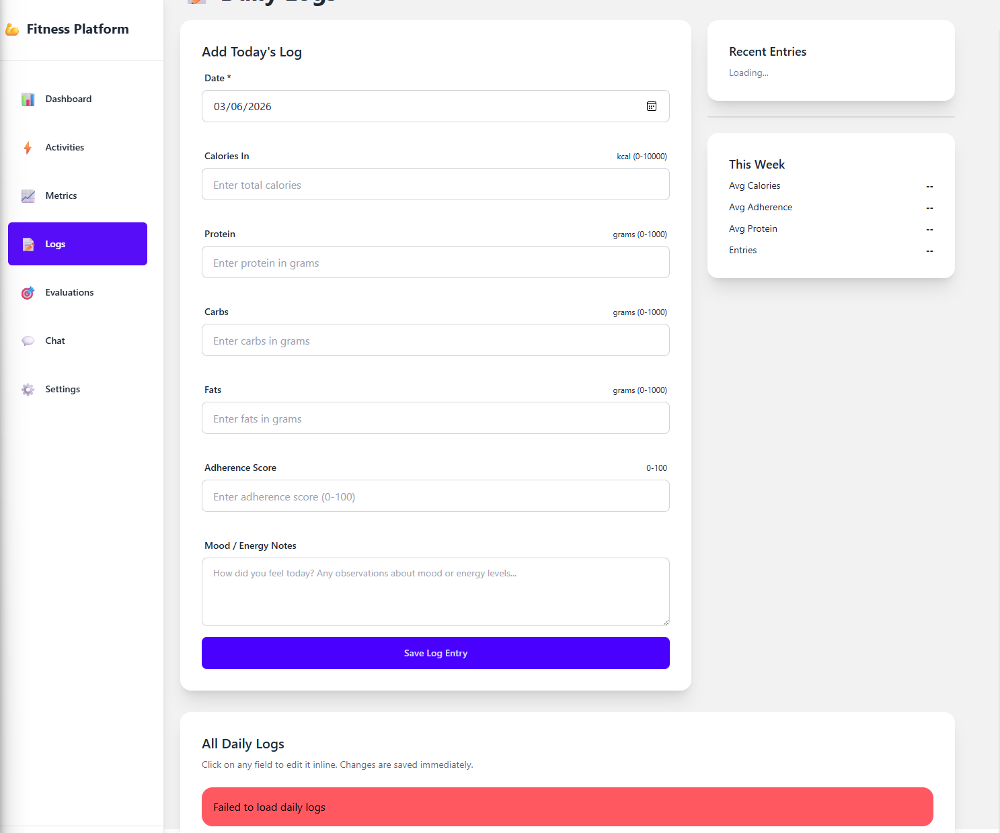

# Implementation Plan: Fitness Platform V2

## Overview

This implementation plan transforms the Fitness Evaluator from a basic dashboard into a comprehensive athlete coaching platform. The implementation is organized into four phases, progressing from core UI and data management features through AI-powered analysis and coaching capabilities, culminating in performance optimization and polish.

The platform uses:
- **Frontend**: Vanilla JavaScript (ES6+), DaisyUI/Tailwind CSS, Chart.js, Leaflet.js
- **Backend**: Python with FastAPI, SQLite, Alembic migrations
- **AI/ML**: LangChain framework with Ollama/LM Studio backends (Mistral model), FAISS, sentence-transformers (all-MiniLM-L6-v2)
- **Integrations**: Strava API with OAuth 2.0

LangChain provides:
- Structured output parsing with Pydantic schema validation
- Prompt template management for consistent formatting
- Streaming response capabilities for real-time chat
- Support for both Ollama and LM Studio (OpenAI-compatible) backends
- Temperature control (0.1 for analysis tasks, 0.7 for chat)

## Tasks

### Phase 1: Core UI Framework and Data Management

- [ ] 1. Database schema setup and migrations
  - [x] 1.1 Create Alembic migration for new tables
    - Add chat_sessions table (id, athlete_id, title, created_at, updated_at)
    - Add chat_messages table (id, session_id, role, content, created_at)
    - Add activity_analyses table (id, activity_id, analysis_text, generated_at)
    - Add faiss_metadata table (id, vector_id, record_type, record_id, embedding_text, created_at)
    - Add strava_tokens table (id, athlete_id, access_token_encrypted, refresh_token_encrypted, expires_at, created_at, updated_at)
    - Add foreign key constraints and indexes
    - _Requirements: 22_
  
  - [x] 1.2 Write property test for database foreign key integrity
    - **Property 14: Database Foreign Key Integrity**
    - **Validates: Requirements 22**
  
  - [x] 1.3 Run migration and verify schema
    - Execute migration against development database
    - Verify all tables, constraints, and indexes created correctly
    - _Requirements: 22_

- [ ] 2. UI framework overhaul with DaisyUI
  - [x] 2.1 Create design tokens and CSS variables
    - Define color palette, spacing scale, typography, and component styles
    - Create CSS custom properties for all design tokens
    - _Requirements: 1.4, 1.5_
  
  - [x] 2.2 Implement persistent navigation sidebar component
    - Create NavigationSidebar JavaScript class
    - Implement desktop layout (visible at >= 768px)
    - Implement mobile hamburger menu (< 768px)
    - Add navigation links for all pages
    - Implement active route highlighting
    - _Requirements: 1.1, 1.2, 1.3_
  
  - [ ] 2.3 Write property test for UI responsiveness
    - **Property 1: UI Responsiveness Invariant**
    - **Validates: Requirements 1.6, 25.1-25.4_
  
  - [ ] 2.4 Write property test for navigation state consistency
    - **Property 19: Navigation State Consistency**
    - **Validates: Requirements 1.1_
  
  - [x] 2.3 Update base HTML template with sidebar layout
    - Modify base template to include sidebar
    - Remove large hero section from dashboard
    - Apply responsive grid layout
    - _Requirements: 1.7, 1.8_

- [ ] 3. Activities list management
  - [x] 3.1 Create activities list page and route
    - Add /activities route to FastAPI
    - Create activities.html template
    - _Requirements: 2_
  
  - [x] 3.2 Implement ActivityList component
    - Create ActivityList JavaScript class
    - Implement table rendering with activity data
    - Add pagination controls (default 25 per page)
    - Display name, type, date, distance, duration, elevation
    - _Requirements: 2.1, 2.6, 2.7_
  
  - [x] 3.3 Add filtering functionality
    - Implement filter UI for activity type, date range, distance
    - Add filter application logic
    - Update API endpoint to support filter parameters
    - _Requirements: 2.2_
  
  - [x] 3.4 Add sorting functionality
    - Implement sortable column headers
    - Add sorting by date, distance, duration, elevation
    - Update API endpoint to support sort parameters
    - _Requirements: 2.3_
  
  - [ ] 3.5 Write property test for activity filter commutativity
    - **Property 2: Activity Filter Commutativity**
    - **Validates: Requirements 2.2_
  
  - [ ] 3.6 Write property test for pagination completeness
    - **Property 8: Pagination Completeness**
    - **Validates: Requirements 2.7_
  
  - [ ] 3.7 Write property test for date range filter correctness
    - **Property 9: Date Range Filter Correctness**
    - **Validates: Requirements 2.2_
  
  - [x] 3.8 Implement row click navigation to detail view
    - Add click handler to table rows
    - Navigate to /activities/{id} on click
    - _Requirements: 2.4_

- [ ] 4. Activity detail visualization
  - [x] 4.1 Create activity detail page and route
    - Add /activities/{id} route to FastAPI
    - Create activity_detail.html template
    - Fetch activity data including splits and route
    - _Requirements: 3_
  
  - [x] 4.2 Implement ActivityDetail component
    - Create ActivityDetail JavaScript class
    - Display activity metadata (time, distance, pace, elevation, HR zones)
    - Render splits table
    - _Requirements: 3.3_
  
  - [x] 4.3 Integrate Leaflet.js for activity map
    - Add Leaflet.js library
    - Implement map rendering with route polyline
    - Add zoom and pan controls
    - Handle missing map data gracefully
    - _Requirements: 3.1, 3.4, 3.6_

- [ ] 5. Body metrics data entry and management
  - [x] 5.1 Create metrics page and route
    - Add /metrics route to FastAPI
    - Create metrics.html template
    - _Requirements: 5, 6_
  
  - [x] 5.2 Implement MetricsForm component
    - Create MetricsForm JavaScript class
    - Add form fields for weight, body fat %, circumferences
    - Implement real-time validation (weight: 30-300kg, body fat: 3-60%)
    - Display specific validation error messages
    - _Requirements: 5.1, 5.2, 5.3, 5.7_
  
  - [ ] 5.3 Write property test for body metric validation consistency
    - **Property 13: Body Metric Validation Consistency**
    - **Validates: Requirements 5.2_
  
  - [ ] 5.4 Write property test for validation idempotence
    - **Property 10: Validation Idempotence**
    - **Validates: Requirements 5.2, 5.3_
  
  - [x] 5.5 Create metrics API endpoints
    - Implement POST /api/metrics for creating records
    - Implement PUT /api/metrics/{id} for editing (within 24 hours)
    - Implement GET /api/metrics for retrieving history
    - Add Pydantic models for validation
    - _Requirements: 5.4, 5.5, 5.6_

- [ ] 6. Body metrics visualization with Chart.js
  - [x] 6.1 Integrate Chart.js library
    - Add Chart.js to project dependencies
    - Create chart configuration utilities
    - _Requirements: 6_
  
  - [x] 6.2 Implement MetricsChart component
    - Create MetricsChart JavaScript class
    - Render line charts for weight, body fat %, circumferences
    - Add time range selector (7d, 30d, 90d, 1y, all)
    - Implement hover tooltips with exact values and dates
    - Handle insufficient data with informative message
    - _Requirements: 6.1, 6.2, 6.3, 6.4, 6.6_

- [-] 7. Daily logging with inline editing
  - [x] 7.1 Create daily logs page and route
    - Add /logs route to FastAPI
    - Create logs.html template
    - _Requirements: 8, 9_
  
  - [x] 7.2 Implement daily log creation form
    - Create form for date, calories, protein, carbs, fats, adherence, mood
    - Implement validation (calories: 0-10000, macros: 0-1000g, adherence: 0-100)
    - Prevent duplicate entries for same date
    - _Requirements: 8.1, 8.2, 8.3, 8.4, 8.5_
  
  - [x] 7.3 Implement DailyLogList component with inline editing
    - Create DailyLogList JavaScript class
    - Display logs in reverse chronological order
    - Enable inline editing on field click
    - Implement save/cancel with visual feedback
    - Validate edited values
    - _Requirements: 8.7, 9.1, 9.2, 9.3, 9.4, 9.5_
  
  - [ ] 7.4 Write property test for inline edit atomicity
    - **Property 18: Inline Edit Atomicity**
    - **Validates: Requirements 9.6_
  
  - [x] 7.5 Create daily logs API endpoints
    - Implement POST /api/logs for creating records
    - Implement PUT /api/logs/{id} for updating records
    - Implement GET /api/logs for retrieving history with pagination
    - Add Pydantic models for validation
    - _Requirements: 8.6_

- [ ] 8. Macro auto-calculation
  - [ ] 8.1 Implement macro calculation logic
    - Add calculation function: (protein × 4) + (carbs × 4) + (fats × 9)
    - Update calories field automatically on macro changes
    - Support manual override with indicator
    - Support returning to auto-calculation mode
    - _Requirements: 10.1, 10.2, 10.3, 10.4, 10.5_
  
  - [ ] 8.2 Write property test for macro calculation consistency
    - **Property 3: Macro Calculation Consistency**
    - **Validates: Requirements 10.1_
  
  - [ ] 8.3 Add macro calculation to API endpoint
    - Implement POST /api/logs/calculate-macros
    - Return calculated calories for given macros
    - _Requirements: 10_

- [ ] 9. Checkpoint - Phase 1 core functionality complete
  - Ensure all tests pass, verify UI renders correctly across viewport sizes, ask the user if questions arise.

### Phase 2: AI-Powered Features and Chat Interface

- [x] 10. Strava OAuth integration
  - [x] 10.1 Implement StravaClient service class
    - Create StravaClient with OAuth flow methods
    - Implement get_authorization_url() for OAuth initiation
    - Implement exchange_code() for token exchange
    - Implement refresh_token() for token refresh
    - Implement get_activities() for fetching activities
    - _Requirements: 20.1, 20.2, 20.5_
  
  - [x] 10.2 Implement token encryption
    - Add Fernet encryption for access and refresh tokens
    - Implement _encrypt_token() and _decrypt_token() methods
    - Store encryption key in environment variable
    - _Requirements: 20.3, 20.4, 30.1, 30.2_
  
  - [x] 10.3 Write property test for token encryption round-trip
    - **Property 7: Token Encryption Round-Trip**
    - **Validates: Requirements 20.3, 30.1_
  
  - [x] 10.4 Create Strava settings UI
    - Add Strava connection status display to settings page
    - Add connect/disconnect buttons
    - Implement OAuth callback handler
    - _Requirements: 19.2, 20.1_
  
  - [x] 10.5 Implement activity sync functionality
    - Create sync_activities() method
    - Add scheduled job for hourly sync (configurable)
    - Handle authorization revocation
    - _Requirements: 20.6, 20.7_
  
  - [x] 10.6 Write property test for activity sync idempotence
    - **Property 17: Activity Sync Idempotence**
    - **Validates: Requirements 20.6_
  
  - [x] 10.7 Implement manual Strava sync button in activities page
    - Add "Sync Strava Activities" button to activities list page header
    - Implement POST /api/activities/sync endpoint
    - If activities exist, use latest activity date as starting point for sync
    - If no activities exist, sync all activities from Strava account
    - Display sync progress with loading indicator
    - Show success message with count of new activities synced
    - Handle errors gracefully (no Strava connection, API errors)
    - Update activities list automatically after successful sync
    - _Requirements: 20.6, 20.7_

- [x] 11. LangChain LLM integration
  - [x] 11.1 Implement LangChain-based LLMClient service class
    - Create LLMClient using LangChain framework
    - Support both Ollama and LM Studio (OpenAI-compatible) backends through LangChain
    - Initialize LangChain with configured endpoint (default: http://localhost:11434 for Ollama)
    - Initialize with configured model name (default: mistral)
    - Implement generate_response() using LangChain invocation
    - Implement stream_response() using LangChain streaming capabilities
    - Add retry logic with exponential backoff (max 3 retries)
    - Handle connection errors and timeouts gracefully
    - Log all initialization parameters, invocation attempts, and validation errors
    - _Requirements: 21.1, 21.2, 21.3, 21.8, 21.10_
  
  - [x] 11.2 Implement LangChain structured output parsing
    - Use LangChain's with_structured_output for validated Pydantic schema responses
    - Create Pydantic models for evaluation reports, effort analysis, and trend analysis
    - Implement prompt templates using LangChain's prompt template system
    - Set temperature=0.1 for evaluation and analysis tasks requiring consistency
    - Set configurable temperature (default 0.7) for conversational chat
    - Limit response length to 500 tokens for chat flow
    - _Requirements: 21.5, 21.6, 21.7, 29.5, 29.6_
  
  - [x] 11.3 Implement prompt engineering with LangChain
    - Create system prompt for coach persona using LangChain templates
    - Implement _build_prompt() with context and history using LangChain formatting
    - Include athlete profile information in system prompt
    - Instruct model to cite specific data points from context
    - Include conversation history (last 10 messages) for context continuity
    - _Requirements: 29.1, 29.2, 29.3, 29.4, 29.7, 29.8_
  
  - [x] 11.4 Create LLM settings UI
    - Add LLM configuration to settings page
    - Support model selection and temperature adjustment
    - Display backend endpoint configuration (Ollama/LM Studio)
    - _Requirements: 19.4, 21.4_

- [x] 12. RAG system with FAISS
  - [x] 12.1 Implement RAGSystem service class
    - Create RAGSystem with FAISS index management
    - Implement initialize_index() for index creation
    - Implement load_index() and save_index() for persistence
    - _Requirements: 15, 16_
  
  - [x] 12.2 Integrate sentence-transformers for embeddings
    - Add sentence-transformers library (all-MiniLM-L6-v2 model)
    - Implement generate_embedding() method
    - Ensure 384-dimensional embeddings
    - Normalize embedding vectors
    - _Requirements: 15.1, 15.6, 28.1, 28.2, 28.7_
  
  - [x] 12.3 Write property test for embedding dimension invariant
    - **Property 4: Embedding Dimension Invariant**
    - **Validates: Requirements 15.6, 28.2_
  
  - [x] 12.4 Implement record formatting for embeddings
    - Create _format_activity_text() method
    - Create _format_metric_text() method
    - Create _format_log_text() method
    - Create _format_evaluation_text() method
    - _Requirements: 28.3, 28.4, 28.5, 28.6_
  
  - [x] 12.5 Implement indexing methods
    - Create index_activity() method
    - Create index_metric() method
    - Create index_log() method
    - Create index_evaluation() method
    - Store metadata in faiss_metadata table
    - _Requirements: 16.1, 16.2, 16.3, 16.4, 16.6_
  
  - [x] 12.6 Write property test for FAISS index consistency
    - **Property 5: FAISS Index Consistency**
    - **Validates: Requirements 16_
  
  - [x] 12.7 Implement semantic search
    - Create search() method with top-k retrieval
    - Generate query embedding
    - Search FAISS index for similar vectors
    - Retrieve full record details from database
    - _Requirements: 15.2, 15.3_
  
  - [x] 12.8 Write property test for semantic search relevance ordering
    - **Property 16: Semantic Search Relevance Ordering**
    - **Validates: Requirements 15.2_
  
  - [x] 12.9 Add index initialization on application startup
    - Load FAISS index into memory on startup
    - Create index if it doesn't exist
    - _Requirements: 16.7_

- [x] 13. LLM-assisted goal setting with tool calling
  - [x] 13.1 Create athlete_goals database table
    - Add athlete_goals table (id, athlete_id, goal_type, target_value, target_date, description, status, created_at, updated_at)
    - Add goal_type enum (weight_loss, weight_gain, performance, endurance, strength, custom)
    - Add status enum (active, completed, abandoned)
    - Add foreign key constraint to athlete
    - Create Alembic migration
    - _Requirements: New - Goal Management_
  
  - [x] 13.2 Implement GoalService with tool calling
    - Create GoalService class with save_goal() method
    - Implement tool definition for LLM (save_athlete_goal tool)
    - Tool parameters: goal_type, target_value, target_date, description
    - Validate goal parameters before saving
    - Return success/failure response to LLM
    - _Requirements: New - Goal Management_
  
  - [x] 13.3 Integrate tool calling into LLMClient
    - Add support for function/tool calling through LangChain
    - Implement _execute_tool() method to route tool calls
    - Register save_athlete_goal tool with LLMClient
    - Handle tool execution results and continue conversation
    - _Requirements: New - Goal Management_
  
  - [x] 13.4 Implement goal setting conversation flow
    - Add system prompt instructions for goal clarification
    - LLM asks clarifying questions (timeframe, specific targets, constraints)
    - LLM calls save_athlete_goal tool when sufficient information gathered
    - LLM confirms goal saved to user
    - _Requirements: New - Goal Management_
  
  - [x] 13.5 Create goal management UI in settings
    - Add "Goals" section to settings page
    - Display active goals with progress indicators
    - Support viewing goal history (completed/abandoned)
    - Add "Set New Goal with Coach" button that opens chat
    - _Requirements: New - Goal Management_
  
  - [x] 13.6 Create goal API endpoints
    - Implement GET /api/goals for listing athlete goals
    - Implement GET /api/goals/{id} for goal details
    - Implement PUT /api/goals/{id} for updating goal status
    - Implement DELETE /api/goals/{id} for deleting goals
    - Add Pydantic models for validation
    - _Requirements: New - Goal Management_

- [x] 14. Coach chat interface
  - [x] 14.1 Create chat page and route
    - Add /chat route to FastAPI
    - Create chat.html template with full-height layout
    - _Requirements: 13_
  
  - [x] 14.2 Implement CoachChat component
    - Create CoachChat JavaScript class
    - Implement message history display
    - Add message input field with Enter/Shift+Enter handling
    - Implement auto-scroll to latest message
    - _Requirements: 13.1, 13.5, 13.6, 13.7_
  
  - [x] 14.3 Implement markdown rendering for responses
    - Add markdown parsing library
    - Render bold, italic, lists, code blocks
    - _Requirements: 13.5_
  
  - [x] 14.4 Create chat API endpoints with LangChain integration
    - Implement GET /api/chat/sessions for listing sessions
    - Implement POST /api/chat/sessions for creating sessions
    - Implement GET /api/chat/sessions/{id}/messages for message history
    - Implement POST /api/chat/sessions/{id}/messages for sending messages
    - Use LangChain LLMClient for generating responses
    - Add Pydantic models for validation
    - _Requirements: 13.2, 13.3, 13.4_

- [x] 15. LLM streaming responses
  - [x] 15.1 Implement Server-Sent Events endpoint
    - Create GET /api/chat/stream endpoint
    - Stream LLM response chunks as SSE events
    - Send "done" event on completion
    - _Requirements: 14.1_
  
  - [x] 15.2 Implement streaming in CoachChat component
    - Add EventSource connection to SSE endpoint
    - Display partial response text as it arrives
    - Append new tokens in real-time
    - Show visual feedback during generation
    - _Requirements: 14.2, 14.3, 14.6_
  
  - [x] 15.3 Write property test for LLM streaming completeness
    - **Property 11: LLM Streaming Completeness**
    - **Validates: Requirements 14.4_
  
  - [x] 15.4 Handle streaming interruptions
    - Save partial response on interruption
    - Display error indicator
    - _Requirements: 14.5_
  
  - [x] 15.5 Persist complete responses
    - Save complete message to database after streaming
    - _Requirements: 14.4_

- [-] 16. RAG context retrieval for chat
  - [x] 16.1 Integrate RAG search into chat flow
    - Generate query embedding for user message
    - Search FAISS index for top 5 relevant records
    - Retrieve full record details
    - _Requirements: 15.1, 15.2, 15.3_
  
  - [x] 16.2 Format context for LLM prompt
    - Include retrieved records in structured format
    - Add athlete profile information to system prompt
    - Include conversation history (last 10 messages)
    - Instruct model to cite specific data points
    - Include active goals in system prompt context
    - _Requirements: 15.4, 29.2, 29.3, 29.4, 29.7_

- [x] 17. Chat session persistence
  - [x] 17.1 Implement session management
    - Create new session on first message
    - Associate all messages with active session
    - Load most recent session on page load
    - _Requirements: 17.1, 17.2, 17.3_
  
  - [x] 16.2 Implement session list UI
    - Display previous sessions with timestamps and preview
    - Support selecting and loading previous sessions
    - Support creating new sessions
    - Limit display to 50 most recent messages per session
    - _Requirements: 17.4, 17.5, 17.6, 17.7_
  
  - [x] 16.3 Write property test for chat message ordering
    - **Property 6: Chat Message Ordering**
    - **Validates: Requirements 17_

- [x] 17. Evaluation report generation
  - [x] 17.1 Implement EvaluationEngine service class
    - Create EvaluationEngine with LangChain LLM integration
    - Implement _gather_activities() for data collection
    - Implement _gather_metrics() for data collection
    - Implement _gather_logs() for data collection
    - Implement _build_context() for LLM prompt
    - _Requirements: 11.2_
  
  - [x] 17.2 Implement evaluation generation with LangChain
    - Create generate_evaluation() method using LangChain structured output
    - Create Pydantic schema for evaluation report (score, strengths, improvements, tips, exercises, goal alignment, confidence)
    - Use temperature=0.1 for consistent evaluation outputs
    - Support configurable time periods (weekly, bi-weekly, monthly)
    - Parse LangChain response into structured format
    - Include overall score, strengths, improvements, tips, exercises, goal alignment
    - _Requirements: 11.1, 11.3, 11.4_
  
  - [x] 17.3 Write property test for evaluation score bounds
    - **Property 12: Evaluation Score Bounds**
    - **Validates: Requirements 11.4_
  
  - [x] 17.4 Create evaluation API endpoints
    - Implement POST /api/evaluations/generate
    - Implement GET /api/evaluations for history
    - Implement GET /api/evaluations/{id} for detail view
    - Add Pydantic models for validation
    - _Requirements: 11.5, 11.7_
  
  - [x] 17.5 Create evaluation pages
    - Add /evaluations route for history list
    - Add /evaluations/{id} route for detail view
    - Display report metadata and content
    - Support filtering by date range and score
    - _Requirements: 12.1, 12.2, 12.3, 12.5_

- [x] 18. AI activity effort analysis
  - [x] 18.1 Implement effort analysis generation with LangChain
    - Add generate_effort_analysis() to LLMClient using LangChain structured output
    - Create Pydantic schema for effort analysis response
    - Use temperature=0.1 for consistent analysis outputs
    - Include HR data, pace variation, elevation in context
    - Store analysis in activity_analyses table
    - _Requirements: 4.1, 4.2, 4.3_
  
  - [x] 18.2 Display effort analysis in activity detail
    - Check for cached analysis on page load
    - Display analysis if available
    - Generate analysis if missing (within 3 seconds)
    - Handle generation failures gracefully
    - _Requirements: 4.4, 4.5, 4.6_

- [x] 19. AI weight tracking suggestions
  - [x] 19.1 Implement trend analysis generation with LangChain
    - Add generate_trend_analysis() to LLMClient using LangChain structured output
    - Create Pydantic schema for trend analysis response
    - Use temperature=0.1 for consistent analysis outputs
    - Calculate weekly average weight change rate
    - Include athlete goals and plan in context
    - Require at least 4 weeks of data
    - _Requirements: 7.1, 7.2, 7.3_
  
  - [x] 19.2 Display trend analysis in metrics page
    - Show analysis with recommendations
    - Regenerate when new data is added
    - Handle generation failures gracefully
    - _Requirements: 7.4, 7.5, 7.6_

- [ ] 20. Checkpoint - Phase 2 AI features complete
  - Ensure all tests pass, verify LLM integration works, test RAG search returns relevant results, ask the user if questions arise.

### Phase 3: Dashboard, Settings, and Administrative Features

- [x] 21. Revised dashboard overview
  - [x] 21.1 Create compact statistics bar
    - Display total activities count
    - Display current weight
    - Display weekly adherence average
    - Display latest evaluation score
    - _Requirements: 18.1_
  
  - [x] 21.2 Implement progress charts
    - Add weekly activity volume chart (last 30 days)
    - Add weight trend chart (last 30 days)
    - _Requirements: 18.2_
  
  - [x] 21.3 Display recent activities and logs
    - Show 5 most recent activities with summary
    - Show 5 most recent daily logs with summary
    - _Requirements: 18.3, 18.4_
  
  - [x] 21.4 Display latest evaluation summary
    - Show score and top 3 strengths
    - _Requirements: 18.5_
  
  - [x] 21.5 Add quick action buttons
    - Add "Log Today" button for daily entry
    - Add "Chat with Coach" button
    - _Requirements: 18.6_

- [x] 22. Settings and profile management
  - [x] 22.1 Create settings page and route
    - Add /settings route to FastAPI
    - Create settings.html template with tabbed sections
    - _Requirements: 19_
  
  - [x] 22.2 Implement profile settings section
    - Add form for name, email, date of birth, height
    - Implement email format validation
    - Implement date of birth range validation
    - Persist changes to database
    - _Requirements: 19.1, 19.6_
  
  - [x] 22.3 Implement training plan settings section
    - Add form for plan name, start date, goal description
    - Persist changes to database
    - _Requirements: 19.3_
  
  - [x] 22.4 Create settings API endpoints
    - Implement GET /api/settings/profile
    - Implement PUT /api/settings/profile
    - Implement GET /api/settings/strava
    - Implement POST /api/settings/strava/connect
    - Implement POST /api/settings/strava/disconnect
    - Implement GET /api/settings/llm
    - Implement PUT /api/settings/llm
    - _Requirements: 19.7_

- [ ] 23. Data export functionality
  - [ ] 23.1 Implement data export service
    - Create export function for all athlete data
    - Include activities, metrics, logs, evaluations, chat sessions
    - Exclude sensitive authentication tokens
    - Add export metadata with timestamp and version
    - Format JSON with proper indentation
    - _Requirements: 26.1, 26.2, 26.3, 26.6, 26.7_
  
  - [ ] 23.2 Create export API endpoint
    - Implement GET /api/settings/export
    - Generate JSON file download
    - _Requirements: 19.5, 26.5_
  
  - [ ] 23.3 Write property test for export-import round-trip
    - **Property 15: Export-Import Round-Trip**
    - **Validates: Requirements 26_

- [ ] 24. Error handling and user feedback
  - [ ] 24.1 Implement global error handling
    - Add error interceptor for network requests
    - Display user-friendly error messages
    - Log errors for debugging
    - _Requirements: 27.1, 27.7_
  
  - [ ] 24.2 Implement form validation feedback
    - Display specific error messages next to fields
    - Show validation errors in real-time
    - _Requirements: 27.2_
  
  - [ ] 24.3 Implement service availability feedback
    - Display message when LLM is unavailable
    - Display message when Strava API errors occur
    - _Requirements: 27.3, 27.4_
  
  - [ ] 24.4 Implement loading and success indicators
    - Add loading spinners for async operations
    - Display success messages for completed actions
    - _Requirements: 27.5, 27.6_

- [ ] 25. Security implementation
  - [ ] 25.1 Implement CSRF protection
    - Add CSRF token generation and validation
    - Apply to all state-changing operations
    - _Requirements: 30.4_
  
  - [ ] 25.2 Implement input sanitization
    - Add SQL injection prevention
    - Add XSS prevention for user input
    - _Requirements: 30.5_
  
  - [ ] 25.3 Implement rate limiting
    - Add rate limiter middleware (100 requests/minute per athlete)
    - Return 429 status for exceeded limits
    - _Requirements: 30.6_
  
  - [ ] 25.4 Write property test for rate limiting fairness
    - **Property 20: Rate Limiting Fairness**
    - **Validates: Requirements 30.6_
  
  - [ ] 25.5 Implement security logging
    - Log authentication events
    - Log security-relevant actions for audit
    - _Requirements: 30.7_

- [ ] 26. Checkpoint - Phase 3 administrative features complete
  - Ensure all tests pass, verify settings work correctly, test data export, ask the user if questions arise.

### Phase 4: Performance Optimization and Accessibility

- [ ] 27. Performance optimization
  - [ ] 27.1 Optimize database queries
    - Add indexes on frequently queried columns (athlete_id, created_at, session_id)
    - Optimize N+1 query patterns
    - Add query result caching where appropriate
    - _Requirements: 22.6, 23.7_
  
  - [ ] 27.2 Optimize frontend rendering
    - Implement lazy loading for large lists
    - Optimize Chart.js rendering for large datasets
    - Debounce filter and search inputs
    - _Requirements: 2.5, 3.5, 6.5_
  
  - [ ] 27.3 Optimize RAG search performance
    - Ensure FAISS search completes within 200ms for 10k vectors
    - Optimize embedding generation
    - Batch index updates
    - _Requirements: 15.5, 23.4_
  
  - [ ] 27.4 Optimize page load times
    - Ensure dashboard loads within 1000ms
    - Ensure list pages load within 300ms
    - Ensure detail pages load within 500ms
    - Minimize JavaScript bundle size
    - _Requirements: 18.7, 23.1, 23.2, 23.3_
  
  - [ ] 27.5 Optimize LLM response streaming
    - Ensure streaming begins within 1000ms
    - Optimize prompt size
    - _Requirements: 23.5_
  
  - [ ] 27.6 Test concurrent user performance
    - Verify performance with 10 concurrent athletes
    - Ensure no degradation under load
    - _Requirements: 23.6_

- [ ] 28. Accessibility implementation
  - [ ] 28.1 Implement keyboard navigation
    - Ensure all interactive elements are keyboard accessible
    - Support Tab, Enter, arrow keys
    - Add skip navigation links
    - _Requirements: 24.1, 24.6_
  
  - [ ] 28.2 Implement focus management
    - Add visible focus indicators to all focusable elements
    - Ensure focus order is logical
    - _Requirements: 24.4_
  
  - [ ] 28.3 Implement color contrast compliance
    - Ensure minimum 4.5:1 contrast ratio for all text
    - Ensure contrast for interactive elements
    - _Requirements: 24.2_
  
  - [ ] 28.4 Implement ARIA labels and roles
    - Add ARIA labels for icon buttons
    - Add ARIA labels for interactive components
    - Add ARIA roles where appropriate
    - _Requirements: 24.3_
  
  - [ ] 28.5 Implement screen reader support
    - Add screen reader announcements for dynamic content
    - Announce new messages in chat
    - Announce loading states
    - Ensure form labels are properly associated
    - Ensure error messages are announced
    - _Requirements: 24.5, 24.7_

- [ ] 29. Responsive design refinement
  - [ ] 29.1 Test and refine mobile layout (375px)
    - Verify all pages render correctly
    - Ensure navigation collapses properly
    - Test table responsiveness (vertical stacking or horizontal scroll)
    - _Requirements: 25.1, 25.5, 25.6_
  
  - [ ] 29.2 Test and refine tablet layout (768px)
    - Verify all pages render correctly
    - Test navigation transition point
    - _Requirements: 25.2, 25.5_
  
  - [ ] 29.3 Test and refine desktop layouts (1024px, 1280px+)
    - Verify all pages render correctly
    - Ensure optimal use of screen space
    - _Requirements: 25.3, 25.4_
  
  - [ ] 29.4 Implement responsive typography
    - Scale typography based on viewport width
    - _Requirements: 25.7_

- [ ] 30. Final integration and testing
  - [ ] 30.1 End-to-end integration testing
    - Test complete user flows (signup → connect Strava → view activities → chat)
    - Test data flow between all modules
    - Verify RAG context appears in chat responses
    - Test evaluation generation with real data
  
  - [ ] 30.2 Cross-browser testing
    - Test on Chrome, Firefox, Safari, Edge
    - Fix any browser-specific issues
  
  - [ ] 30.3 Performance profiling
    - Profile page load times
    - Profile database query performance
    - Profile FAISS search performance
    - Optimize bottlenecks
  
  - [ ] 30.4 Security audit
    - Review authentication and authorization
    - Verify token encryption
    - Test rate limiting
    - Review input sanitization
  
  - [ ] 30.5 Documentation
    - Document API endpoints
    - Document environment variables
    - Document deployment process
    - Create user guide for key features

- [ ] 31. Final checkpoint - Platform ready for deployment
  - Ensure all tests pass, verify all features work end-to-end, confirm performance targets met, ask the user if questions arise.

## Notes

- Tasks marked with `*` are optional property-based tests and can be skipped for faster MVP delivery
- Each task references specific requirements for traceability
- Checkpoints ensure incremental validation at phase boundaries
- Property tests validate universal correctness properties from the design document
- Implementation follows the phased approach defined in requirements (Phase 1: High Priority, Phase 2: Medium Priority, Phase 3: Low Priority, Phase 4: Performance & Polish)
- All code should be production-ready with proper error handling, validation, and user feedback
- Frontend uses Vanilla JavaScript (ES6+) with DaisyUI/Tailwind CSS
- Backend uses Python with FastAPI framework
- AI features use LangChain framework with support for Ollama and LM Studio backends (default: Mistral model)
- LangChain provides structured output parsing, prompt templates, and streaming capabilities
- Temperature is set to 0.1 for analysis tasks (evaluations, effort analysis, trend analysis) requiring consistency
- Temperature is configurable (default 0.7) for conversational chat
- FAISS is used for semantic search with sentence-transformers (all-MiniLM-L6-v2) embeddings
