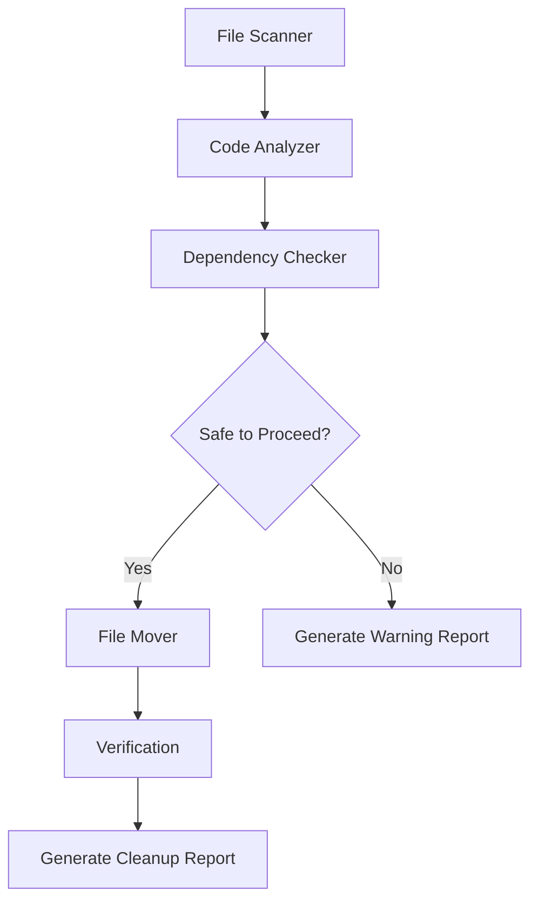

# Design Document: Workspace Cleanup and Reorganization

## Overview

This design document outlines the technical approach for reorganizing and cleaning up the workspace to improve maintainability and discoverability. The system will consolidate approximately 60+ test files from the root directory into the tests/ folder, move 5 markdown documentation files to the wiki/ folder, evaluate and process legacy specs/ folder content, and safely remove obsolete code while preserving all functional components.

The design follows a three-phase approach:
1. **Analysis Phase**: Scan the workspace, identify files to move, and detect obsolete code
2. **Validation Phase**: Check dependencies and verify safety of all operations
3. **Execution Phase**: Perform file operations and generate comprehensive reports

The system is designed to be conservative, prioritizing safety over aggressive cleanup. All operations will be logged, and breaking changes will be detected before they occur.

## Architecture

### System Components

The workspace cleanup system consists of four primary components:

1. **File Scanner**: Discovers and categorizes files in the workspace
2. **Code Analyzer**: Identifies obsolete code and evaluates content value
3. **Dependency Checker**: Verifies import statements, references, and test discovery
4. **File Mover**: Executes file operations and generates reports

### Component Interaction Flow



### Data Flow

1. File Scanner produces a categorized file inventory
2. Code Analyzer enriches inventory with obsolescence classifications
3. Dependency Checker validates safety of proposed operations
4. File Mover executes approved operations
5. Verification confirms no breaking changes occurred
6. Report Generator documents all changes

## Components and Interfaces

### File Scanner

**Purpose**: Discover and categorize all files in the workspace that require processing.

**Interface**:
```python
class FileScanner:
    def scan_root_documentation(self) -> List[Path]:
        """Returns list of markdown files in workspace root"""
        
    def scan_root_tests(self) -> Dict[str, List[Path]]:
        """Returns dict of test files by type (py, html, db)"""
        
    def scan_specs_folder(self) -> List[Path]:
        """Returns list of files in specs/ folder"""
        
    def get_protected_directories(self) -> Set[Path]:
        """Returns directories that must not be modified"""
```

**Implementation Details**:
- Uses pathlib for cross-platform path handling
- Filters files based on patterns: `test_*.py`, `test_*.html`, `test_*.db`, `*.md`
- Protected directories: `app/`, `alembic/`, `public/`, `scripts/`, `.kiro/specs/`
- Excludes hidden directories (`.git`, `.venv`, `__pycache__`)

### Code Analyzer

**Purpose**: Identify obsolete code and evaluate content value of legacy files.

**Interface**:
```python
class CodeAnalyzer:
    def analyze_test_file(self, file_path: Path) -> ObsolescenceReport:
        """Analyzes a test file for obsolescence indicators"""
        
    def evaluate_specs_content(self, file_path: Path) -> ContentEvaluation:
        """Evaluates if specs file contains valuable content"""
        
    def find_duplicate_tests(self, test_files: List[Path]) -> List[DuplicateGroup]:
        """Identifies test files with duplicate functionality"""
```

**Obsolescence Detection Strategy**:

1. **Duplicate Functionality**: Compare test function names and imports across files
2. **Removed Features**: Check if tested modules/functions still exist in app/
3. **Temporary Tests**: Identify files with names containing "debug", "temp", "scratch"
4. **Superseded Tests**: Find older test files that have newer equivalents (by timestamp and naming)

**Content Evaluation Strategy** for specs/ folder:
- Parse markdown structure
- Check for unique technical content vs. boilerplate
- Verify if content is already covered in .kiro/specs/ or wiki/
- Classify as: "valuable" (move to wiki), "obsolete" (remove), "duplicate" (remove)

**Data Structures**:
```python
@dataclass
class ObsolescenceReport:
    file_path: Path
    is_obsolete: bool
    reason: str
    confidence: float  # 0.0 to 1.0
    
@dataclass
class ContentEvaluation:
    file_path: Path
    has_value: bool
    reason: str
    recommended_action: str  # "move_to_wiki", "remove"
```

### Dependency Checker

**Purpose**: Verify that file operations will not break the application or tests.

**Interface**:
```python
class DependencyChecker:
    def check_import_safety(self, file_path: Path) -> SafetyReport:
        """Verifies file is not imported by core application"""
        
    def check_config_references(self, file_path: Path) -> List[str]:
        """Finds references in configuration files"""
        
    def check_documentation_links(self, file_path: Path) -> List[str]:
        """Finds references in documentation"""
        
    def verify_test_imports(self, moved_tests: List[Path]) -> ImportVerification:
        """Verifies test imports resolve after moving to tests/"""
        
    def verify_pytest_discovery(self) -> DiscoveryReport:
        """Verifies pytest can discover all tests in tests/"""
```

**Dependency Checking Strategy**:

1. **Import Analysis**: Use AST parsing to find all import statements in app/ that reference the file
2. **Configuration Scanning**: Search pyproject.toml, alembic.ini, docker-compose.yml for file references
3. **Documentation Links**: Parse markdown files in wiki/ for relative links to the file
4. **Test Import Resolution**: After moving tests, verify all imports can be resolved (may need to update relative imports)

**Import Path Updates**:
- Tests moved from root to tests/ may need import path adjustments
- Example: `from app.models import User` remains valid
- Example: `from test_helper import fixture` → `from tests.test_helper import fixture`

**Data Structures**:
```python
@dataclass
class SafetyReport:
    file_path: Path
    is_safe_to_remove: bool
    blocking_imports: List[str]
    blocking_configs: List[str]
    blocking_docs: List[str]
    
@dataclass
class ImportVerification:
    all_imports_valid: bool
    broken_imports: List[Tuple[Path, str]]  # (file, import_statement)
```

### File Mover

**Purpose**: Execute file operations safely and generate comprehensive reports.

**Interface**:
```python
class FileMover:
    def move_file(self, source: Path, destination: Path) -> MoveResult:
        """Moves a file and verifies the operation"""
        
    def remove_file(self, file_path: Path, reason: str) -> RemovalResult:
        """Removes a file and logs the operation"""
        
    def generate_cleanup_report(self, operations: List[Operation]) -> Path:
        """Generates markdown report of all operations"""
```

**File Operation Strategy**:

1. **Move Operations**:
   - Use `shutil.move()` for atomic file moves
   - Verify source file exists before moving
   - Verify destination file doesn't exist (avoid overwrites)
   - Verify file exists at destination after move
   - Preserve file permissions

2. **Remove Operations**:
   - Only remove files marked safe by Dependency Checker
   - Log file path and reason before removal
   - Use `Path.unlink()` for file deletion
   - Remove empty directories after file removal

3. **Rollback Strategy**:
   - Keep operation log with source/destination paths
   - If verification fails, provide rollback instructions in report
   - Do not implement automatic rollback (too risky)

**Data Structures**:
```python
@dataclass
class MoveResult:
    success: bool
    source: Path
    destination: Path
    error: Optional[str]
    
@dataclass
class RemovalResult:
    success: bool
    file_path: Path
    reason: str
    error: Optional[str]
    
@dataclass
class Operation:
    type: str  # "move", "remove", "preserve"
    file_path: Path
    destination: Optional[Path]
    reason: str
    timestamp: datetime
```

## Data Models

### File Inventory

```python
@dataclass
class FileInventory:
    """Complete inventory of workspace files"""
    root_documentation: List[Path]
    root_tests_py: List[Path]
    root_tests_html: List[Path]
    root_tests_db: List[Path]
    specs_files: List[Path]
    protected_files: Set[Path]
    
    def total_files_to_process(self) -> int:
        """Returns count of all files requiring processing"""
```

### Cleanup Plan

```python
@dataclass
class CleanupPlan:
    """Complete plan for workspace cleanup"""
    files_to_move_to_wiki: List[Tuple[Path, Path]]  # (source, dest)
    files_to_move_to_tests: List[Tuple[Path, Path]]
    files_to_remove: List[Tuple[Path, str]]  # (file, reason)
    files_to_preserve: List[Path]
    
    def validate(self) -> List[str]:
        """Returns list of validation errors, empty if valid"""
```

### Cleanup Report

```python
@dataclass
class CleanupReport:
    """Final report of all cleanup operations"""
    moved_to_wiki: List[Operation]
    moved_to_tests: List[Operation]
    removed_files: List[Operation]
    preserved_files: List[Path]
    verification_results: VerificationResults
    timestamp: datetime
    
    def to_markdown(self) -> str:
        """Generates markdown report"""
```

## Correctness Properties


*A property is a characteristic or behavior that should hold true across all valid executions of a system—essentially, a formal statement about what the system should do. Properties serve as the bridge between human-readable specifications and machine-verifiable correctness guarantees.*

### Property 1: Move Operation Atomicity

*For any* file that is moved from source to destination, the file must exist at the destination and must not exist at the source after the operation completes.

**Validates: Requirements 1.6, 1.7, 3.6**

### Property 2: Test File Pattern Matching

*For any* file in the workspace root matching the patterns `test_*.py`, `test_*.html`, or `test_*.db`, that file must be moved to the tests/ folder.

**Validates: Requirements 3.1, 3.2, 3.3**

### Property 3: File Name Preservation

*For any* file that is moved, the filename at the destination must be identical to the filename at the source (only the directory path changes).

**Validates: Requirements 3.5**

### Property 4: Import Resolution After Move

*For any* test file moved to the tests/ folder, all import statements in that file must resolve correctly after the move operation.

**Validates: Requirements 3.7, 7.2**

### Property 5: Empty Directory Cleanup

*For any* directory that becomes empty after all its files are processed, that directory must be removed.

**Validates: Requirements 2.7**

### Property 6: Existing Structure Preservation

*For any* file or directory that exists in tests/ or wiki/ before cleanup operations begin, that file or directory must remain unchanged after all operations complete.

**Validates: Requirements 3.4, 6.6, 6.7**

### Property 7: Duplicate Detection Capability

*For any* set of test files where two or more files contain identical test function names and similar imports, the Code Analyzer must identify them as duplicates.

**Validates: Requirements 4.1**

### Property 8: Removed Feature Detection

*For any* test file that imports a module that does not exist in the app/ directory, the Code Analyzer must identify that test file as testing a removed feature.

**Validates: Requirements 4.2**

### Property 9: Temporary File Detection

*For any* file whose name contains the substrings "debug", "temp", "scratch", or "tmp", the Code Analyzer must identify it as a temporary file.

**Validates: Requirements 4.3**

### Property 10: Superseded Test Detection

*For any* pair of test files where one file is older and has a similar name to a newer file, the Code Analyzer must identify the older file as potentially superseded.

**Validates: Requirements 4.4**

### Property 11: Obsolescence Justification

*For any* test file classified as obsolete by the Code Analyzer, the classification must include a non-empty justification string explaining the reason.

**Validates: Requirements 4.5**

### Property 12: Obsolescence Report Completeness

*For any* test file classified as obsolete, that file must appear in the obsolescence report generated by the Code Analyzer.

**Validates: Requirements 4.6**

### Property 13: Active Test Exclusion

*For any* test file that imports and tests functionality that exists in the app/ directory, the Code Analyzer must not classify it as obsolete.

**Validates: Requirements 4.7**

### Property 14: Dependency-Free Removal

*For any* file marked for removal, the Dependency Checker must verify that the file has no imports from Core_Application, no references in configuration files, and no references in documentation.

**Validates: Requirements 5.1, 5.2, 5.3**

### Property 15: Safety Classification

*For any* file that has dependencies (imports, configuration references, or documentation references), the Code Analyzer must mark it as not safe to remove.

**Validates: Requirements 5.4**

### Property 16: Verified Removal Only

*For any* file that is removed, the Dependency Checker must have previously verified it as safe to remove.

**Validates: Requirements 5.5**

### Property 17: Removal Logging

*For any* file that is removed, there must be a log entry documenting the file path, reason for removal, and timestamp.

**Validates: Requirements 5.6**

### Property 18: Protected Directory Preservation

*For any* file in the directories app/, alembic/, public/, scripts/, or .kiro/specs/, that file must not be modified, moved, or removed by any cleanup operation.

**Validates: Requirements 5.7, 6.1, 6.2, 6.3, 6.4, 6.5**

### Property 19: Core Application Import Integrity

*For any* import statement in any file within the app/ directory, that import must resolve correctly after all cleanup operations complete.

**Validates: Requirements 7.1**

### Property 20: Documentation Link Integrity

*For any* markdown link in any file within the wiki/ directory, that link must resolve to an existing file after all cleanup operations complete.

**Validates: Requirements 7.3**

### Property 21: Breaking Change Reporting

*For any* breaking change detected during verification (broken import, broken link, or failed test discovery), there must be a report entry listing the affected file and the nature of the break.

**Validates: Requirements 7.4**

### Property 22: Pytest Discovery Verification

*For any* test file in the tests/ directory after cleanup operations, pytest must be able to discover that test file.

**Validates: Requirements 7.5**

### Property 23: Orphaned Database Detection

*For any* .db file in the tests/ directory, that file must not be referenced by any active test file (indicating it is orphaned and can be removed).

**Validates: Requirements 7.6**

### Property 24: Permission Preservation

*For any* file that is moved, the file permissions at the destination must be identical to the file permissions at the source.

**Validates: Requirements 7.7**

### Property 25: Report Completeness

*For any* file that is moved, removed, or preserved, that file must appear in the appropriate section of the cleanup report (moved to wiki, moved to tests, removed, or preserved).

**Validates: Requirements 8.1, 8.2, 8.3, 8.4**

### Property 26: Report Detail Sufficiency

*For any* file listed in the cleanup report, the report entry must include the original path, and for moved files the destination path, and for removed files the justification.

**Validates: Requirements 8.5, 8.6**

## Error Handling

### File Operation Errors

**Move Operation Failures**:
- If source file doesn't exist: Log error, skip file, continue with other operations
- If destination file already exists: Log error, skip file to avoid overwrite, continue
- If destination directory doesn't exist: Create directory, retry move operation
- If permission denied: Log error, mark file as requiring manual intervention, continue

**Remove Operation Failures**:
- If file doesn't exist: Log warning (already removed), continue
- If permission denied: Log error, mark file as requiring manual intervention, continue
- If file is locked: Log error, mark file as requiring manual intervention, continue

**Error Recovery Strategy**:
- All errors are logged but do not halt execution
- Failed operations are collected and reported in the cleanup report
- Manual intervention section lists all files requiring attention
- No automatic rollback (too risky for file operations)

### Dependency Checking Errors

**Import Resolution Failures**:
- If AST parsing fails: Log error, mark file as requiring manual review
- If module not found: Record as broken import for reporting
- If circular dependency detected: Log warning, continue (not blocking)

**Configuration Scanning Errors**:
- If config file is malformed: Log error, skip that config file, continue
- If config file doesn't exist: Log warning, continue

**Fallback Strategy**:
- If dependency checking fails for a file, mark it as "not safe to remove"
- Conservative approach: when in doubt, preserve the file

### Analysis Errors

**Content Evaluation Failures**:
- If file cannot be read: Log error, mark as "preserve" (safe default)
- If file is binary: Log warning, mark as "preserve"
- If parsing fails: Log error, mark as "preserve"

**Obsolescence Detection Errors**:
- If test file cannot be analyzed: Mark as "not obsolete" (safe default)
- If comparison fails: Log error, skip that comparison, continue

**Error Reporting**:
- All analysis errors are collected in a separate section of the report
- Files with analysis errors are never removed (conservative approach)

## Testing Strategy

### Unit Testing Approach

The workspace cleanup system will use a combination of unit tests and property-based tests to ensure correctness.

**Unit Test Focus Areas**:
1. Specific file operations (move, remove, verify)
2. Edge cases (empty directories, permission issues, locked files)
3. Error handling paths (missing files, malformed configs)
4. Report generation formatting
5. Integration between components

**Example Unit Tests**:
- Test moving a specific markdown file to wiki/
- Test removing an empty directory after file removal
- Test handling permission denied error
- Test generating report with specific operations
- Test detecting a specific temporary file pattern

### Property-Based Testing Approach

Property-based tests will verify universal properties across many generated inputs using a PBT library.

**Property Test Configuration**:
- Library: Hypothesis (Python)
- Minimum iterations: 100 per property test
- Each test tagged with: `# Feature: workspace-cleanup-reorganization, Property {N}: {property_text}`

**Property Test Focus Areas**:
1. Move operation atomicity (Property 1)
2. File name preservation (Property 3)
3. Import resolution after moves (Property 4)
4. Protected directory preservation (Property 18)
5. Report completeness (Property 25)

**Example Property Tests**:

```python
# Feature: workspace-cleanup-reorganization, Property 1: Move Operation Atomicity
@given(st.text(min_size=1), st.text(min_size=1))
def test_move_operation_atomicity(filename, content):
    """For any file moved, it must exist at destination and not at source"""
    # Generate random file with random content
    # Move file from source to destination
    # Assert file exists at destination
    # Assert file does not exist at source
```

```python
# Feature: workspace-cleanup-reorganization, Property 3: File Name Preservation
@given(st.text(min_size=1, alphabet=st.characters(blacklist_categories=('Cs',))))
def test_filename_preservation(filename):
    """For any moved file, filename must be identical at source and destination"""
    # Generate random filename
    # Move file to different directory
    # Assert basename(source) == basename(destination)
```

```python
# Feature: workspace-cleanup-reorganization, Property 18: Protected Directory Preservation
@given(st.sampled_from(['app/', 'alembic/', 'public/', 'scripts/', '.kiro/specs/']))
def test_protected_directory_preservation(protected_dir):
    """For any file in protected directories, it must not be modified"""
    # Generate random file in protected directory
    # Run cleanup operations
    # Assert file still exists and is unchanged
```

### Integration Testing

**End-to-End Test Scenarios**:
1. Full cleanup run on a test workspace with known file structure
2. Verify all expected moves occurred
3. Verify all expected removals occurred
4. Verify report accuracy
5. Verify no breaking changes (imports resolve, tests discoverable)

**Test Workspace Setup**:
- Create temporary directory structure mimicking real workspace
- Populate with test files, documentation, and obsolete code
- Run cleanup system
- Verify results against expected state

### Manual Verification Steps

After automated testing, manual verification should include:
1. Review cleanup report for accuracy
2. Run pytest to verify all tests are discoverable
3. Check that application starts without import errors
4. Verify documentation links in wiki/ are not broken
5. Spot-check a few moved files to ensure content is intact

